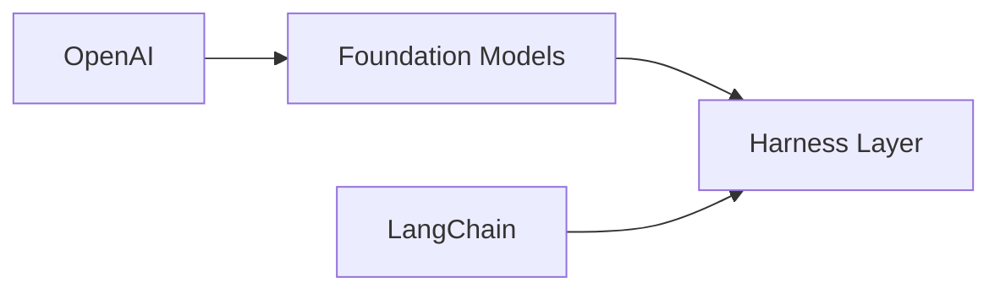

## La pregunta que nadie hace: ¿quién envuelve a la IA?

En los últimos dos años, la conversación pública sobre inteligencia artificial se ha centrado casi exclusivamente en los modelos fundacionales: GPT-4, Claude, Gemini, Llama. Pero hay una pregunta más silenciosa y, probablemente, más determinante para el futuro económico del sector: **¿qué hay alrededor de esos modelos?** ¿Quién construye el "arnés" —*harness*, en inglés— que permite que un modelo de lenguaje se convierta en un agente útil, evaluable y desplegable en producción?

El término *harness* ha circulado durante décadas en ingeniería de software, casi siempre asociado a *test harnesses* —entornos que ejecutan código bajo condiciones controladas para verificar su comportamiento. Pero en 2026, su significado ha mutado. Hoy, un harness de IA es el conjunto de herramientas, orquestadores, evaluadores, prompts, conectores y guardarraíles que envuelven un modelo de lenguaje para hacerlo operable. Piénsalo como la diferencia entre un motor de combustión y un automóvil: el modelo es el motor; el harness es todo lo demás.

Y aquí empieza lo interesante desde una perspectiva de análisis de poder.

## La nueva capa media del stack tecnológico

Históricamente, la industria del software ha oscilado entre ciclos de **verticalización** y ciclos de **abstracción**. En los años noventa, las empresas luchaban por controlar la pila completa: Microsoft con Windows + Office + Internet Explorer; Sun con Java + Solaris; IBM con todo. La caída de esas guerras —con el juicio antimonopolio contra Microsoft como punto de inflexión— abrió paso a una era más horizontal, donde capas como Linux, MySQL o Apache demostraron que la infraestructura podía ser neutral y comunitaria.

El auge de los grandes modelos de lenguaje ha reintroducido la verticalización, pero con un giro interesante. Empresas como **OpenAI**, **Anthropic** y **Google DeepMind** controlan el "motor", pero dependen crucialmente del harness para que sus modelos sean útiles fuera de un *chatbot*. Aquí es donde entran jugadores como **LangChain** (hoy una empresa valorada en más de mil millones de dólares tras su ronda de 2024), **Fixpoint**, **Weights & Biases**, **Galileo**, o el ecosistema más reciente de frameworks agentivos como **CrewAI** y **AutoGen** de Microsoft.

La pregunta de poder es directa: ¿esta nueva capa media será capturada por los proveedores de modelos fundacionales —convirtiéndose así en un *lock-in* adicional—, o permanecerá como un terreno competitivo donde múltiples actores pueden diferenciarse?

## El precedente histórico: las guerras del middleware

Para entender lo que está en juego, conviene recordar las **guerras del middleware** de principios de los 2000. Empresas como BEA Systems, IBM con WebSphere, Oracle tras la adquisición de BEA, y SAP libraron una batalla campal por controlar la capa de software que conectaba aplicaciones, bases de datos y sistemas legacy. Quien controlaba el middleware controlaba las integraciones —y, por tanto, las decisiones de compra de cualquier CIO.

La historia sugiere una advertencia clara para los actuales jugadores del harness de IA: **ser la capa media es rentable mientras dura, pero las capas medias rara vez sobreviven intactas a las siguientes olas de abstracción**.

## Quién posee el arnés hoy

Si observamos el panorama actual, hay tres movimientos estratégicos visibles:

**Primero**, los proveedores de modelos están intentando absorber el harness. OpenAI lanzó sus *Custom GPTs* y su *Agents SDK*; Anthropic expandió *Model Context Protocol* (MCP) como estándar; Google integró agentes en Vertex AI. Cada uno busca que el "arnés" sea inseparable de su modelo.

**Segundo**, los especialistas independientes como LangChain intentan resistir esa captura ofreciendo neutralidad. LangChain —fundada por Harrison Chase— plantea ser el "sistema operativo" del agente, compatible con cualquier modelo. Pero su modelo de negocio es frágil: vive en una capa donde el valor añadido puede ser fácilmente *comoditizado* por los propios proveedores de modelos.

**Tercero**, el código abierto como contrapeso. Proyectos como **LangChain** (en su versión open source), **LlamaIndex**, **Haystack** de deepset, o **Guidance** de Microsoft, ofrecen alternativas donde ninguna empresa controla la capa. Sin embargo, mantener infraestructura open source es caro, y la historia demuestra que el open source sin un modelo de negocio sostenible termina siendo absorbido o abandonado.

## Concentración de capital y el dilema del desarrollador

Un dato que rara vez se discute: el ecosistema del harness de IA ha recibido miles de millones en capital riesgo en apenas 24 meses. LangChain, Fixpoint, CrewAI, Dust, Letta y docenas de startups más han recaudado rondas significativas. Este capital no es neutral —exige retornos, y los retornos en software se logran típicamente mediante lock-in, integración vertical o adquisiciones.

Para el desarrollador promedio, esto plantea un dilema concreto: construir sobre el harness de OpenAI significa aceptar sus términos, sus precios y sus límites. Construir sobre LangChain open source ofrece flexibilidad, pero a costa de mantener tu propio *stack*. Y construir algo propio desde cero es prohibitivamente caro para la mayoría de equipos.

**El resultado predecible es una mayor concentración**, no menos. Cada vez que una capa media no logra mantenerse neutral, el valor fluye hacia arriba (modelos) o hacia abajo (cloud). Las empresas que parecen "independientes" hoy —incluidos muchos de estos proveedores de harness— son candidatas naturales a adquisición por parte de Microsoft, Google o Amazon en los próximos tres a cinco años.

## Una reflexión que incomoda

La pregunta que deberíamos hacernos —como profesionales, inversores y ciudadanos— no es *¿qué modelo de IA es mejor?*, sino **¿quién decide cómo se usa ese modelo?**. Porque en tecnología, como en política, el poder real rara vez está donde apuntan las cámaras.

