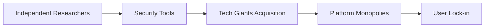

# Moxie's 2006 Scrap: The Warning We Forgot About Silicon Valley's Security Debt

There's a particular kind of archaeological pleasure in digging through a 2006 tweet from Moxie Marlinspike — a moment when the future founder of Signal was posting early experiments and ideas into what was, at the time, a barely-year-old platform called Twitter. The HackerNews community resurfacing this old artifact matters more than it might seem. It tells us something about the structural amnesia of an industry that loves its own mythology while ignoring its own warnings.

## What Scrap Actually Was

In 2006, Moxie Marlinspike was not yet the cryptographic celebrity he would later become. He hadn't yet founded Whisper Systems (which Twitter itself would acquire in 2011), hadn't yet written the SSL stripping paper that would make him famous in academic circles, and certainly hadn't yet helped build Signal — the encrypted messaging app that would become the gold standard for journalists, dissidents, and privacy-conscious users worldwide.

"Scrap" was an early, almost forgotten project. But like many of Moxie's side experiments, it pointed at a problem the industry didn't want to confront: the gap between how security is *marketed* and how it is *actually implemented* by the dominant platforms. Even then, Moxie was doing what he has consistently done for nearly two decades — building tools that expose the fragility of the systems we trust with our most intimate data.

## The Economics of Ignored Warnings

Here's what the HackerNews thread is really about, whether the participants realize it or not: **the asymmetry between who produces security research and who profits from it.**

This is the labor model of modern cybersecurity: **proletarian researchers, aristocratic platforms.** Google, Apple, Meta, and Microsoft operate vast bug bounty programs that function, in practice, as outsourced R&D departments. The bounties are generous by historical standards — Google paid over $12 million to researchers in 2023 — but they are tiny compared to the value extracted. A researcher who finds a critical vulnerability that protects a billion users receives, perhaps, $100,000. The company keeps the trust, the lock-in, and the market position.

## The Moxie Pipeline: From Indie to Acquisition

Moxie's career is the clearest case study of this pipeline. Independent researcher → respected voice → startup founder → **acquired by Twitter in 2011** for Whisper Systems. Then, years later, emerges as the architect of Signal, which operates under the nonprofit Signal Foundation — explicitly structured to avoid capture by the same platform monopolists who consumed his earlier work.

This isn't unique. It is the standard path. WhatsApp's Brian Acton and Jan Koum sold to Facebook for $19 billion. The founders of Privoxy, TOR nodes, even elements of PGP — all of it eventually either gets acquired, replicated, or quietly absorbed into the infrastructure of companies whose business models depend on surveillance, not privacy.

## The Concentration Problem

- **Apple** controls the iMessage ecosystem with proprietary, non-interoperable encryption
- **Meta** owns WhatsApp and Facebook Messenger, both with proprietary protocols
- **Google** controls RCS through carrier partnerships and SMS fallback
- **Signal** remains independent but small, with limited resources relative to its user base

This is what scholars call "privacy monopolism" — a market structure where users cannot meaningfully choose to leave because the network effects are too strong. Even when excellent open-source alternatives exist (and Signal is excellent), the structural incentives push toward consolidation. The 2006 Moxie tweet is a reminder that these problems were visible *early*. We had the diagnosis. We chose not to treat it.

## What We Lost in Translation

There's a particular tragedy in resurfacing old work from brilliant independent researchers. The community on HackerNews treats it as nostalgia — "look how prescient Moxie was!" But nostalgia is the wrong frame. These tweets are not artifacts of a more innocent era. They are **incident reports** from a crime scene that is still ongoing.

Every time a security researcher publishes a finding that doesn't fit neatly into a corporate bug bounty program, every time a tool like Scrap surfaces a vulnerability that can't be monetized through a vendor relationship, every time an independent voice says "the emperor has no clothes" about a major platform — that work is structurally devalued by an industry that has organized itself around the suppression of exactly these insights.

## Conclusion: Reading the Past to Understand the Present

The 2006 tweet from Moxie is worth reading not because it's a clever bit of nostalgia, but because it forces us to confront an uncomfortable truth: **the security industry, as currently structured, is a system for converting independent insight into corporate moat.**

The path from Scrap to Signal to the current standoff between Signal and the EU's eIDAS 2.0 regulations is one continuous story. It is the story of an industry that has perfected the art of acknowledging security research in the abstract while ensuring that its material benefits flow to incumbents.

If we want a different future — one where independent researchers can build durable institutions, where privacy is not a feature to be marketed but an infrastructure to be maintained — we need to stop treating early warnings as curiosities. We need to read them as the indictments they were always meant to be.