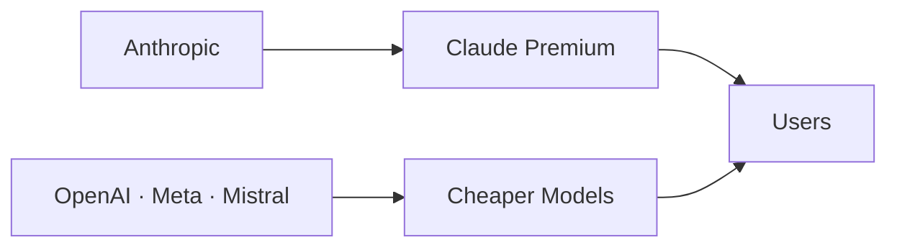

# El espejismo de la IA premium: por qué el modelo más avanzado de Anthropic no convence a los usuarios

A finales de 2024, Anthropic cerró una ronda de financiación que valoró a la empresa en más de 60.000 millones de dólares. Su modelo más reciente, técnicamente superior en benchmarks independientes, prometía redefinir el estándar de la industria. Sin embargo, según reporta el Financial Times, la realidad del mercado cuenta una historia muy diferente: desarrolladores y empresas siguen eligiendo modelos más baratos —y en muchos casos, abiertamente inferiores en capacidades brutas— para construir sus productos.

## La paradoja del benchmark

El fenómeno revela una tensión fundamental en la economía de la inteligencia artificial: la correlación entre rendimiento técnico y adopción comercial es mucho más débil de lo que la narrativa del sector sugiere. Los benchmarks como MMLU, HumanEval o SWE-bench miden capacidades en condiciones controladas, pero los usuarios reales evalúan otras variables: latencia, costo por token, integración con herramientas existentes, estabilidad de la API y, sobre todo, precio.

## Lecciones de la historia tecnológica

- **IBM y los clones PC**: IBM perdió el control del mercado de PCs frente a fabricantes de clones que ofrecían hardware compatible a precios mucho menores.
- **Microsoft y Linux**: durante años, los defensores del software propietario argumentaron que Linux nunca sería viable. La persistencia y la reducción de costos de adopción cambiaron el equilibrio.
- **Sun Microsystems y Java vs. .NET**: la fragmentación del ecosistema de Sun permitió que Microsoft consolidara .NET a través de integraciones verticales con Windows y Office.
- **Nokia y el iPhone**: liderar técnicamente no es lo mismo que liderar comercialmente cuando la propuesta de valor del usuario cambia.

La lección recurrente: en mercados en rápida expansión, **la distribución y el precio a menudo vencen a la superioridad técnica marginal**.

## El mapa de poder actual

El ecosistema actual de IA generativa está dominado por una estructura oligopólica con capas claras:

1. **Núcleo de infraestructura**: NVIDIA controla aproximadamente el 80% del mercado de GPUs para entrenamiento, con márgenes operativos superiores al 60%. Esta posición le permite dictar las condiciones de acceso a la computación, el recurso más escaso del sector.

2. **Modelos frontier**: OpenAI (respaldada por Microsoft), Anthropic (respaldada por Google y Amazon), Google DeepMind y Meta compiten en la frontera técnica. Aquí se concentra la inversión de capital: las grandes tecnológicas han comprometido colectivamente cientos de miles de millones en infraestructura de IA.

3. **Capa de distribución**: Microsoft, a través de Azure y la integración con Office 365, controla la principal vía de distribución empresarial de IA. Google tiene su propio canal mediante Workspace y Cloud. Amazon, con AWS y su inversión en Anthropic, intenta recuperar terreno.

4. **Modelos abiertos y de bajo costo**: Llama de Meta, Mistral, DeepSeek, Qwen de Alibaba y otros modelos abiertos o de bajo costo están capturando la base de la pirámide. Aquí la economía es radicalmente diferente: márgenes comprimidos, pero volumen y relevancia estratégica.

El problema de Anthropic es estructural: está atrapada en la capa de modelos frontier, sin controlar ni la infraestructura (NVIDIA), ni la distribución (Microsoft, Google), ni la escala de adopción masiva (Meta con sus modelos abiertos).

## ¿Qué significa esto para el ecosistema?

Si la tendencia continúa, veremos una bifurcación:

- **Una capa de hyperscalers** (OpenAI, Google, Anthropic, Meta) compitiendo en capacidades técnicas avanzadas para casos de uso donde la calidad justifica precios premium.
- **Una capa masiva de modelos eficientes y abiertos** satisfaciendo la mayor parte de la demanda, presionando los precios hacia abajo.

Para los desarrolladores y empresas que toman decisiones hoy, el mensaje es pragmático: la mejor IA no es la que lidera los benchmarks, sino la que resuelve el problema al menor costo y con la menor fricción operativa.

## Conclusión: el valor está en la distribución, no en el modelo

La situación de Anthropic ilustra una verdad incómoda para Silicon Valley: en mercados con efectos de red, la superioridad técnica es condición necesaria pero no suficiente. Quien controla la distribución, la infraestructura y el ecosistema de integración define las reglas del juego.

La pregunta no es si los modelos de Anthropic son buenos —lo son—. La pregunta es si la calidad diferencial justifica el sobreprecio en un mundo donde alternativas más baratas son "suficientemente buenas". Hasta ahora, la respuesta del mercado es un rotundo no.

Quizás la verdadera lección de esta noticia no es sobre Anthropic, sino sobre la naturaleza del poder en la industria tecnológica: el capital fluye hacia donde se perciben futuros beneficios, pero el valor real se acumula donde existen usuarios, datos y distribución. Y eso, históricamente, lo han controlado muy pocos actores.