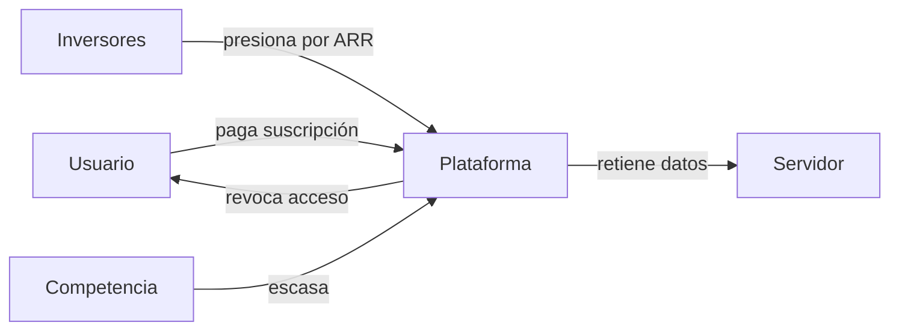

## La ilusión de poseer: cómo las tecnológicas convirtieron tu propiedad en suscripción

### El fin del "comprar y conservar"

Durante décadas, comprar software significaba algo tangible: un disco, una caja, un manual, una licencia perpetua. Pagabas una vez y el producto era tuyo. Podías revenderlo, prestarlo, conservarlo veinte años en un cajón. Empresas como **Microsoft**, **Adobe** o **Apple** construyeron imperios sobre ese modelo. El salto al modelo de suscripción —Microsoft 365 en 2013, Creative Cloud en 2013 también, Apple One en 2020— no fue una evolución natural: fue una decisión estratégica para transformar ingresos puntuales en flujos recurrentes.

### ¿Quién posee tus archivos realmente?

El desplazamiento del software a la nube cambió no solo cómo pagamos, sino qué poseemos. Cuando guardas un documento en Google Docs, una foto en iCloud o un proyecto en Figma, técnicamente no "tienes" nada: tienes una licencia revocable de acceso. Los términos de servicio —esos textos que nadie lee— lo dejan meridianamente claro. Apple, Google, Microsoft y Adobe conservan el derecho de terminar tu cuenta, eliminar tu contenido o cambiar las condiciones unilateralmente.

### La concentración del capital

Detrás de cada servicio al que "te suscribes" hay una estructura oligopólica. El mercado del software creativo está dominado por Adobe. El de ofimática, por Microsoft y Google. El de almacenamiento personal, por Apple, Google y Microsoft. El de diseño colaborativo, por Figma (ahora bajo el paraguas de Adobe tras una adquisición bloqueada parcialmente). La competencia real es escasa, y los precios suben con menos resistencia que nunca.

El estratega empresarial Peter Thiel lo formuló sin rodeos: la competencia es para perdedores; lo rentable es el monopolio. Las grandes tecnológicas han pasado del "software como producto" al "software como infraestructura crítica", una capa sobre la que funcionan trabajos, ocios, relaciones y memorias. Una vez que dependes de ella, el precio deja de ser una variable.

### La tendencia histórica no es nueva

En cada sector, el patrón se repite: **primero te tientan con conveniencia, luego normalizan la dependencia, finalmente suben el precio y amplían las restricciones**. La "transformación digital" ha sido, en buena medida, una gigantesca operación de relocalización de renta: del bolsillo del consumidor a la cuenta de resultados de unas pocas empresas cotizadas.

### El precio oculto que no aparece en la factura

Más allá del dinero, la suscripción perpetua implica tres costos invisibles:

1. **Pérdida de soberanía técnica**. Ya no puedes auditar, modificar ni reparar lo que "usas". El software privativo se ha vuelto la norma incluso en sectores donde antes era impensable, como la agricultura o la medicina.
2. **Vulnerabilidad ante el cambio arbitrario de condiciones**. Una actualización puede eliminar funciones, bloquear integraciones o devaluar años de trabajo.
3. **Erosión del derecho a reparar y a reventa**, principios que en el mundo físico damos por sentados pero que en el digital se han desvanecido.

Y existe un cuarto costo, más difuso pero quizá más profundo: **la normalización de no poseer nada**. Cuando toda tu vida profesional, creativa y personal depende de licencias revocables, tu autonomía económica queda condicionada a la buena voluntad de empresas que no responden ante ti sino ante sus accionistas.

### ¿Hay salida?

La respuesta corta: sí, pero requiere intención. Proyectos como Linux, LibreOffice, GIMP, Blender o el ecosistema de autoalojamiento (Nextcloud, Immich, Jellyfin) demuestran que alternativas técnicamente viables existen. La pregunta es por qué no se adoptan masivamente, y la respuesta vuelve a ser económica: el software libre no tiene un departamento de marketing de mil millones de dólares ni se integra por defecto en el sistema educativo.

Mientras tanto, cada usuario individual puede tomar decisiones informadas: leer antes de aceptar, preferir compras únicas cuando existen, exigir interoperabilidad, diversificar proveedores, y recordar que cuando algo es gratis o muy barato, **el producto eres tú y tus datos**. La frase de schlarp.com no es una boutade generacional: es la descripción literal de un sistema económico que ha convertido la propiedad en una ficción cómoda para todos, excepto para quien la paga.

Quizá la próxima vez que pulses "Aceptar" en unos términos de servicio, valga la pena preguntarse qué estás firmando realmente. Y a quién le pertenece, de verdad, todo lo que crees tuyo.

