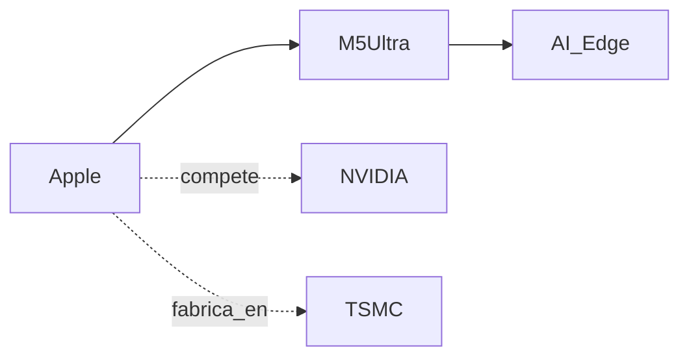

## Apple M6 y M5 Ultra: la nueva muralla de Cupertino en la guerra por la IA

En agosto de 2026, Apple presentó dos nuevos procesadores que marcan un punto de inflexión en su estrategia: el **M6** y el **M5 Ultra**. Detrás del lenguaje publicitario habitual de la compañía —"el mayor salto en rendimiento", "revolución en computación de IA"— se esconde una jugada de poder mucho más profunda. Apple no está simplemente lanzando chips más rápidos. Está consolidando un modelo de negocio que depende, cada vez más, del control absoluto de su cadena de valor.

### La arquitectura del control

Desde que Tim Cook asumió la dirección de Apple en 2011, una de sus decisiones más estratégicas ha sido priorizar el diseño de silicio propio. La transición desde Intel, completada en 2020 con el chip M1, no fue un capricho de ingeniería: fue una declaración de independencia tecnológica. El M6 y el M5 Ultra llevan esa lógica a su máxima expresión.

El **M5 Ultra**, con su configuración de doble matriz de obleas y un ancho de banda de memoria unificado sin precedentes, está diseñado específicamente para cargas de trabajo de inteligencia artificial. El **M6**, por su parte, promete extender esa capacidad a dispositivos de consumo masivo, desde MacBook Air hasta tablets. La estrategia es transparente: crear un ecosistema donde cada capa —del transistor al sistema operativo, pasando por APIs y servicios— esté optimizada para extraer el máximo rendimiento del silicio propietario.

### Por qué importa a la competencia

El movimiento de Apple golpea directamente a tres actores clave del mercado:

- **Intel**: Lleva una década perdiendo cuota en el segmento premium. Después de los tropiezos con sus nodos de 10nm y 7nm, y con varios cambios en su dirección ejecutiva, Intel ha pasado de proveedor exclusivo a actor secundario para Apple. El M6 demuestra que depender de fundiciones externas no es el problema real; el problema es no tener una estrategia coherente de integración vertical.

- **NVIDIA**: Aquí está la batalla más interesante. Jensen Huang ha construido un imperio basado en la computación de IA para centros de datos, con CUDA como foso defensivo casi infranqueable. Sin embargo, Apple está apostando por un modelo alternativo: **IA en el dispositivo**, con inferencia local y privacidad como diferenciadores. El M5 Ultra no pretende competir con el H200 o el futuro B300 en entrenamiento de modelos masivos, pero apunta a la inferencia empresarial y al edge computing, mercados en plena expansión.

- **Qualcomm**: El Snapdragon X Elite intentó capitalizar el fin de la exclusividad x86 en portátiles, pero la promesa de "rendimiento comparable al M-series" sigue sin materializarse plenamente. El M6, con mayor eficiencia energética, amplía la brecha.

### La concentración como modelo de negocio

Lo que Apple está haciendo con el M6 y M5 Ultra es parte de una tendencia más amplia: la **concentración del poder tecnológico** en manos de unos pocos actores con capacidad de diseñar, fabricar y distribuir a escala global. En el ecosistema actual, solo unas pocas empresas —Apple, NVIDIA, Qualcomm y, con matices, AMD— tienen los recursos para diseñar chips de alto rendimiento desde cero. Intel se mantiene gracias a su legado industrial, pero su posición es cada vez más frágil.

### Lección histórica: de PowerPC a Apple Silicon

La transición actual hacia el silicio propio no es la primera de Apple. A mediados de la década de 2000, la compañía abandonó la arquitectura PowerPC —dominada por IBM y Motorola/Freescale— para adoptar los procesadores de Intel, una decisión que en su momento se presentó como pragmatismo técnico pero que, en retrospectiva, era una solución temporal. El verdadero objetivo siempre fue el control total del hardware. Los chips M1, M2, M3, M4, M5 y ahora M6 son la culminación de una estrategia de más de dos décadas orientada a eliminar dependencias externas. A diferencia del salto a Intel, que obligó a Apple a convencer a desarrolladores y usuarios de asumir otro cambio arquitectónico, la migración a Apple Silicon ha sido la primera donde la compañía controlaba simultáneamente el silicio y el software, permitiéndole suavizar la transición con herramientas como Rosetta 2 y un ecosistema de APIs propio.

### ¿Qué significa para desarrolladores y usuarios?

Para los desarrolladores, el dilema es real. Optimizar para Apple Silicon significa, en la práctica, abandonar una parte del mercado de PCs tradicional. Frameworks como PyTorch y TensorFlow han mejorado su soporte para MPS (Metal Performance Shaders), pero la fragmentación persiste. Para los usuarios finales —especialmente profesionales creativos y empresas— la promesa de la integración vertical se traduce en un rendimiento por vatio difícil de igualar, aunque también en precios que reflejan la posición dominante de Apple.

