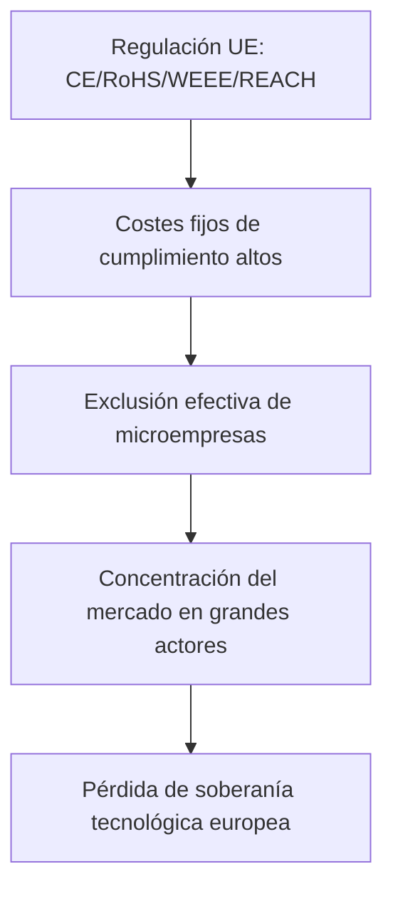

## Cuando proteger al consumidor significa destruir al competidor

En las últimas semanas, una publicación del marketplace Lectronz ha sacudido a la comunidad maker europea. Su autor, vendedor de hardware de código abierto, describe con crudeza una realidad que miles de pequeños emprendedores conocen: producir, importar y vender un dispositivo electrónico en Europa se ha convertido en una empresa casi imposible si no se cuenta con el respaldo de una corporación con departamentos legales propios.

## La asimetría estructural del cumplimiento

Para una empresa como Arduino (ahora participada por Qualcomm y con ingresos que rondan los 30 millones de euros anuales) o Pimoroni (recientemente integrada en el ecosistema de Raspberry Pi Holdings, que cotiza en la bolsa de Londres), el coste de certificar un producto es un porcentaje menor de su facturación. Cuentan con ingenieros de cumplimiento, abogados especializados y relaciones establecidas con laboratorios de certificación como TÜV o Bureau Veritas.

Para un maker que vende 200 unidades al año de un dispositivo de monitorización ambiental en su tienda de Lectronz, Tindie o incluso Etsy, el coste de obtener un certificado CE puede superar fácilmente los 5.000-15.000 euros por producto, sin contar ensayos de laboratorio, documentación técnica y mantenimiento de la conformidad. Un estudio publicado por la propia Comisión Europea en 2022 reconoció que el coste regulatorio de cumplimiento de las directivas de productos en la UE es entre 4 y 10 veces superior para las microempresas en términos relativos que para las grandes corporaciones.

## El patrón histórico: regulación como barrera de entrada

En Estados Unidos, las pequeñas destilerías sobrevivieron a la Prohibición y a décadas de regulación federal diseñada — según argumentan historiadores como Mark H. Moore — para favorecer a grandes productores industriales. En Europa, las directivas REACH de 2006, con un coste estimado de cumplimiento superior a los 2.300 millones de euros anuales para la industria química, han concentrado aún más un sector ya de por sí dominado por BASF, Bayer y unas pocas multinacionales.

## El caso específico de los makers: el hardware abierto bajo sospecha

Sin embargo, la regulación europea no distingue. Un dispositivo con un microcontrolador ESP32 que mide la calidad del aire debe pasar por el mismo proceso de marcado CE que un producto industrial de Schneider Electric, aunque su creador publique cada línea de código y cada esquema eléctrico bajo licencias abiertas.

Mientras tanto, productos idénticos o incluso superiores llegan a consumidores europeos a través de Amazon, AliExpress o Temu, importados directamente desde fabricantes asiáticos que evitan las rutas tradicionales de cumplimiento. No se trata de que la regulación sea ineficaz por diseño: las aduanas europeas sí interceptan productos no conformes. Pero la asimetría es brutal: a Amazon le sale rentable absorber alguna multa ocasional como coste operativo; al maker independiente, una sola retirada de producto le puede llevar a la quiebra.

## Concentración de capital: lo que realmente está en juego

El economista italiano Mariana Mazzucato ha documentado ampliamente cómo el estado de bienestar y la regulación, en su forma actual, tienden a socializar riesgos y privatizar beneficios entre grandes actores. El sector del hardware maker europeo ilustra esta dinámica de forma casi pedagógica.

Esto tiene consecuencias para la soberanía tecnológica europea, un objetivo declarado de la propia Comisión con su Chips Act y sus estrategias industriales. La paradoja es evidente: una Europa que quiere autonomía tecnológica está simultáneamente estrangulando al ecosistema de pequeños innovadores que históricamente la han nutrido.

## ¿Hay salida?

Algunos señalan la necesidad de crear categorías regulatorias específicas para pequeños volúmenes de producción, similares a las "exenciones para investigación y desarrollo" que ya existen parcialmente. Otros proponen sistemas de certificación simplificada para hardware abierto con documentación pública completa, una idea que ya se debate en círculos del Parlamento Europeo.

Sin embargo, el problema de fondo es político: regular es decidir quién puede operar y quién no. Cuando el regulador no incorpora en su análisis de impacto la distribución del coste entre tamaños de empresa, está tomando una decisión que favorece a los incumbentes, lo sepa o no. Esto no requiere malas intenciones, solo requiere matemáticas básicas sobre costes fijos.

