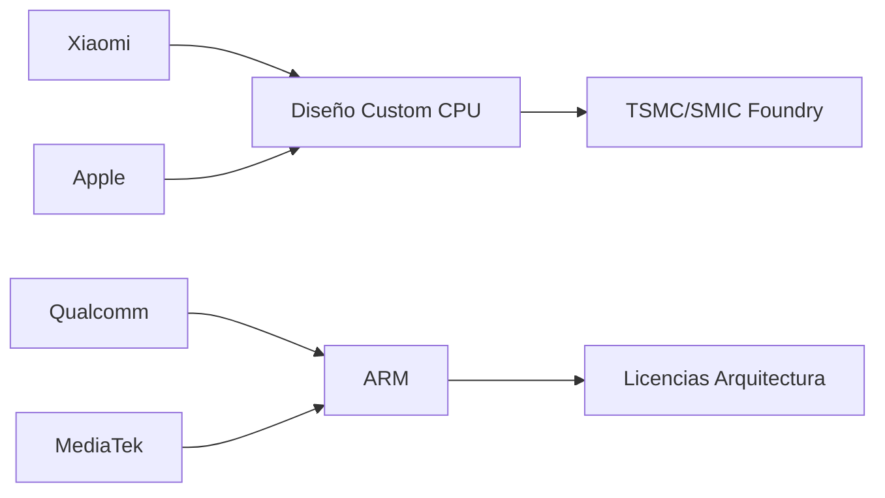

# Xiaomi rompe el techo de Apple: el chip propio que reescribe el mapa del silicio

Cuando Daniel Lemire, uno de los benchmarks más respetados del ecosistema open source, publicó que un procesador de Xiaomi iguala el rendimiento single-threaded de los núcleos de Apple y los supera ampliamente en multithread, no estábamos ante un titular más de marketing. Estábamos ante una grieta en una de las hegemonías tecnológicas más sólidas de la última década: la del silicio de Cupertino.

Desde el lanzamiento del M1 en noviembre de 2020, Apple ha ostentado una ventaja casi insultante en rendimiento por vatio. La compañía de Tim Cook ejecutó una de las transiciones arquitectónicas más exitosas de la historia de la computación: pasar de Intel a su propio silicio basado en ARM sin perder rendimiento, e incluso ganándolo de forma aplastante. Mientras tanto, Qualcomm, MediaTek y el resto del ecosistema Android vivían en una especie de dependencia crónica de diseños ARM de referencia, con eficiencias energéticas que apenas rascaban la superficie de lo que Apple conseguía en sus laboratorios de Cupertino.

## Lo que realmente dice la noticia

El dato central —publicado por Lemire en su cuenta de X y recogido por Hacker News— no es solo que un chip de Xiaomi alcance a Apple en single-threaded, una métrica donde el liderazgo de la compañía fundada por Jobs, Wozniak y Wayne parecía intocable. Lo verdaderamente disruptivo es que lo haga en multithread con márgenes significativos. Esto implica densidad de núcleos, eficiencia en el diseño del die y, sobre todo, capacidad de fabricarlo a escala.

## El contexto que los titulares ignoran

En primer lugar, la **erosión del modelo ARM como negocio puramente licenciante**. ARM cobra regalías por arquitectura, pero los diseños de referencia (Cortex) han sido durante años el camino fácil para Qualcomm y MediaTek. Cuando un actor como Xiaomi diseña núcleos custom de alta calidad, está diciendo implícitamente que el modelo "licenciar y copiar" tiene fecha de caducidad. SoftBank, dueño de ARM, debería tomar nota: su próxima salida a bolsa depende de que el mercado crea que ARM sigue siendo indispensable, y noticias como esta complican esa narrativa.

En segundo lugar, la **dinámica de concentración de capital en la industria de los chips**. Durante años hemos asistido a una consolidación feroz: Nvidia absorbió ARM (intentona fallida pero reveladora), AMD compró Xilinx y Pensando, Intel intentó devorar a Tower Semiconductor, y Broadcom se hizo con VMware. La tendencia es inequívoca: menos actores, más poder de fijación de precios. Que Xiaomi entre en liza con diseño propio de alto rendimiento es, paradójicamente, un movimiento contra-consolidación que podría redistribuir márgenes a lo largo de la cadena.

## ¿Dónde está la trampa?

Además, está la cuestión del **coste de oportunidad y capital**. Diseñar un núcleo CPU competitivo con Apple requiere equipos de cientos de ingenieros durante años, con salarios de mercado de entre 300.000 y 800.000 dólares anuales por cabeza. Esa es una apuesta que solo se justifica con volúmenes de decenas de millones de unidades al año. Xiaomi los tiene, pero a costa de canibalizar su propia dependencia de Qualcomm y MediaTek, lo que abre un frente frío con dos proveedores que durante años le han dado soporte técnico, modems y referencias de plataforma.

## Una reflexión sobre la próxima década del silicio

La pregunta incómoda para los analistas no es si Xiaomi puede igualar a Apple en un benchmark concreto, sino si el modelo abierto de la industria de semiconductores —basado en licencias ARM y foundries compartidas— puede sobrevivir cuando cada gran actor decide que su ventaja estratégica está en verticalizar el stack completo. Si la respuesta es no, estamos ante el fin de una era de interoperabilidad y ante el comienzo de jardines amurallados de silicio, cada uno con su propia política de acceso. Lo que viene después ya no será solo tecnología: será geopolítica compilada en lenguaje máquina.

