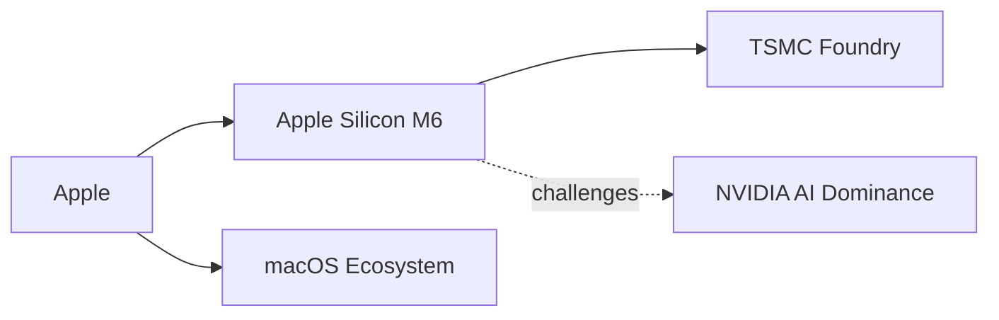

# Apple M6 y M5 Ultra: la jugada que consolida el poder del silicio propio

Cuando Apple presentó el M1 en noviembre de 2020, muchos analistas lo trataron como una curiosidad ingenieril: un chip ARM que, según se sospechaba, no podría sostener el ritmo de trabajo profesional. Cinco años después, el anuncio conjunto del M6 —nueva generación— y del M5 Ultra —tope de gama del ciclo previo— confirma algo que la compañía lleva tiempo demostrando en silencio. El control del silicio se ha convertido en la variable más decisiva de la computación contemporánea, y cada movimiento de Apple redefine los márgenes, las prioridades de inversión y hasta la geopolítica de toda la industria.

## Lo que el anuncio realmente significa

## La presión estructural sobre Intel, AMD y Qualcomm

Para Intel, la situación se ha vuelto estructuralmente difícil. La compañía apostó miles de millones en nodos de fabricación propios y en su giro hacia la foundry, una transición que no ha dado los resultados esperados. Su cuota en el mercado Mac es prácticamente cero, y en el ecosistema Windows compite con un rival nuevo: Qualcomm y su familia Snapdragon X, también basada en ARM.

Pero Qualcomm tiene una limitación que Apple no tiene: no controla el sistema operativo. Microsoft intentó replicar la jugada con los chips SQ1, SQ2 y los recientes Snapdragon X Elite, pero sigue dependiendo del roadmap de un socio. AMD, por su parte, conserva una posición fuerte en servidores y gaming, pero en el segmento de productividad premium y creación profesional su presencia es marginal. Apple no compite solo con chips: compite con un ecosistema cerrado, y ese es el verdadero foso.

## El verdadero campo de batalla: la computación de IA

Aquí la apuesta de Apple se vuelve más interesante y, para algunos rivales, más incómoda. Durante años, NVIDIA ha dominado el entrenamiento de modelos de IA con sus GPUs, sostenida por el ecosistema CUDA, que tardó más de una década en construirse. Pero el entrenamiento es solo una parte del ciclo. La inferencia —ejecutar modelos ya entrenados— representa la mayor parte del gasto operativo, y ahí la eficiencia energética del silicio de Apple resulta devastadoramente competitiva.

Al diseñar chips optimizados para cargas de inferencia en dispositivo, Apple erosiona una de las tesis centrales del mercado: que toda IA significativa debe pasar por la nube de NVIDIA. No es que NVIDIA vaya a desaparecer —su dominio en data centers sigue siendo casi absoluto—, pero la narrativa de "toda la IA corre en GPUs de NVIDIA" empieza a tener excepciones notables. Y el siguiente movimiento lógico de Apple, una mayor integración de modelos en el propio dispositivo, apunta directamente al corazón del negocio cloud de sus competidores.

## La concentración de capital como barrera de entrada

Diseñar un chip de esta categoría requiere inversiones que solo un puñado de empresas en el mundo puede sostener de forma sostenida: Apple, Google, Amazon, Microsoft, Meta y NVIDIA. Las economías de escala, los acuerdos plurianuales con TSMC y Samsung, y la capacidad de atraer a los mejores ingenieros del planeta son ventajas acumulativas que se refuerzan con cada ciclo.

El resultado es una industria de semiconductores que, alguna vez diversa, se está consolidando en una estructura oligopólica. Los diseñadores sin fábrica (fabless) y los fabricantes sin diseño (foundries) son interdependientes, pero quienes integran todo el stack —Apple es el caso más claro en consumo— capturan una proporción creciente del valor generado.

## El precedente histórico: integración sin apertura

## Lo que viene

