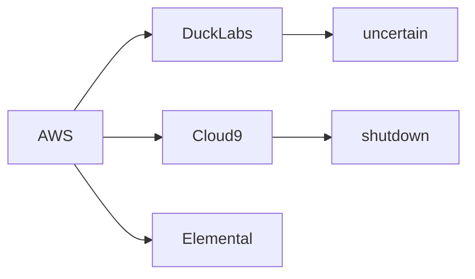

Amazon Web Services has confirmed the acquisition of DuckLabs, a developer infrastructure company whose team and tooling will be folded into the cloud giant's expanding portfolio. The announcement, dated August 26, 2026, was light on technical specifics but heavy on strategic implications. For Amazon, this is a familiar playbook: identify an emerging toolchain, acquire the team, and integrate.

The financial terms remain undisclosed, but the underlying logic is transparent. DuckLabs joins a growing list of companies that built something useful, attracted enterprise customers, and ultimately became more valuable to AWS as an acquisition than as an independent competitor. The pattern has become so consistent in cloud infrastructure that experienced operators now design their products with hyperscaler acquisition in mind.

## The AWS Acquisition Playbook

Amazon's cloud division has spent the last decade systematically absorbing companies that fill gaps in its platform. The 2015 acquisition of Elemental Technologies brought video encoding capabilities now embedded in AWS Media Services. The 2019 purchase of Cloud9, a popular cloud IDE, integrated development tooling directly into the AWS console. The same year, CloudEndure added disaster recovery to the migration portfolio. More recently, the 2021 acquisition of Wickr brought secure communications into AWS GovCloud.

Each acquisition follows a similar script: acquire a team, absorb the product, and either integrate it into AWS services or, more commonly, sunset the standalone version in favor of a rebranded in-house alternative. Customers who built workflows around the acquired tool face a choice: migrate to the AWS-native replacement, often gated behind new pricing tiers, or rebuild on something else. Either way, AWS retains the customer relationship and adds a new lock-in vector.

## The Hyperscaler Concentration Problem

When a hyperscaler acquires a smaller tool vendor, the effects ripple through the ecosystem. Competitors lose a potential acquisition target, partner, or simply a neutral option they could point customers toward. Independent developers lose a platform they could build on without fear of competing with their own vendor. And customers lose negotiating leverage, because every tool that moves inside AWS reduces the universe of alternatives not owned by their primary cloud provider.

The history of cloud M&A offers few encouraging precedents. Cloud9, acquired in 2019, had its standalone service shut down, with key features redistributed across other AWS products. Customers who relied on the original IDE had to migrate, often to AWS-native alternatives, whether they wanted to or not. Elemental's brand effectively disappeared into the larger AWS video stack. Wickr's enterprise features were absorbed, but the consumer product was discontinued.

## The Innovation Paradox

This is the innovation paradox at the heart of modern cloud computing: the same acquisitions that fuel capability growth also reduce market diversity. Every independent tool that joins AWS is one less company that can challenge AWS, partner with AWS competitors, or offer a genuinely alternative approach. The acquisitions that look like consolidation in the short term look like dependency in the long term.

## A Pattern Older Than the Cloud

To understand the current moment, it's worth remembering that this pattern is older than the cloud itself. The 1990s saw the rise of independent software vendors competing on relatively equal footing with platform owners. The 2000s brought the platform wars, with Microsoft, Google, and Apple establishing walled gardens that smaller developers had to navigate. The 2010s and 2020s have extended this dynamic into infrastructure.

Antitrust regulators have noticed, though their response has been cautious. The Federal Trade Commission's ongoing scrutiny of cloud market practices reflects growing concern, but the legal framework for addressing infrastructure consolidation remains underdeveloped. In Europe, the Digital Markets Act has begun to bite, but enforcement is slow, and the scope of what counts as "gatekeeper" infrastructure is still being defined through a series of contested decisions.

## What Customers Should Watch

For organizations evaluating their cloud strategy, the DuckLabs acquisition is a reminder to think carefully about dependencies. The convenience of a fully integrated toolchain comes with a hidden cost: lock-in. When your IDE, your monitoring, your database, your security tooling, and increasingly your developer productivity layer are all owned by the same company, the cost of switching providers becomes prohibitive, even if prices rise or service quality declines.

The practical advice isn't to avoid AWS, but to understand the trade-offs. Multi-cloud strategies remain complex and expensive, but they preserve optionality. Open-source alternatives, where they exist, offer a hedge against vendor consolidation. Contractual provisions that protect data portability and pricing can slow the drift toward full dependency. And architectural decisions made today about whether to use AWS-native services or portable abstractions will determine how much freedom organizations have in three to five years.

## The Bigger Picture

The DuckLabs deal is one acquisition among many, but it represents something larger: the continued normalization of infrastructure consolidation. Each individual purchase seems reasonable, even beneficial. The cumulative effect is an industry where three or four companies increasingly determine what technology gets built, how it gets built, and who gets to build it.

For developers, founders, and customers, the question isn't whether this trend will continue, but how to navigate a market where the most likely exit for a successful product is acquisition by a company many times its size. The answer, for now, seems to be: build something useful, hope the hyperscalers want it, and accept that independence may be a temporary state.

That's not necessarily a bad outcome for everyone involved. But it's worth understanding clearly. The cloud was supposed to be the great equalizer. Two decades in, it's looking more like a new form of concentrated power, with the same old rules dressed in new vocabulary. The only question left is whether the industry, and the regulators who oversee it, will notice before the next acquisition closes.

