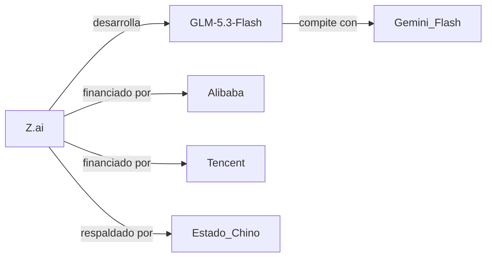

## La nueva frontera de la eficiencia

## El accionariado detrás del modelo

## El espejismo de la competencia abierta

Es decir, hablamos de una "apertura" que opera dentro de los parámetros del sistema tecnológico estadounidense. La paradoja es que Z.ai puede distribuir modelos gratuitos a developers en San Francisco, pero sigue dependiendo de chips H100 que viajan desde Taiwan para entrenar sus modelos. La autonomía tecnológica real —el santo grial de la política industrial china— sigue siendo una promesa, no un logro.

## La guerra de los "Flash"

El sufijo "Flash" no es casual. Google popularizó esta nomenclatura con Gemini Flash, y desde entonces se ha convertido en un código de la industria para designar modelos optimizados para inferencia rápida y bajo coste. GLM-5.3-Flash entra directamente en este segmento, compitiendo con Gemini Flash, GPT-4o-mini, Claude Haiku y los modelos pequeños de Mistral.

## Lecciones históricas y tendencias

## ¿Quién gana realmente?

Para los developers independientes, la proliferación de modelos eficientes es genuinamente beneficiosa: más competencia significa precios más bajos y mayor flexibilidad. Pero para el ecosistema en su conjunto, el lanzamiento de GLM-5.3-Flash consolida una dinámica preocupante: la IA se está convirtiendo en un oligopolio bipolar donde la alternativa a un duopolio (OpenAI/Anthropic) no es la descentralización, sino otro duopolio con sede en Beijing.

La pregunta incómoda es si la llamada "democratización" de la IA es realmente tal o si simplemente estamos presenciando una redistribución del poder entre dos bloques que comparten más similitudes de las que admiten: concentración de capital, dependencia de infraestructuras centralizadas y una agenda definida por inversionistas institucionales, no por comunidades de usuarios.

## Conclusión: una apertura que conviene mirar con lupa

La respuesta a esa pregunta determinará si la próxima década de inteligencia artificial será realmente distribuida o simplemente un monopolio compartido entre dos capitales.

---