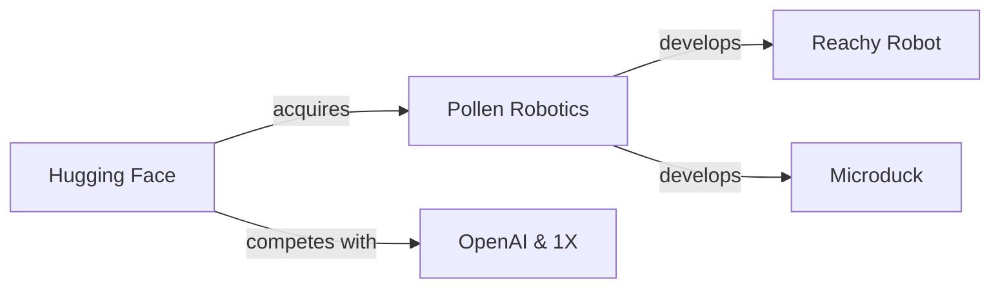

En un momento en que la robótica humanoide copa titulares con promesas de billones en valor de mercado, una pequeña empresa francesa lanza un robot del tamaño de un pato de goma. El contraste no podría ser más revelador.

Pollen Robotics, la compañía francesa detrás del conocido robot Reachy, ha presentado **Microduck**, un dispositivo que parece diseñado menos para conquistar fábricas y más para cuestionar hacia dónde se dirige realmente la industria robótica. Y la pregunta es oportuna, porque la propia Pollen acaba de ser absorbida por Hugging Face, el gigante del código abierto en inteligencia artificial.

## El contexto: una adquisición que reordena el tablero

Hugging Face entiende algo que muchos todavía no han interiorizado: en la próxima década, la batalla no será solo por los mejores modelos, sino por quién controla el *stack* completo — datos, modelos, plataformas, y eventualmente, hardware. Poseer un robot open source como Reachy les da algo que ningún acuerdo de distribución podría comprar: legitimidad técnica, narrativa unificada y un terreno de pruebas físico para sus modelos.

## El ecosistema que Microduck hereda

Para entender por qué Microduck importa, hay que mirar a su alrededor. El panorama de la robótica humanoide está experimentando una concentración de capital sin precedentes:

- **Figure AI** cerró rondas por cientos de millones de dólares con una valoración cercana a los 40 mil millones, respaldada por Microsoft, OpenAI y Nvidia.
- **Apptronik** recibió inversión de Google, en una jugada que anticipa la integración entre Gemini y robots industriales.
- **1X Technologies**, respaldada por OpenAI, persigue el robot doméstico definitivo.
- **Boston Dynamics**, tras años de vida nómada, encontró refugio bajo el paraguas de Hyundai, con toda la disciplina coreana para manufactura que eso implica.
- **Tesla** continúa con Optimus, en un movimiento que convierte a Elon Musk en un actor dual: proveedor de IA (xAI) y de cuerpos físicos.

En este contexto, un robot pequeño y barato de una empresa francesa absorbida por una plataforma de IA no es una curiosidad. Es una declaración de principios. Es, también, una jugada de mercado perfectamente calculada.

## Open source como estrategia, no como ideología

El código abierto es, en el caso de Pollen, un mecanismo de **distribución y legitimación**. Permite que investigadores, makers y desarrolladores creen aplicaciones que la propia empresa nunca tendría capacidad de producir internamente. Cuando Hugging Face compra Pollen, no compra solo hardware: compra años de contribuciones comunitarias, cientos de proyectos derivados y un repositorio de casos de uso reales que validan su apuesta.

## La miniaturización como tendencia estructural

Microduck, por su escala, se inscribe en otra tendencia poderosa: la miniaturización. La robótica industrial tradicional (ABB, KUKA, FANUC) se mide en metros y toneladas. Los cobots de Universal Robots redujeron eso a brazos articulados de mesa. Ahora, plataformas como Microduck apuntan a dispositivos del tamaño de un juguete, pero con capacidad de cómputo embebido suficiente para ejecutar modelos de IA localmente.

Esta miniaturización tiene implicaciones económicas profundas que rara vez se discuten:

- Reduce los costes de fabricación y distribución, democratizando el acceso.
- Permite la entrada a mercados educativos y de investigación con presupuestos limitados.
- Desplaza el valor desde la mecánica de precisión (dominada por Alemania y Japón) hacia el software y la integración de IA (dominada por Silicon Valley).
- Crea un nuevo segmento de mercado donde la competencia no es Boston Dynamics, sino Raspberry Pi y Arduino.

## Lo que el capital ve en Pollen

La pregunta incómoda que pocos analistas están planteando es: ¿qué vio Hugging Face en Pollen que justifique la adquisición? Hay tres respuestas posibles, y probablemente las tres son ciertas a la vez:

1. **Defensa competitiva**: si OpenAI tiene a 1X y Google a Apptronik, Hugging Face necesita su propia apuesta física para no quedar fuera del mercado de *embodied AI*.

2. **Plataforma, no producto**: Reachy y Microduck no se venderán millones de unidades. Su valor es ser el "Android de la robótica", el sistema sobre el cual otros construyan.

3. **Narrativa**: en un mercado saturado de promesas de humanoides que cambiarán el mundo, un robot francés, abierto y simpático ofrece una historia diferente. Y las historias mueven dinero en las rondas de inversión.

## Reflexión final

Microduck es, en muchos sentidos, un síntoma. Nos dice que la robótica ha dejado de ser un sector industrial puro para convertirse en un campo de batalla donde se cruzan modelos de negocio, comunidades de desarrolladores y estrategias de plataformas.

El riesgo —y aquí está la reflexión que invito a hacer al lector— es que la concentración que estamos viendo en IA de propósito general, donde tres o cuatro empresas controlan la frontera tecnológica, se reproduzca exactamente igual en robótica. Si Hugging Face, Google, OpenAI y Tesla terminan definiendo también los estándares de los robots físicos, el *open source* que Pollen defiende podría convertirse en una categoría de marketing más que en una estructura de poder alternativa.

HF[Hugging Face] -->|acquires| Pollen[Pollen Robotics]
Pollen -->|develops| Reachy[Reachy Robot]
Pollen -->|develops| Microduck[Microduck]
HF -->|competes with| OpenAI[OpenAI & 1X]

