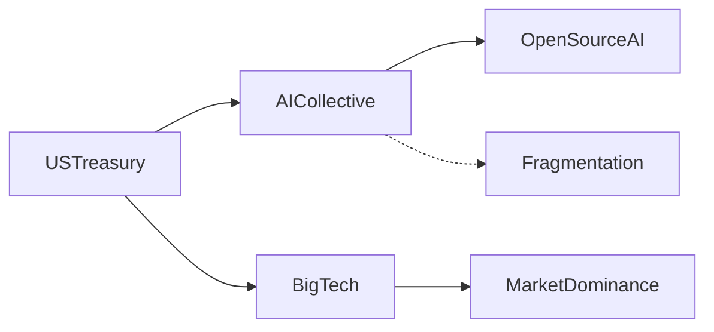

# Sanciones de EE.UU. al A/I Collective: ¿guerra fría tecnológica o proteccionismo disfrazado?

La reciente decisión del Departamento del Tesoro de Estados Unidos de incluir al **A/I Collective** en su lista de entidades sancionadas marca un punto de inflexión en la geopolítica tecnológica. Pero más allá del titular, lo que realmente importa es lo que esta medida revela sobre las nuevas reglas del juego: la tecnología ya no es un sector económico más, es el campo de batalla principal de las potencias del siglo XXI.

## El nuevo mapa del poder tecnológico

El A/I Collective —una agrupación de investigadores, laboratorios y empresas de inteligencia artificial que había construido en los últimos años una alternativa descentralizada a los modelos fundacionales de OpenAI, Google DeepMind y Anthropic— se había convertido en uno de los pocos contrapesos reales a la concentración del sector. Su apuesta por el *open source*, su estructura cooperativa y su gobernanza distribuida habían permitido que universidades, startups y países enteros accedieran a tecnología de frontera sin depender exclusivamente de Silicon Valley.

Ahora, con las sanciones, ese experimento llega a un abrupto final. O al menos, eso es lo que pretende Washington.

## Las lecciones de Huawei

La pregunta es si el A/I Collective seguirá un camino similar. Las sanciones pueden actuar como catalizador de autonomía tecnológica o pueden estrangular un proyecto antes de que madure. La historia sugiere que el resultado depende menos del proyecto sancionado y más de si existe un Estado-nación dispuesto a respaldarlo con capital paciente y voluntad política de largo plazo.

## Concentración de capital: los verdaderos ganadores

Mientras el A/I Collective enfrenta restricciones, las grandes tecnológicas estadounidenses consolidan su posición de forma silenciosa. **NVIDIA**, que ya controla aproximadamente el 80% del mercado de GPUs para entrenamiento de IA, ve cómo sus competidores internacionales pierden acceso a financiamiento y a componentes críticos de la cadena de suministro. **Microsoft, Alphabet, Amazon y Meta** —los cuatro hyperscalers que dominan la infraestructura cloud— se benefician indirectamente de cualquier medida que debilite a la competencia externa.

Es un patrón que se repite con preocupante regularidad: las restricciones antimonopolio prometidas por las administraciones recientes han sido tibias, mientras que las sanciones internacionales han sido agresivas y expeditas. El resultado es paradójico. Se libera a las big tech de presión regulatoria doméstica al mismo tiempo que se estrangula a cualquier competidor internacional con capacidad tecnológica relevante.

## ¿Qué viene después?

Para el ecosistema europeo y latinoamericano, las sanciones al A/I Collective envían una señal preocupante. Si Estados Unidos está dispuesto a sancionar a una agrupación que defiende explícitamente los principios de la inteligencia artificial abierta y distribuida, ¿qué impide que tome medidas similares contra **Mistral AI**, contra **Stability AI** o contra cualquier iniciativa que no se alinee con sus intereses estratégicos?

La respuesta europea, hasta ahora, ha sido tibiamente retórica. La **AI Act** de la Unión Europea establece marcos regulatorios detallados, pero no genera infraestructura propia ni financia modelos de frontera. Francia, Alemania y el Reino Unido hablan de "soberanía digital", pero siguen dependiendo masivamente de infraestructura cloud estadounidense y de chips diseñados en California y fabricados en Taiwán.

Mientras tanto, China continúa su propia estrategia de autosuficiencia. **Baidu, Alibaba y Tencent** han desarrollado modelos competitivos, y la inversión estatal en semiconductores no muestra señales de desaceleración. Las sanciones, paradójicamente, refuerzan la determinación china de construir un ecosistema completamente independiente, lo que a medio plazo podría crear un mundo con dos —o tres— estándares de IA incompatibles entre sí.

## Reflexión final

Las sanciones al A/I Collective no son solo una decisión de política exterior. Son un indicador de hacia dónde se dirige el orden tecnológico global: un mundo donde la inteligencia artificial se fragmentará en esferas de influencia, donde el acceso a chips avanzados determinará el poder económico de las naciones, y donde la **innovación abierta** se verá cada vez más constreñida por fronteras geopolíticas.

Para los profesionales del sector, el mensaje es claro: la neutralidad tecnológica ya no existe. Cada línea de código, cada modelo entrenado, cada chip vendido tiene una dimensión geopolítica explícita. Las empresas que no entiendan esto —o que pretendan mantenerse neutrales— descubrirán que esa neutralidad tiene un costo cada vez más alto, y que el precio lo pagarán quienes lleguen tarde a alinearse con alguno de los dos bandos.

