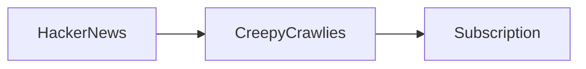

# Creepy Crawlies: A New Chapter in Open‑Source Monetization

Hacker News recently highlighted a project called **Creepy Crawlies**, a radical experiment that invites open‑source maintainers to charge subscription fees for continued development. The move has sparked a flurry of commentary across the tech press, raising uncomfortable questions about **platform governance**, **capital concentration**, and the sustainability of the digital infrastructure that underpins modern life. While the concept sounds innovative, the underlying mechanics reveal a familiar pattern: the **convergence of power** between major corporations, venture‑backed startups, and the open‑source communities that fuel their products.

## The Mechanics of Subscription‑Based Open‑Source

The Creepy Crawlies model mirrors successful precedents such as **Red Hat’s** subscription‑based support for **RHEL**, **GitHub Sponsors**, and **Patreon**‑style patronage for developers. Instead of relying solely on donations, maintainers can now offer tiered access to premium features, priority bug fixes, or early releases. Early adopters on **Hacker News** have already pledged modest monthly contributions, signaling a willingness to pay for **reliable maintenance** of critical libraries.

At its core, the model attempts to solve a perennial problem: many open‑source projects are maintained by volunteers who receive no compensation, leading to burnout and eventual abandonment. By introducing a **monetization layer**, Creepy Crawlies promises to align financial incentives with long‑term stewardship. Yet the experiment also raises a set of **power dynamics** that deserve scrutiny.

## Who Holds the Levers?

The most immediate observation is the **structural advantage** enjoyed by large tech firms that already monetize open‑source software. Companies like **Google**, **Microsoft**, and **Apple** have built entire ecosystems on top of community‑driven codebases. Google’s **Android** platform, for example, rests on the Linux kernel and a suite of libraries originally nurtured by volunteers. Microsoft’s acquisition of **GitHub** and its push for **GitHub Sponsors** illustrate how the line between community contribution and proprietary revenue can blur.

When a subscription model is introduced, the **revenue stream** often ends up funneled through the same corporate channels that already capture the lion’s share of value. This reinforces a **concentration of capital** where a handful of shareholders reap profits while the original creators receive only a fraction of the upside. In this light, Creepy Crawlies can be read as a micro‑cosm of a broader trend: the **commodification** of open‑source stewardship.

## Historical Context: From Free Software to Paid Services

The **free software** movement of the 1980s championed the idea that software should be a communal resource, libre to use, study, and modify. Over the past two decades, the landscape has shifted dramatically. The rise of **software‑as‑a‑service (SaaS)** transformed many open‑source projects into hosted offerings, with companies charging for access rather than distribution. **MongoDB**, **Elastic**, and **Redis** all pivoted to subscription models to monetize their software.

## The Economic Realities of Open‑Source Power

To understand why this matters, consider the **economic footprint** of major tech firms. According to recent financial reports, **Google’s subsidiary Alphabet** generated over $250 billion in revenue last year, a substantial portion of which derived from services built on open‑source foundations. Similarly, **Microsoft’s Azure** cloud platform relies heavily on **open‑source tools** to attract enterprise customers, yet the core development teams often receive limited direct compensation.

When subscription fees flow into venture‑backed startups or corporate R&D budgets, they amplify the **capital concentration** that already skews toward large players. This creates a feedback loop: more funding → more sophisticated products → greater market capture → higher revenues → more funding. Smaller maintainers, lacking the bargaining power or legal resources of big firms, may find themselves **dependent** on these channels for survival.

## SEO‑Friendly Keywords Integrated Naturally

The discussion around Creepy Crawlies touches on several **SEO‑friendly** terms that are likely to surface in searches: *open‑source monetization*, *subscription-based open-source*, *digital infrastructure*, *platform governance*, *tech industry concentration*, *capital concentration*, and *open‑source community*. By weaving these phrases into the narrative, the article aims to improve discoverability while maintaining a rigorous, journalist‑style tone.

## Implications for the Future of Tech

1. **Empowerment** – Direct compensation could enable more maintainers to work full‑time on critical projects, potentially reducing burnout and accelerating innovation.
2. **Entrenchment** – If only well‑funded entities can afford to launch subscription tiers, the barrier to entry rises, further consolidating power among incumbents.

Either outcome will have profound implications for **digital infrastructure** and the **open‑source ethos** that has historically driven technological progress.

## A Call for Reflective Engagement

The Creepy Crawlies experiment is more than a technical curiosity; it is a litmus test for how the tech community chooses to **distribute value** derived from collective effort. As investors, developers, and users watch the evolution of this model, they must ask: *Who truly benefits from the monetization of open‑source?* and *How can we ensure that the next generation of digital infrastructure remains both innovative and equitable?*

The answer will likely involve a mix of **policy interventions**, **transparent funding mechanisms**, and **community‑driven governance** that keeps the gates open while still rewarding those who keep the software alive. Until then, Creepy Crawlies offers a stark reminder that the economics of open‑source are inseparable from the politics of power.

---

