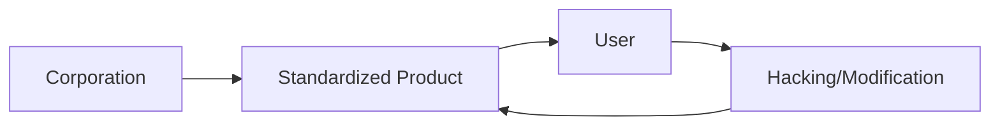

El término "hacking" ha migrado, en las últimas décadas, desde los laboratorios del MIT y las subculturas de computación hacia el salón de nuestras casas. Recientemente, la tendencia del *IKEA hacking* —el acto de modificar, expandir o transformar muebles estándar de la firma sueca— ha ganado tracción en foros como HackerNews. A primera vista, parece un pasatiempo inofensivo de bricolaje o una búsqueda de estética personalizada. Sin embargo, desde una perspectiva de análisis tecnológico e industrial, este fenómeno es un síntoma crítico de nuestra relación actual con el consumo y la propiedad.

Para entender el *IKEA hacking*, debemos entender primero el modelo de negocio de IKEA. No se trata solo de vender muebles; se trata de la democratización del diseño a través de la optimización extrema de la cadena de suministro y la externalización del trabajo (el montaje) al consumidor final. Este modelo es el espejo físico de lo que empresas como Apple o Microsoft han implementado en el software: la creación de ecosistemas cerrados diseñados para una eficiencia máxima de capital, donde el usuario es un operador, no un dueño.

**La ilusión de la propiedad y la concentración de capital**

En la industria tecnológica, hemos transitado de la propiedad del hardware y el software hacia el modelo de "Suscripción como Servicio" (SaaS). Cuando compramos un dispositivo moderno, a menudo no poseemos el código que lo hace funcionar; simplemente pagamos por una licencia de uso revocable. El mueble de IKEA, aunque es un objeto físico, opera bajo una lógica similar de "estandarización forzada". Al reducir la diversidad de materiales y simplificar las estructuras para maximizar la logística, IKEA concentra el capital eliminando la necesidad de artesanía local y personalizada.

El *hacking* de estos muebles es, en esencia, un acto de insurrección contra la homogenización. Cuando un usuario decide perforar un tablero de partículas para añadirle una funcionalidad que la empresa no previó, está reclamando la soberanía sobre el objeto. Es el equivalente físico al *jailbreaking* de un iPhone o a la instalación de una distribución de Linux en una laptop diseñada para Windows. Es el intento del individuo de romper la relación de poder donde el fabricante decide qué es el producto y cómo debe ser usado.

**Tendencias históricas: Del Open Source al Derecho a Reparar**

El *IKEA hacking* conecta directamente con el movimiento contemporáneo del *Right to Repair* (Derecho a Reparar). Empresas como Framework están intentando revertir esta tendencia en el hardware, creando laptops modulares. Pero la corriente dominante sigue siendo la de la obsolescencia programada. IKEA, al utilizar materiales como el aglomerado y el papel prensado, crea productos con una vida útil finita. El hacking, por lo tanto, no es solo estética; es una estrategia de supervivencia económica. Al mejorar la calidad de un mueble barato mediante modificaciones, el usuario lucha contra la inercia del "comprar-tirar-comprar".

**La paradoja del capital: El hacking como marketing involuntario**

La industria tecnológica ha aprendido que la personalización es un valor deseable, pero solo si ocurre dentro de los márgenes que no amenacen el flujo de ingresos. El *IKEA hacking* es permitido porque no compite con la escala de producción de la empresa. Pero si el hacking se convirtiera en un estándar de durabilidad y autosuficiencia, la estructura de capital de la empresa colapsaría.

**Conclusión: ¿Dueños o arrendatarios de nuestra realidad?**

El *hacking*, en todas sus formas, es la herramienta para recuperar la agencia. Cada vez que alguien transforma un mueble estándar en algo único y duradero, o que instala un software libre en un hardware propietario, está cuestionando la hegemonía del capital concentrado. La pregunta que debemos hacernos es: ¿queremos vivir en un mundo de soluciones prefabricadas y efímeras, o estamos dispuestos a asumir el trabajo y la responsabilidad de construir y mantener nuestras propias herramientas?

