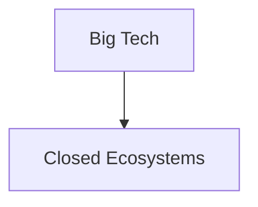

La noticia parece trivial: un entusiasta del DIY (do-it-yourself) documenta cómo transformar muebles de IKEA en piezas personalizadas y funcionales. Sin embargo, para quien analiza la tecnología no como un conjunto de gadgets, sino como una estructura de poder, el "IKEA hacking" es una metáfora perfecta de la tensión actual entre el usuario y el proveedor.

Hacer *hacking* a un mueble de IKEA es, en esencia, un acto de reapropiación. IKEA basa su imperio en la democratización del diseño a través de la estandarización extrema y la optimización de la logística. Al vender productos diseñados para ser ensamblados por el consumidor, la empresa trasladó parte del coste de producción al hogar. Pero el hacker va un paso más allá: toma ese objeto estandarizado y lo subvierte, rompiendo la intención original del diseñador para adaptarlo a una necesidad real y específica.

### La ilusión de la propiedad y la arquitectura cerrada

Hoy, empresas como **Apple** y **Microsoft** han desplazado este paradigma hacia el "capitalismo de plataforma". Ya no compramos productos, sino que alquilamos el acceso a ecosistemas. Cuando Apple suelda la memoria RAM a la placa base de sus MacBook o bloquea la sustitución de baterías mediante software (el llamado *parts pairing*), está eliminando la capacidad de "hackear" el objeto. Están convirtiendo el hardware en un "mueble de IKEA" que no puedes modificar, donde el manual de instrucciones es un contrato de licencia que prohíbe la alteración.

La concentración de capital en manos de unas pocas corporaciones ha permitido que estas dicten no solo qué consumimos, sino cómo interactuamos con la materia. La estructura de poder es clara: la empresa posee la propiedad intelectual y el control del ciclo de vida del producto, mientras que el usuario es un mero operador temporal.

### El eco del Software Libre y el Derecho a Reparar

Actualmente, vemos una convergencia entre el *hacking* doméstico y el movimiento del **Derecho a Reparar (Right to Repair)**. Empresas como **John Deere** han sido criticadas ferozmente por bloquear el acceso al software de sus tractores, impidiendo que los agricultores reparen sus propias máquinas. Aquí, la dinámica económica es perversa: el agricultor posee la máquina físicamente, pero el capital intelectual reside en una nube controlada por la corporación, obligando al usuario a pagar suscripciones y servicios técnicos oficiales.

Es la misma lógica que IKEA aplica a gran escala, pero sin la benevolencia de permitir que el usuario use un taladro para cambiar una balda. Cuando el hardware se vuelve cerrado, el objeto deja de ser una herramienta para convertirse en un mecanismo de extracción de rentas.

### De la obsolescencia programada a la soberanía material

Si trasladamos esto a la tecnología, la solución no pasa solo por leyes de garantías más largas, sino por un cambio en la arquitectura de poder. Necesamos hardware abierto, estándares interoperables y un diseño que invite a la modificación. La tendencia actual de "servitización" (convertir todo en un servicio mensual) es el intento final de las grandes tecnológicas por eliminar cualquier posibilidad de hacking. Si no posees el objeto, no puedes hackearlo.

### Conclusión: El acto político de modificar

El hacking de muebles de IKEA, aunque parezca un pasatiempo decorativo, es un recordatorio de que la creatividad humana siempre buscará grietas en los sistemas cerrados. Cada vez que alguien modifica un mueble, que un programador crea un *fork* de un software propietario o que un técnico repara un teléfono bloqueado, se está librando una batalla por la autonomía.

La pregunta que debemos hacernos es: ¿queremos vivir en un mundo donde somos simples suscriptores de nuestra propia existencia material, o queremos recuperar la capacidad de abrir, entender y transformar las herramientas que definen nuestra vida? La soberanía tecnológica comienza con la voluntad de no aceptar el manual de instrucciones como la única verdad posible.

