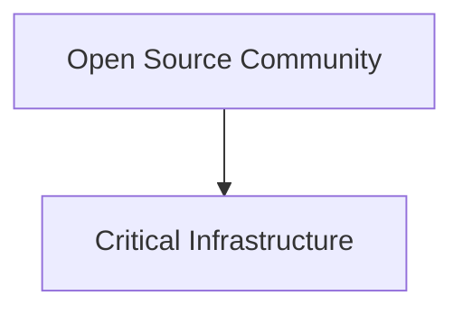

La reciente aparición de **"Creepy Crawlies"** en los círculos de HackerNews no es solo una curiosidad técnica sobre la gestión de dependencias o la limpieza de código en el kernel. Para el observador atento, es un síntoma de una patología mucho más profunda que afecta a la industria tecnológica global: la fragilidad de nuestra infraestructura digital y la peligrosa concentración de poder en manos de unas pocas corporaciones.

Históricamente, el movimiento del software libre y el código abierto (OSS) se fundó sobre la premisa de la descentralización. La idea era simple pero revolucionaria: el código debe ser un bien común, mantenido por una comunidad global, fuera del alcance de los intereses comerciales restrictivos. Sin embargo, si analizamos la trayectoria desde la era de GNU hasta la actualidad, vemos que hemos transitado desde una utopía colaborativa hacia un modelo de "colonialismo digital".

### La paradoja de la dependencia gratuita

El proyecto Creepy Crawlies pone el dedo en la llaga sobre un problema sistémico: el software moderno no se escribe, se ensambla. Dependemos de miles de pequeñas librerías y módulos mantenidos, a menudo, por voluntarios anónimos en su tiempo libre. Aquí es donde entra la dinámica económica real.

Empresas como **Microsoft, Google y Amazon (AWS)** han construido imperios multimillonarios sobre los hombros de este trabajo no remunerado. El modelo de negocio es cínicamente eficiente: utilizan el código abierto para reducir sus costos de I+D y acelerar el despliegue de sus servicios en la nube. Cuando una herramienta de código abierto se vuelve indispensable, estas corporaciones no necesariamente contribuyen a su sostenibilidad financiera, sino que la "absorben" mediante la creación de capas propietarias encima de ella.

### Relaciones de poder y la "Captura del Estándar"

Cuando una empresa como **Google** impulsa un proyecto o una arquitectura, no lo hace por altruismo. Lo hace para establecer el estándar. Quien define el estándar define las reglas del juego. Si el mundo entero adopta una tecnología que es "abierta" pero cuya hoja de ruta (roadmap) está dictada por los intereses de una sola empresa, el concepto de "libre" se vuelve puramente semántico.

El riesgo que sugiere la problemática de los "bichos" o dependencias no controladas es que estamos construyendo rascacielos digitales sobre cimientos de arena. Si el mantenimiento de una pieza crítica de infraestructura depende de un desarrollador en Nebraska que no cobra un centavo, mientras que **AWS** factura miles de millones facilitando el acceso a esa pieza, estamos ante una falla de mercado masiva y una transferencia de valor obscena.

### El retorno a la fragilidad

El análisis crítico nos obliga a preguntarnos: ¿estamos realmente innovando o simplemente optimizando la extracción de rentas? La tendencia actual es mover todo hacia la nube (SaaS), lo que desplaza el control del usuario final y del desarrollador hacia el proveedor de infraestructura. 

En este escenario, el código abierto se convierte en el "departamento de mantenimiento gratuito" de Big Tech. Las empresas proporcionan el capital para el marketing y la distribución, pero el riesgo técnico y el trabajo base recaen en una comunidad que se cree autónoma, pero que en realidad opera dentro de los límites establecidos por los propietarios de los servidores y las plataformas de despliegue.

### Reflexión final: Hacia una economía del software sostenible

La pregunta no es si el código es abierto o cerrado, sino quién posee los medios de producción y distribución de ese código. Mientras la respuesta sea "tres empresas en Seattle y Mountain View", el software libre seguirá siendo un huésped en una casa que no le pertenece.

***

