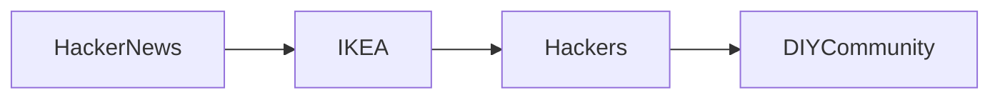

# Hackeo de muebles IKEA: DIY Rebellion and Corporate Power Dynamics

Los recientes auges de proyectos de "hackeo de muebles IKEA" han pasado de blogs de aficionados a la cobertura tecnológica mainstream. Las comunidades en foros y GitHub están reconfigurando estanterías, armarios y gabinetes de estilo flat‑pack en clústers de cómputo funcionales, servidores domésticos y estaciones de trabajo modulares. Estas modificaciones no son solo decorativas; exponen una colisión entre un gigante minorista global y una cultura maker descentralizada que busca recuperar la agencia sobre la tecnología.

## De la Estantería al Rack del Servidor

Uno de los ejemplos más visibles es la conversión de un libro de IKEA BILLY en un rack de servidor de 19‑pulgadas. Al perforar agujeros precisos e instalar soportes de montaje en riel, los aficionados pueden montar equipos de estilo 1U dentro de los paneles blancos familiares. El resultado es un servidor de bajo costo y aestheticamente neutro que encaja perfectamente en un entorno de salón. Transformaciones similares incluyen convertir un cubo IKEA KALLAX en un centro de medios basado en Raspberry Pi o reconvertir un dresser IKEA MALM en una estación de trabajo DIY con fuentes de alimentación y ventiladores integrados.

Estos proyectos prosperan en ecosistemas de hardware de código abierto. Plataformas como Arduino, ESP32 y el movimiento maker más amplio ofrecen el firmware y los esquemas que permiten la integración del hardware. Los hackers comparten esquemas, archivos CAD y guías paso a paso, creando un conocimiento abierto que es accesible públicamente. Este modelo colaborativo refleja la era temprana de los PC, cuando los entusiastas intercambiaban ajustes de BIOS y modificaciones de hardware en grupos de usuarios, acelerando la innovación fuera de los laboratorios corporativos.

## Poder Corporativo y Concentración de Mercado

El modelo de negocio de IKEA se basa en una escala masiva, integración vertical y una cadena de suministro estrechamente controlada. La empresa posee sus patentes de diseño, fabrica en regiones de bajo costo y fija precios a través de una red global de tiendas franquiciadas. Al desafiar abiertamente la utilidad de estos productos, los hackers exponen cómo el poder corporativo puede ser tanto un motor de adopción masiva como un cuello de botella para la reutilización. Cuando un solo minorista controla los parámetros estéticos y funcionales de millones de unidades, cualquier intento de subvertir esos parámetros se convierte en un acto político.

## Ecos de la Historia Tecnológica

El fenómeno de reutilizar objetos de producción masiva no es nuevo. En los años 70, los aficionados abrieron computadoras caseras tempranas como el Apple II y el Commodore 64 para cambiar chips, añadir periféricos y ejecutar firmware personalizado. Esos actos sentaron las bases del movimiento de software de código abierto y, más adelante, de la cultura maker moderna. De manera similar, los hackers de los 90 transformaron cartuchos de Nintendo en dispositivos de almacenamiento portátil temprano, y los entusiastas reutilizaron hardware Atari para proyectos embebidos. Cada ola demostró que el progreso tecnológico a menudo surge de los márgenes, donde los usuarios reclaman el control sobre artefactos diseñados para el consumo y no para la creación.

## Estudios de Caso y Dinámicas Comunitarias

Un estudio de caso concreto involucra el cubo IKEA KALLAX, que se ha convertido en una carcasa de facto para soluciones DIY de Red‑Attached Storage (NAS). Los usuarios instalan placas Raspberry Pi o NUC Intel, montan discos duros en soportes personalizados y ejecutan servicios de intercambio de archivos de código abierto. La documentación colectiva de la comunidad ha producido un estándar de facto que rivaliza con los electrodomésticos NAS propietarios en flexibilidad, mientras cuesta una fracción del precio.

Otro ejemplo notable es la transformación de una silla IKEA ADILS en una estación de trabajo portátil equipada con una bandeja plegable y regletas de corriente integradas. El proyecto se lanzó bajo una licencia Creative Commons, invitando a otros a iterar el diseño. Este enfoque de licencia abierta difumina la línea entre los activos corporativos y la propiedad intelectual generada por la comunidad, cuestionando nociones tradicionales de posesión.

## Implicaciones Económicas y Tendencias Futuras

No obstante, el impacto sigue siendo modesto en comparación con la escala de las operaciones de IKEA. La compañía continúa dominando el segmento de muebles de mercado masivo, y su capital de marca ofrece un margen de protección frente a cambios de consumo hacia la tecnología reutilizada. Aún así, la visibilidad de estos hacks sinaliza a inversores y responsables políticos que las expectativas de los consumidores están evolucionando hacia la personalización y la sostenibilidad, presiones que podrían remodelar las estrategias corporativas a largo plazo.

## Empoderamiento Social y Fragmentación

Más allá de lo económico, la cultura del hacking fomenta un sentido de empoderamiento. Las personas adquieren habilidades tangibles en electrónica, ingeniería mecánica e integración de software, conocimientos que antes estaban confinados a profesiones especializadas. Esta democratización se alinea con movimientos más amplios que abogan por la alfabetización digital y la educación maker. Sin embargo, la comunidad también enfrenta fragmentación: diferentes niveles de competencia técnica pueden crear silos, y la dependencia de firmware propietario o componentes de código cerrado puede limitar la verdadera apertura.

## Conclusión

La ola de "hackeo de muebles IKEA" es más que una novedad; es una lente a través de la cual examinar cómo poder, capital y tecnología se intersectan en la era moderna. Al convertir los flat‑packs de producción masiva en plataformas para la innovación de código abierto, los hackers exponen la fragilidad del control corporativo y insinúan modelos alternativos de producción y consumo. A medida que estos proyectos se vuelven más sofisticados, pueden seguir erosionando los límites entre consumidor y creador, invitándonos a todos a reconsiderar quién posee realmente los objetos que llenan nuestras vidas cotidianas.