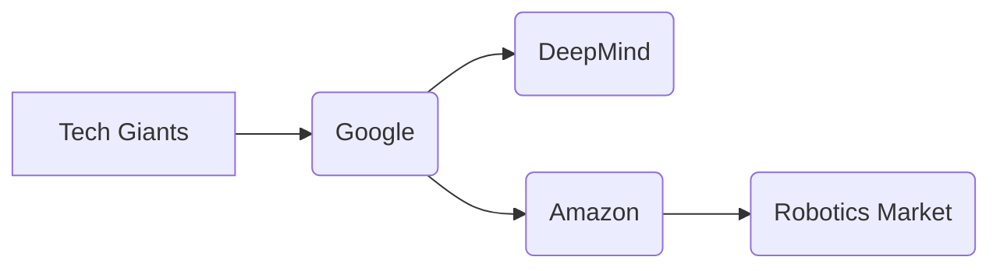

Creepy Crawlies is not just a whimsical term; it refers to an exciting new field in AI focused on developing "autonomous agents" capable of complex, often physically demanding tasks. These robots will interact with the physical world around them and perform tasks such as cleaning, maintenance, exploration, or even surgery in increasingly specialized and diverse industries like manufacturing, healthcare, and construction.  

However, this technological revolution isn't unfolding smoothly. Behind these innovative "creepy crawlies" are a complex network of tech giants wielding significant influence over the field. While companies like Google (DeepMind) and Amazon (Astro) are making considerable strides in AI research, they face increasing competition from other players with their own unique approaches.

On the other side of the spectrum, Amazon has been quietly developing its own fleet of robotic assistants. The "Astro" robot is designed to assist with household tasks and provide companionship, showcasing Amazon's ambition in the home automation market. This move highlights their desire to expand into a new frontier - not just as a digital retail giant but also as a provider of physical services.

It's crucial that policymakers and individuals alike understand this evolving paradigm shift. Investing in open-source platforms, promoting ethical considerations, and fostering collaboration between tech companies and research institutions are vital steps to ensure a future where "creepy crawlies" empower humanity and not simply serve the interests of established players.

