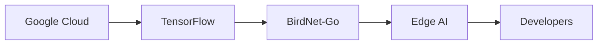

# Convertir una cámara de seguridad en un motor de identificación de aves

Cuando instalé por primera vez una modesta cámara de seguridad de 1080p en el patio de mi jardín, esperaba solo un disuasivo contra ocasionales mapaches. En cambio, el dispositivo se convirtió en el eje de un proyecto inesperado: un sistema autónomo de identificación de aves impulsado por IA de código abierto. Al reutilizar hardware económico y combinar modelos libres, construí una línea de procesamiento que escanea continuamente el cielo, captura cuadros y clasifica a cada visitante emplumado en tiempo real.

La base técnica del sistema se apoya en **BirdNET‑Go**, un motor de inferencia de código abierto que funciona en dispositivos perimetrales modestos. A diferencia de soluciones solo en la nube, BirdNET‑Go se ejecuta completamente en la GPU del dispositivo, entregando predicciones en milisegundos sin enviar video a un centro de datos remoto. Esta ejecución local no solo preserva la privacidad —no sale metraje sin procesar de mi red—, sino que también evita las penalizaciones de latencia que afectan a muchos servicios de vigilancia “inteligentes”.

## La economía de la implementación de Edge‑AI

Aunque el costo del hardware fue inferior a 70 USD, el verdadero gasto reside en el ecosistema circundante. **Los proveedores de nube** (Amazon Web Services, Microsoft Azure, Google Cloud) dominan la capa de infraestructura, ofreciendo servicios gestionados para entrenamiento de modelos, etiquetado de datos y computación escalable. Sus modelos de precios incentivan la carga continua de datos, reforzando un ciclo de retroalimentación donde grandes volúmenes de datos se convierten en materia prima para modelos cada vez más refinados.

Este dinámico ilustra un patrón más amplio de **concentración de capital** en la cadena de suministro de IA. Fondos de capital de riesgo inyectan miles de millones en empresas como **Google** (TensorFlow, Google Cloud), **Microsoft** (Azure AI) y **Meta** (PyTorch), moldeando las prioridades de desarrollo de proyectos de código abierto. Aunque un modelo se libere bajo una licencia MIT, su mantenimiento a menudo depende de las mismas corporaciones que lo financiaron, creando una dependencia sutil pero poderosa.

En mi configuración, utilicé un **NVIDIA Jetson Nano** para alojar el motor de inferencia. La línea Jetson es producto de una estrecha asociación hardware‑software: NVIDIA aporta la arquitectura GPU, mientras que el **SDK JetPack** agrupa bibliotecas, controladores y una suite de herramientas de IA. Esta integración vertical garantiza un rendimiento optimizado, pero también atenta a los usuarios a la hoja de ruta de un fabricante específico.

## Contexto histórico: de la TV por cable cerrado a la visión impulsada por IA

La transición de la CCTV analógica a la analítica de video con IA refleja cambios anteriores en el sector tecnológico. En los años 70, la **televisión cerrada de circuito** era una tecnología propietaria limitada a bancos y instalaciones gubernamentales, accesible solo a quienes podían costear hardware a medida. La llegada de webcams baratas en los 90 democratizó la captura de video, sentando las bases para el periodismo ciudadano y el streaming en línea.

Avanzado al decenio de 2010, el aprendizaje profundoreactivó el interés en visión por computadora. Empresas como **Google** y **Amazon** abrieron sus API al público, ofreciendo modelos pre‑entrenados para detección de objetos, reconocimiento facial y análisis de escenas. Sin embargo, estos servicios seguían atados al **cómputo centralizado en la nube**, reforzando una estructura de poder donde las corporaciones con abundante datos podían monetizar el contenido generado por usuarios.

Mi experimento vuelve a poner en conversación este debate: al ejecutar IA localmente, recupero el control del flujo de datos, pero también expongo las **dependencias asimétricas** que persisten. Incluso un modelo de código abierto como BirdNET‑Go depende de archivos de pesos libres que fueron entrenados con conjuntos de datos curados por laboratorios de investigación importantes, muchos de los cuales recibieron financiamiento de las mismas corporaciones que hoy alojan servicios de nube.

## Dinámicas de poder y concentración de capital

El proyecto reveló tres dinámicas críticas de poder:

1. **Control de la infraestructura** – Los proveedores de nube controlan la mayor parte de los recursos de cómputo escalables. Los innovadores de pequeña escala deben comprar instancias de GPU costosas o depender de granjas de GPU comunitarias, vulnerables a limitaciones de escala y a cambios de política.  
2. **Propiedad de los datos** – Aunque los fotogramas de video nunca salen de mi red doméstica, la tarea de etiquetar y curar datos suele requerir experiencia subvencionada por startups financiadas por venture capital. Estas entidades pueden dictar qué especies se priorizan para el reconocimiento, definiendo el enfoque ecológico de las herramientas de IA.  
3. **Vinculación de proveedores** – La dependencia de hardware específico (p. ej., GPUs NVIDIA) y de stacks de software crea un efecto de bloqueo sutil. Cambiar a otro acelerador (como el Ethos de Arm) requeriría una reingeniería sustancial, una barrera que protege a los proveedores incumbentes de la competencia disruptiva.

Estas dinámicas remiten a patrones históricos en los que **plataformas tecnológicas** se convierten en arenas para extraer rentas económicas. A principios de los 2000, la hegemonía de **Microsoft Windows** sobre la informática personal creó un ecosistema de desarrolladores terceros que tanto dependían como reforzaban la plataforma. Hoy, la pila de IA ocupa un lugar comparable, con un puñado de corporaciones que dictan el ritmo de la innovación.

## El papel de las comunidades de código abierto

Las iniciativas de código abierto brindan un contrapeso, pero no están al margen de la captura. **BirdNET‑Go** mismo es mantenido por una comunidad global de ornitólogos, ingenieros de aprendizaje automático y aficionados. Las contribuciones van desde afinaciones de modelo hasta actualizaciones de documentación, todas bajo una licencia permissiva. No obstante, la sostenibilidad del proyecto a menudo depende de patrocinios esporádicos de socios corporativos, creando un delicado equilibrio entre independencia y dependencia.

Mi experiencia demuestra que **IA impulsada por la comunidad** puede democratizar el acceso a analíticas sofisticadas, pero también subraya la necesidad de una conciencia crítica sobre la procedencia del financiamiento, los datos y el cómputo. Modelos de gobernanza transparente y fuentes de financiación diversificadas son esenciales para evitar que proyectos de código abierto sean cooptados por unos pocos actores poderosos.

## Implicaciones para el futuro de la vigilancia inteligente

La convergencia de hardware perimental asequible y modelos de IA de código abierto está remodelando la forma en que pensamos sobre la vigilancia. En lugar de un paradigma monolítico de “gran hermano”, podríamos estar avanzando hacia una **red distribuida de centinelas especializados**, cada uno entrenado para tareas estrechas como detección de aves, control de plagas o monitoreo de vida silvestre.

Este giro promete varios beneficios: mayor privacidad, menor consumo de ancho de banda y la capacidad de adaptar modelos a contextos ecológicos locales. Sin embargo, también plantea preguntas sobre **estandarización**, **interoperabilidad** y **gobernanza de modelos compartidos**. ¿Quién decide qué especies reciben prioridad? ¿Cómo se coordinan las actualizaciones de modelo entre dispositivos dispares? Estas no son solo cuestiones técnicas, sino sociotécnicas y requieren una deliberación colectiva.

## Reflexiones sobre la IA DIY y las estructuras de poder

Al convertir una modesta cámara de seguridad en una herramienta de identificación de aves, ingresé inadvertidamente en un debate más amplio sobre **quién construye tecnología, con qué propósito y bajo qué restricciones económicas**. El proyecto puso de relieve que la ingeniosidad técnica puede florecer fuera de los laboratorios de investigación corporativos, pero la infraestructura subyacente —servicios de nube, proveedores de semiconductores, capital de riesgo— sigue modelando los contornos de lo posible.

Comprender estas relaciones de poder es esencial para cualquiera que pretenda aprovechar la IA en usos no tradicionales. Exige una mirada crítica a las fuentes de cómputo, datos y financiación, así como un compromiso con soluciones transparentes y orientadas a la comunidad que puedan resistir la co‑optación.

En última instancia, mi jardín se ha convertido en un laboratorio donde convergen **privacidad, ecología y economía de la IA**. Las aves que visitan mi comedero son ahora más que simples sujetos de curiosidad; son puntos de datos en una conversación más amplia sobre quién controla las herramientas que observan e interpretan nuestro mundo.

---

MERMAID: graph LR; Google[Google Cloud] --> TensorFlow[TensorFlow]; TensorFlow --> Birdnet[BirdNet-Go]; Birdnet --> EdgeAI[Edge AI]; EdgeAI --> Developers[Developers]

