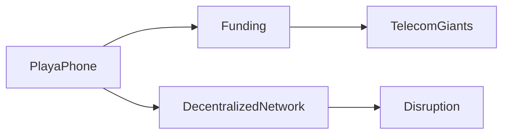

# Playa Phone: Un Análisis Crítico de una Propuesta Disruptiva

*Análisis independiente para el lector técnicamente curioso.*

## Introducción  

El reciente lanzamiento de **Playa Phone** ha generado conversación en los círculos tecnológicos. Si bien el producto promete un enfoque novedoso para la conectividad móvil, la historia subyacente revela tensiones más profundas dentro del sector de telecomunicaciones. Este artículo examina las estructuras de poder, los flujos de capital y los precedentes históricos que modelan estas innovaciones.

## La Propuesta de Playa Phone  

Playa Phone se presenta como una alternativa ligera y de código abierto a los servicios celulares tradicionales. Su marketing enfatiza **arquitectura descentralizada**, con la intención de eludir la hegemonía de los tres principales operadores móviles de EE. UU. La empresa sostiene que, mediante la utilización de redes punto a punto, puede reducir la dependencia de costosas licencias de espectro.

Desde una perspectiva empresarial, la propuesta es atractiva. Atrapa a usuarios cansados de altas cuotas mensuales y límites restrictivos de datos. Además, Playa Phone anuncia un **modelo de precios transparente**, en el que las tarifas se vinculan directamente al consumo de ancho de banda en lugar de planes embundados. Esta proposición económica atrae a consumidores sensibles al costo y a desarrolladores de pequeña escala.

## Dinámicas de Poder en Telecomunicaciones  

La estrategia de Playa Phone desafía este modelo al **desagregar** los servicios de red, confiando en nodos generados por la comunidad. Sin embargo, su dependencia de financiamiento venture introduce otra capa de dinámicas de poder. Los patrocinadores del startup incluyen una mezcla de inversores ángeles y una firma de capital riesgo conocida por adquirir tecnologías móviles emergentes. Esta fuente de financiamiento puede influir en la dirección del producto, alineándolo potencialmente con intereses estratégicos más amplios.

## Dinámica del Capital de Riesgo  

Estos patrones de financiamiento recuerdan a las fusiones históricas en las que pequeñas empresas fueron adquiridas para reforzar los ecosistemas de los incumbentes. El artículo traza paralelismos con los primeros años 2000, cuando los agregadores de banda ancha compraaron ISPs nicho para ampliar su presencia. Estos movimientos reforzaron la concentración del mercado, limitando la entrada de verdaderas iniciativas disruptivas.

## Paralelos Históricos  

Examinar la evolución del sector móvil revela ciclos recurrentes de **innovación y consolidación**. La primera ola de teléfonos celulares en los años 80 impulsó un auge de fabricantes de hardware, seguido por la emergencia de pocos operadores dominantes. Más recientemente, la llegada de **pagos móviles** vio a startups como Square y PayPal desafiar la banca tradicional, pero muchas fueron posteriormente integradas en plataformas financieras más grandes.

La intento de Playa Phone refleja estos patrones: una ola inicial de tecnologia disruptiva, seguida de una posible absorción en la cadena de valor existente. Comprender este ciclo ayuda a inversores y reguladores a anticipar la probable trayectoria de plataformas emergentes.

## Implicaciones Económicas  

Además, las **implicaciones de privacidad de datos** de una arquitectura descentralizada merecen escrutinio. Aunque la plataforma presume cifrado de extremo a extremo, la naturaleza distribuida implica que múltiples nodos manejan los metadatos de los usuarios, lo que genera preguntas sobre supervisión centralizada y cumplimiento de marcos regulatorios.

## Conclusión  
---
