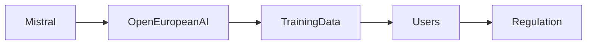

# ¿Puedo negarme? Poder, datos y el futuro del entrenamiento de IA

La pregunta “¿Puedo negarme a que mis datos de entrada o salida sean usados para entrenamiento?” ha pasado de los foros de desarrolladores de nicho al centro del debate público. El reciente artículo de ayuda de Mistral AI provocó una oleada de comentarios en los círculos tecnológicos, planteando no solo preocupaciones técnicas, sino también preguntas más profundas sobre quién controla el material bruto que alimenta los modelos de lenguaje grandes actuales (LLM). Como analista independiente, veo esto como una oportunidad para examinar lasdinámicas de poder que estructuran el ecosistema de IA.

## Detalle técnico detrás de la cláusula de negación

Mistral AI, una startup con sede en París que se ha posicionado como un desafiante europeo de los gigantes estadounidenses, ofrece ahora a los usuarios un interruptor para impedir que sus datos conversacionales sean recopilados para futuros ajustamientos de modelos. El mecanismo es sencillo: un usuario puede desactivar la recopilación de datos en la configuración de su cuenta, y la empresa afirma que dichos datos se eliminarán después de un breve período de retención. Técnicamente, esto respeta un nivel mínimo de agencia del usuario, pero también resalta un patrón más amplio de la industria: controles de privacidad reactivos en lugar de estructurales.

La opción de negarse no es exclusiva de Mistral. OpenAI, Anthropic y Google han introducido toggles similares en los últimos meses, cada uno en respuesta a la creciente presión regulatoria y la escrutinio público. Sin embargo, la implementación varía ampliamente. Algunas plataformas obligan a los usuarios a desplazarse a través de textos legales extensos para encontrar la opción; otras la esconden profundamente en los menús de la cuenta, haciéndola fácil de pasar por alto. El resultado es un mosaico de experiencias de consentimiento que puede inducir a los usuarios a una falsa sensación de control.

## Concentración de capital y la cadena de suministro de datos

En el corazón del auge de la IA reposan dos pilares económicos: recursos computacionales masivos y conjuntos de datos en constante expansión. La capital necesaria para comprar GPUs, construir centros de datos y mantener infraestructura en la nube concentra el poder en unas pocas corporaciones — Google (Alphabet), Microsoft, Amazon y, cada vez más, firmas estatales chinas como Baidu y Huawei. Estas compañías controlan tanto la pila de hardware como los canales que alimentan a los modelos con texto, imágenes y código.

Cuando una empresa como Mistral decide restringir su propio conjunto de datos a ser usado para entrenamiento, envía una señal de movimiento estratégico para proteger su ventaja competitiva. Sin embargo, el efecto más amplio es el refuerzo de la barrera de datos que ya protege a los incumbentes. Las grandes firmas pueden acumular billones de tokens de contenido generado por usuarios sin mecanismos explícitos de negación, porque su escala supera a la de los rivales más pequeños. La cláusula de negación, por tanto, se vuelve un gesto simbólico más que un cambio sistémico en la propiedad de los datos.

## Paralelos históricos: de la imprenta al streaming

La historia muestra que cada revolución tecnológica ha generado debates sobre quién posee y controla la información. En el siglo XV, la imprenta democratizó la producción de libros, pero también creó nuevas jerarquías entre editores y autores. En la era del streaming, las plataformas han luchado por equilibrar la disponibilidad de contenido con los derechos de los creadores. De manera similar, la IA enfrenta un dilema: la apertura de sus modelos puede fomentar la innovación, pero también consolidar el poder en manos de quienes controlan los datos de entrenamiento. La opción de negarse puede verse como un intento de devolver parte de ese control a los usuarios, aunque su impacto real dependerá de cuán ampliamente se adopte.

## Relaciones de poder entre los actores clave

1. **Mistral AI** – Una empresa emergente europea que apela a modelos de código abierto y a una reputación de transparencia para atraer a usuarios que desconfían de la gran tecnología. Su política de negación es un diferenciador estratégico, pero su valoración aún depende de capitales de riesgo que tienen participaciones en proveedores de nube competidores.
2. **OpenAI** – Creador de la serie GPT, que ha pasado de un ethos “de investigación primero” a un modelo más comercial con el lanzamiento de la API GPT‑4. Sus mecanismos de consentimiento suelen estar ligados a acuerdos de nivel de servicio que conceden a la empresa derechos más amplios para usar las interacciones de los usuarios en mejoras de modelos.
3. **Google (DeepMind/Google AI)** – Opera uno de los conjuntos de datos propietarios más extensos, que abarca consultas de búsqueda, contenido de YouTube y metadatos de Gmail. Aunque Google ofrece un panel de “Controles de datos”, los críticos argumentan que los valores predeterminados favorecen la recolección, haciendo que la opción de negarse sea una característica marginal en lugar de una expectativa predeterminada.
4. **Meta (Facebook AI)** – Utiliza enormes conjuntos de datos de redes sociales para entrenar modelos como LLaMA. Sus políticas de datos son notoriamente opacas, y las opciones de negación están limitadas principalmente a preferencias publicitarias más que a la capacitación de modelos.

Estas relaciones ilustran una red de energía donde los datos fluyen de los usuarios finales a los operadores de plataformas, que a su vez monetizan los modelos derivados a través de API, servicios en la nube y publicidad. El debate sobre la negación es, por tanto, una microcosmática de una negociación mayor: ¿cuánta agencia retendrán los usuarios, y cómo afectará eso a la economía del desarrollo de modelos?

## Implicaciones económicas de un panorama de datos fragmentado

Si una parte significativa del contenido generado por usuarios se vuelve inaccesible para entrenamiento, el costo de construir modelos de última generación podría aumentar significativamente. Las empresas más pequeñas podrían verse obligadas a recurrir a datos sintéticos, que actualmente presentan problemas de fidelidad y sesgo. Esto podría ampliar la brecha entre los incumbentes bien financiados y los nuevos entrantes ágiles, potencialmente llevando a un mercado con menos pero más homogeneizado competidores.

Por el contrario, un régimen de negación podría estimular la innovación en licencias de datos y mercados de datos. Las compañías podrían comenzar a ofrecer suscripciones de datos con niveles diferenciados, donde los usuarios pueden optar por licenciar sus contribuciones a cambio de una tarifa, similar a los modelos de royalties en la industria musical. Tales economías emergentes podrían redistribuir parte de la riqueza generada por la IA, alineando incentivos más estrechamente con los creadores de contenido.

Las iniciativas regulatorias, especialmente en la Unión Europea, están dando forma a este escenario. El próximo AI Act propone requisitos más estrictos de transparencia sobre la procedencia de los datos de entrenamiento, lo que podría obligar a las empresas a revelar las fuentes de sus corpora de entrenamiento. Si se aprueba, esto estándarizaría las expectativas de negación y forzaría a las grandes firmas a adoptar mecanismos de consentimiento más uniformes.

## Mirando hacia el futuro: una llamada a la acción colectiva

La conversación desencadenada por la cláusula de negación de Mistral recuerda que la tecnología no se desarrolla en un vacío; está imbricada en estructuras económicas y relaciones de poder. A medida que los usuarios se vuelven más conscientes de cómo sus datos alimentan empresas multimillonarias, es probable que exigan controles más robustos, una mayor remuneración o incluso prohibiciones de ciertos usos de sus contribuciones.

Para analistas independientes, periodistas y responsables de política, el reto es rastrear estos flujos de datos hasta sus fuentes y exponer los incentivos que los impulsan. Esto implica no solo examinar las políticas de empresas individuales, sino también mapear la red más amplia de capital, infraestructura y marcos regulatorios que configuran la trayectoria de la IA.

En última instancia, la capacidad de negarse puede parecer una concesión modesta, pero es un punto de apoyo para una lucha mayor por quién escribe el futuro del aprendizaje automático. La pregunta persiste: ¿ese punto de apoyo evolucionará en una plataforma sólida para una propiedad compartida, o permanecerá como un gesto simbólico dentro de un sistema aún dominado por unos pocos intereses concentrados? La respuesta moldeará no solo la próxima generación de modelos de IA, sino también la naturaleza del trabajo digital y la expresión creativa en las próximas décadas.

