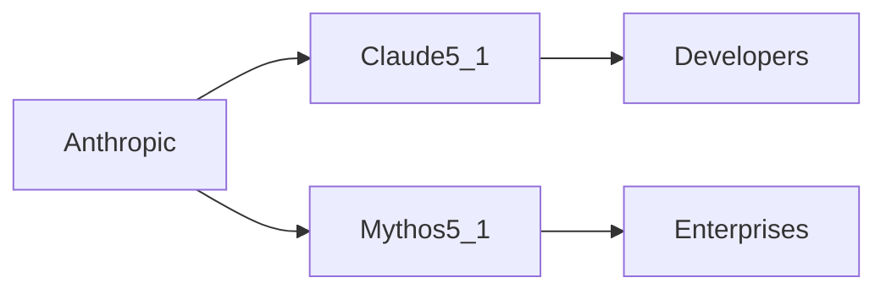

# Claude 5.1 and Mythos 5.1: Redefining AI Power Structures  

Anthropic’s simultaneous rollout of **Claude 5.1** and **Mythos 5.1** has sparked intense debate across the AI sector. While the two models share a common version number, their divergent architectures, pricing models, and target audiences signal a strategic pivot that could reshape who controls the next wave of large‑language‑model (LLM) infrastructure.  

## The Technical Split  

- **Claude 5.1** is positioned as a *general‑purpose conversational engine*, emphasizing safety, alignment, and extended context handling. Its API pricing is modest, targeting developers who need reliable, enterprise‑grade chat experiences without the overhead of bespoke fine‑tuning.  

- **Mythos 5.1**, by contrast, is an *integrated reasoning suite* aimed at high‑stakes enterprise workloads — legal research, financial modeling, and scientific simulation. It bundles advanced tool‑use capabilities, custom tool‑calling APIs, and tighter integration with Anthropic’s cloud services, commanding a premium price tier.  

Both models leverage Anthropic’s proprietary "constitution" framework, but Mythos 5.1 adds a layer of *explainable reasoning* that directly challenges the black‑box perception of many competing LLMs. This technical bifurcation is not merely a product lineup decision; it reflects a calculated effort to capture two distinct segments of the AI economy: the mass‑market developer community and the high‑margin corporate enterprise market.  

## Market Concentration and Capital Dynamics  

Anthropic’s valuation has surged past $30 billion after a Series E round that included strategic investments from **Amazon**, **Google**, and **Microsoft**. These partnerships are more than financial endorsements; they embed Anthropic’s models within the cloud ecosystems of the world’s largest tech firms, creating a feedback loop where cloud usage drives model refinement, and model refinement drives cloud consumption.  

The **concentration of capital** is evident in the way these deals structure revenue sharing. Amazon’s AWS, for instance, receives an exclusive “priority‑access” clause for hosting Mythos 5.1 workloads, while Google Cloud gains early integration of Claude 5.1 into its Vertex AI platform. Such arrangements erode the competitive moat of independent cloud providers and concentrate a disproportionate share of AI inference traffic under a handful of hyperscalers.  

Historically, the AI sector has moved from a *research‑centric, academically funded arena* to an *oligopolistic market* dominated by a few well‑capitalized players. The 2010s saw Google’s deep investment in DeepMind, IBM’s Watson, and Meta’s Llama models, each tethered to a parent company’s broader enterprise strategy. Anthropic’s latest move continues this pattern, but with a nuanced twist: it deliberately splits its offering to monetize both the *developer‑driven open ecosystem* and the *enterprise‑driven closed ecosystem*.  

## Power Shifts in the Developer Ecosystem  

For independent developers and startups, Claude 5.1’s lower cost and generous rate limits lower the barrier to entry. Early adopters have already integrated the model into chatbots, content‑generation tools, and educational platforms, creating a nascent **developer‑driven network effect**. However, the model’s closed API and lack of native fine‑tuning options limit true open‑source alternatives.  

This dual‑track strategy mirrors the **“platform vs. product”** dichotomy that characterized the early smartphone era, where Apple’s iOS and Google’s Android co‑existed, each commanding distinct developer incentives. In AI, the stakes are higher because the platform itself — model access — carries significant computational and regulatory costs.  

## Historical Perspective and Regulatory Horizons  

The current dynamics echo the **telecom boom of the 1990s**, where a handful of incumbents (AT&T, Verizon, Sprint) consolidated power through spectrum auctions and strategic mergers. Just as those firms used vertical integration to control both infrastructure and services, today’s AI leaders are integrating model development, cloud infrastructure, and application layers.  

Regulators in the EU and US have begun scrutinizing **“AI concentration”** as a new antitrust frontier. The European Commission’s recent whitepaper on “Foundation Models” warns that a small number of providers could exert “significant market power” over downstream applications. Anthropic’s split offering may be designed to pre‑empt such scrutiny: by visibly supporting an open‑ish developer community (Claude 5.1) while keeping the high‑margin enterprise tier under tighter control (Mythos 5.1), the company can argue that competition remains vibrant.  

Nevertheless, the **economics of scale** remain compelling. Training a model like Mythos 5.1 incurs costs exceeding $500 million in compute and data acquisition. Only a handful of players can shoulder that burden, reinforcing a **capital concentration** that limits new entrants. This reality suggests that future innovation may be funneled into a few well‑funded labs, echoing the historical pattern where *technological breakthroughs are initially exclusive before becoming broadly democratized*.  

## Looking Ahead: Implications for the AI Landscape  

- **For investors**, the bifurcated model offers a diversified revenue stream but also raises questions about long‑term sustainability. The premium pricing of Mythos 5.1 may deliver higher margins, yet it also risks alienating price‑sensitive enterprise segments.  

- **For developers**, the lower‑cost Claude 5.1 could accelerate experimentation, but the lack of open‑source alternatives may constrain customization. Hybrid approaches — using Claude 5.1 for prototyping and migrating to Mythos 5.1 for production — could become a common workflow, further entrenching Anthropic’s foothold.  

- **For policymakers**, the key will be to monitor how these market dynamics affect **innovation diffusion** and **competitive entry**. Policies that encourage open model research, subsidize compute for smaller labs, or enforce data‑access transparency could mitigate the concentration risks highlighted by Anthropic’s strategy.  

In sum, the release of **Claude 5.1** and **Mythos 5.1** is more than a product announcement; it is a strategic maneuver that reflects the AI industry’s evolution toward **capital‑intensive, layered power structures**. As the market matures, the interplay between open developer communities and tightly controlled enterprise ecosystems will determine not only who wins the next wave of AI adoption, but also how that power is distributed across the global economy.  

*Reflection*: When a single company can split its technology into two distinct economic models — one for the masses, one for the elite — what does that say about the future of innovation, competition, and the very notion of an open AI ecosystem?  

---

