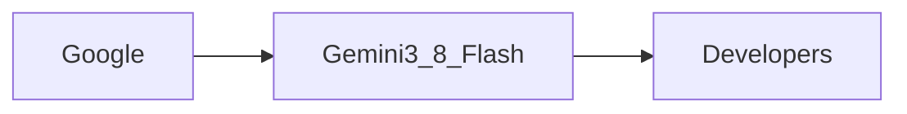

# Introducción

El reciente anuncio de Google sobre **Gemini 3.8 Flash** y **Gemini 3.8 Flash Cyber** ha generado ondas en la industria tecnológica. Si bien las especificaciones técnicas generan entusiasmo, la historia más profunda reside en cómo estos lanzamientos remodelan las dinámicas de poder, concentran el capital y afectan el panorama económico para desarrolladores y empresas por igual.

# Destacar Gemini 3.8 Flash: Especificaciones técnicas

**Gemini 3.8 Flash** se posiciona como un modelo de alta capacidad y baja latencia optimizado para cargas de trabajo de inferencia a gran escala. Al reducir los costos de inferencia hasta un 30 % en comparación con su predecesor, Google pretende hacer accessible la IA avanzada a un conjunto más amplio de clientes, desde startups hasta empresas Fortune 500. La arquitectura del modelo aprovecha técnicas de sparsity y cuantización que hacen eco a investigaciones anteriores de Google Brain, sin embargo, su apertura comercial señala un giro estratégico hacia servicios de IA nativas de la nube y monetizables.

# Gemini 3.8 Flash Cyber: Ventaja en Seguridad

Complementando la versión base, **Gemini 3.8 Flash Cyber** integra robustez adversarial incorporada y detección de amenazas en tiempo real. Este enfoque en la seguridad responde a las crecientes preocupaciones sobre ataques impulsados por IA, especialmente cuando las empresas adoptan IA para infraestructuras críticas. Al incorporar ciberresiliencia directamente en el modelo, Google no solo diferencia su oferta, sino que también crea una nueva fuente de ingresos basada en la confianza como servicio.

# Dinámica de Poder en el Paisaje de la IA

El lanzamiento subraya una tendencia más amplia: la consolidación de capacidades de IA dentro de un número reducido de proveedores a gran escala. Google, Microsoft y Amazon están en una competencia triangular donde los lanzamientos de modelos son tan importantes para la posición de mercado como para el avance tecnológico. Gemini 3.8 Flash y Flash Cyber refuerzan el intento de Google de consolidar a **Google Cloud** como la plataforma preferida para IA de última generación, desafiando la asociación OpenAI de Azure y la dominancia de SageMaker de AWS.

# Historical Parallels: From Mainframes to Cloud

Los paralelismos históricos nos llevan desde los enormes mainframes de los años 60 hasta la era actual de la computación en la nube, donde la IA ocupa un papel similar de centralización.

# Implicaciones Económicas para Desarrolladores y Empresas

Para los desarrolladores, el modelo de precios de Gemini introduce una estructura **pago por uso** que puede reducir las barreras de entrada, pero también genera dependencia del ecosistema de facturación de Google. Las empresas deben sopesar los ahorros de costos de Flash frente a posibles bloqueos de proveedor. Además, las funciones de seguridad integradas de Flash Cyber pueden obligar a pequeñas empresas a adoptar la pila completa de Google para permanecer protegidas, lo que concentra aún más los flujos de ingresos.

# Movimientos Estratégicos de los Competidores

La respuesta de Microsoft llegó rápidamente con la suite **Azure AI Copilot**, que enfatiza herramientas integradas para desarrolladores y orquestación multi‑modelo. Amazon, por su parte, anunció mejoras en los modelos **Titan** y una integración más profunda con **SageMaker**. Estos movimientos ilustran una carrera competitiva donde cada jugador aprovecha su infraestructura de nube propietaria para ofrecer servicios de IA integrados, reforzando efectos de red que atrapan a los clientes en ecosistemas específicos.

# Perspectivas: Qué Significa para el Futuro de la IA

En el horizonte, el lanzamiento de Gemini 3.8 Flash y Flash Cyber podría acelerar la **concentración de talento y capital de IA** en unas pocas empresas tecnológicamente avanzadas. Si bien esto podría impulsar una innovación rápida, también corre el riesgo de reducir la diversidad de soluciones disponibles en el mercado amplio. Los responsables de políticas y los líderes de la industria deberán monitorear estas tendencias para garantizar un mercado de IA competitivo y resiliente.

# Conclusión: Un Momento de Reflexión

En última instancia, el artículo invita a los lectores a reflexionar sobre las implicaciones de estos modelos poderosos. A medida que la IA sigue evolucionando, el equilibrio entre innovación, concentración de mercado y despliegue ético sigue siendo un debate crítico.

