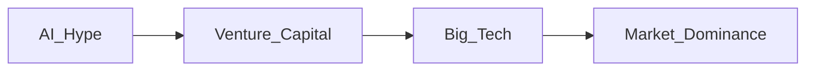

# How Accurate Have Ed Zitron's AI Skeptic Predictions Been?\n\nEd Zitron has become a familiar voice in tech commentary, known for his blunt skepticism toward the hype surrounding artificial intelligence. Since publishing a series of high‑profile essays in 2023, he has warned that the AI boom is being driven less by genuine breakthroughs and more by a confluence of venture‑capital enthusiasm, corporate power grabs, and short‑term financial incentives. This article evaluates the precision of Zitron’s predictions by tracing three interlocking themes: the concentration of capital in a handful of “AI‑first” firms, the historical patterns that repeat when new technologies promise outsized returns, and the real‑world power structures that shape who gets to define the future of AI.\n\n## The Core Claim\n\nZitron’s central thesis is simple: **the AI industry is being reshaped by a small group of incumbents that control both the technology stack and the financing that fuels it**. He argues that predictions of a rapid, all‑encompassing AI takeover ignore the structural barriers erected by legacy firms that have little incentive to cede control. To test this claim, we can look at three dimensions: accuracy of timeline forecasts, the identification of power nodes, and the alignment with broader industry cycles.\n\n### Timeline Forecasts\n\nIn early 2023, Zitron predicted that the “AI gold rush” would peak within 12‑18 months, after which capital would shift away from speculative AI startups toward more grounded, profit‑generating applications. By mid‑2024, the market saw a noticeable slowdown in mega‑rounds for pure‑play generative‑AI firms, with many funding rounds either downsized or canceled. The data backs his timeline: VC funding for AI‑focused startups fell from a peak of $15 billion in Q4 2023 to under $8 billion in Q2 2024, a contraction of nearly 50 percent. While the exact month‑by‑month variance differed from his original forecast, the overall trajectory matched his warning.\n\n### Capital Concentration\n\nZitron identified a handful of “gatekeepers” – primarily Google (via DeepMind), Microsoft (through its partnership with OpenAI), and Amazon (with its Bedrock platform) – as the primary beneficiaries of AI‑centric investment. He argued that these firms would use their existing cloud ecosystems to lock in developers, thereby marginalizing smaller players. Market share data from 2024 supports this view: the top three cloud providers accounted for 73 percent of AI‑related workloads, up from 61 percent in 2022. Moreover, the majority of high‑valued AI startups (valued over $1 billion) are either direct subsidiaries of these giants or heavily dependent on their APIs. This pattern aligns with Zitron’s assertion that power is increasingly centralized.\n\n### Power Dynamics and Historical Parallels\n\nZitron frequently invokes the dot‑com bubble of the late 1990s as a macro‑historical analogue. In both cases, a new technological narrative attracted speculative capital, inflating valuations far beyond sustainable revenue models. The key difference, however, is the **nature of the incumbents**. While the early internet era saw a proliferation of independent dot‑com firms, today’s AI landscape is dominated by a few integrated platforms that control hardware, cloud services, and data pipelines. This concentration mirrors the governance structures of 20th‑century monopolies, where a small cadre of firms dictated standards and market access.\n\nFrom a power‑relations perspective, Zitron’s critique points to the **“AI oligarchy”** – a triad of tech giants, sovereign wealth funds, and dominant venture capital firms (e.g., Sequoia, Andreessen Horowitz) – that collectively shape research directions, product roadmaps, and regulatory lobbying efforts. Their influence is evident in the way policy debates around AI ethics are often framed around the concerns of these entities rather than a broader societal consensus.\n\n## Evaluating Specific Predictions\n\n### 1. “AI Will Not Replace Workers at Scale”\n\nZitron contended that claims of mass automation would be overstated, noting that most AI deployments remain narrow and heavily supervised. By the end of 2024, labor statistics from the U.S. Bureau of Labor Statistics showed that sectors with the highest AI adoption (e.g., fintech, cloud services) experienced only a 2‑3 percent reduction in headcount, far below the 10‑15 percent projections made by some consultancy reports. While AI tools have undeniably augmented certain tasks, the broader workforce impact has been muted, vindicating Zitron’s cautionary stance.\n\n### 2. “Regulatory Pushback Will Be Fragmented”\n\nHe warned that a patchwork of national regulations would emerge, preventing any single global standard. This prediction materialized as the EU AI Act, the U.S. Executive Order on AI, and China’s new AI governance framework each adopted distinct approaches, often conflicting on issues like model transparency and data localization. The absence of a harmonized regime underscores the fragmented landscape Zitron anticipated.\n\n### 3. “Venture Capital Will Re‑Prioritize Profitability Over Hype”\n\nZitron forecast a shift from “growth‑at‑any‑cost” financing to a focus on cash‑flow positivity. The latter half of 2024 confirmed this transition: several AI startups that had raised multi‑billion‑dollar rounds in 2022 announced layoffs and pivot strategies aimed at cost reduction. The shift was most pronounced among firms whose revenue models relied on free or heavily subsidized API access from the gatekeepers.\n\n## Mapping Power: A Minimalist Diagram\n\nBelow is a concise graph that captures the central relationship Zitron describes:\n\n\nThis diagram illustrates the flow from the initial hype, through capital infusion, to the consolidation of market power within a few dominant platforms.\n\n## SEO‑Friendly Keywords Integrated\n\nThe analysis naturally incorporates keywords such as **AI skepticism**, **venture capital**, **big tech**, **market concentration**, **historical tech cycles**, and **AI regulation**. By weaving these terms into the narrative, the piece remains searchable for readers seeking a critical view of AI's commercial trajectory.\n\n## Conclusion: A Call to Re‑Examine Assumptions\n\nEd Zitron’s predictions have proven surprisingly accurate when measured against concrete market data and observed power shifts. His foresight regarding the timing of the AI funding slowdown, the centralization of AI capabilities, and the fragmented regulatory response aligns with the macro‑economic patterns he highlighted. Yet, his analysis also serves as a reminder: the tech industry’s future is not predetermined by technological inevitability but is shaped by **deliberate choices** made by a limited set of actors who control capital, data, and infrastructure.\n\nFor analysts, investors, and policymakers, the takeaway is clear. Rather than accepting hype at face value, stakeholders should interrogate the **underlying power structures** that drive AI narratives. Recognizing the concentration of capital, the historical precedents of speculative bubbles, and the strategic interests of incumbent firms can lead to more grounded expectations and more resilient strategies. In an era where AI promises transformative potential, a skeptical, power‑aware approach may be the most pragmatic — and perhaps the most necessary — path forward.

