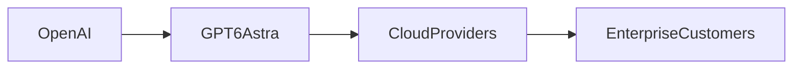

## Introducción

## Arquitectura y características técnicas

Astra se basa en una arquitectura de transformador escalada, con aproximadamente 600 billones de parámetros y capacidades multimodales que integran texto, imagen y datos estructurados. El modelo introduce un mecanismo de razonamiento en cadena que permite generar respuestas más coherentes sin necesidad de prompts extensos. Además, Astra incorpora un motor de ajuste fino continuo que puede actualizarse mediante aprendizaje reforzado a partir de retroalimentación humana, lo que prolonga su vida útil comercial. Desde el punto de vista de la implementación, el modelo se ejecuta sobre clusters de GPU de última generación en la infraestructura de Azure, lo que crea una dependencia económica estrecha entre OpenAI y Microsoft, así como con los fabricantes de chips que suministran los aceleradores necesarios. Esta interdependencia refuerza la visión de que el control de la capa de ejecución es tan valioso como la innovación en algoritmos.

## Concentración de poder y dinámicas de mercado

El modelo de negocio de Astra se articula alrededor de tres fuentes de ingresos: suscripción directa a la API, licencias empresariales con precios diferenciados y venta de recursos de cómputo a terceros que albergan el modelo en sus propios datos. Esta triangulación permite a OpenAI capturar valor en distintos puntos de la cadena de suministro. Los precios de la API se ajustan según el volumen de tokens y el nivel de latencia, lo que favorece a los clientes con alto consumo pero puede excluir a pequeñas startups que carecen de capital para absorber costos variables. Además, los acuerdos de licencia privada con grandes corporaciones como Google Cloud y Amazon Web Services otorgan a estos competidores acceso anticipado a nuevas funcionalidades, lo que potencia su capacidad para ofrecer servicios diferenciados. En consecuencia, la capacidad de OpenAI para dictar condiciones de acceso y precios se traduce en una forma de poder que trasciende el ámbito técnico y se inserta en decisiones de inversión y estrategia corporativa.

## Relación con competidores y ecosistema

Microsoft, el principal inversor de OpenAI, ha anunciado una integración profunda de Astra en su suite de productividad, ofreciendo a los usuarios de Office 365 asistencia de IA basada en Astra. Simultáneamente, Amazon Web Services (AWS) y Google Cloud presentan sus propias ofertas de inferencia que compiten directamente con la solución de Azure, creando un entorno de rivalidad estratégica. Esta competencia se manifiesta en campañas de marketing que resaltan la velocidad, la precisión y la privacidad de sus respectivos servicios. Sin embargo, la ventaja de Astra reside en su capacidad para ser fine‑tuned en dominios específicos mediante datos propietarios, lo que genera una barrera de entrada para nuevos actores que deseen competir en nichos especializados. Al mismo tiempo, la política de exclusividad de ciertas funcionalidades de Astra obliga a los desarrolladores a depender de la plataforma de OpenAI para acceder a las últimas mejoras, lo que aumenta la dependencia de la empresa.

## Contexto histórico

La evolución de la industria tecnológica muestra patrones recurrentes en los que la supremacía se logra mediante la combinación de hardware, software y servicios. IBM, en los años 60, dominó el mercado de mainframes al vender tanto equipos como programas de gestión. En la década de 1990, Microsoft consolidó su posición al extender Windows como estándar abierto mientras vendía Office, creando una sinergia que atrapó a los usuarios. En la actualidad, la carrera por la IA sigue este esquema: la empresa que controle tanto el modelo como la infraestructura de cómputo tendrá la capacidad de definir estándares, precios y reglas de interoperabilidad. Astra representa el intento de OpenAI de convertirse en ese “sistema operativo” de la IA, un rol que permite no solo vender el modelo, sino también dictar cómo se integrará en productos de terceros.

## Implicaciones para usuarios y reguladores

Para los desarrolladores, Astra abre nuevas posibilidades de integración, pero también introduce una dependencia de la disponibilidad y precios de la API. Las cláusulas de servicio incluyen restricciones de re‑uso y prohibiciones de crear modelos derivados sin autorización, lo que limita la capacidad de los usuarios para experimentar libremente. Los reguladores en Estados Unidos y la Unión Europea están examinando de cerca si la consolidación de modelos de IA puede afectar la competencia, la privacidad y la seguridad. En particular, la capacidad de OpenAI para imponer condiciones de exclusividad en sus contratos de servicio plantea preguntas sobre la interoperabilidad y la soberanía tecnológica. La transparencia en la gestión de datos de entrenamiento y en los procesos de auditoría de sesgos se vuelve esencial para evitar abusos y para garantizar que el poder no se concentre más allá de los límites legales.

## Conclusión