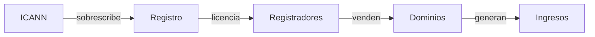

## El Juego de Poder Oculto Detrás de la Terminación del Dominio .name

La reciente noticia de que el dominio de primer nivel .name será formalmente retirado ha despertado comentarios en círculos tecnológicos. Aunque el titular parece una decisión rutinaria del registro, los mecanismos subyacentes revelan un cambio decisivo en quién controla el (DNS). Este artículo desglosa el movimiento, mapea las estructuras de poder que genera y lo sitúa dentro de un patrón más largo de consolidación que ha moldeado la arquitectura de direccionamiento de internet. Palabras clave SEO como *DNS*, *ICANN* y *consolidación tecnológica* aparecen naturalmente en la discusión.

## Un TLD especializado con una visión ambiciosa

Originalmente lanzado en 2001 como un TLD genérico especializado, .name se promocionó como un identificador personal para individuos y familias. Los operadores del registro prometieron una alternativa centrada en las personas frente al más comercial .com y .org. La idea era permitir que la gente reclamara “john.smith.name” como una marca personal, reflejando el sueño inicial de la web como espacio de autoexpresión. Sin embargo, el TLD nunca alcanzó masa crítica; su volumen de registros se estabilizó por debajo del 0,5 % del total de dominios globales. Esta limitada adopción hizo que fuera un objetivo atractivo para la consolidación, especialmente cuando las políticas de expansión de ICANN abrieron la puerta a nuevos gTLD y los registros heredados enfrentaron presión para simplificar sus carteras.

## Mecánica de la terminación

La terminación se ejecutó mediante una cláusula contractual que permitió al registro renunciar a su gestión tras un periodo de aviso de 24 meses. Los documentos legales indican que la decisión se vio impulsada por la combinación de tasas de renovación en descenso y una realineación estratégica hacia activos más rentables. La medida fue ratificada por la Junta de ICANN en una sesión a puertas cerradas, planteando interrogantes sobre transparencia y la influencia de los principales interesados en los debates de gobernanza. Aunque el proceso cumplió con los acuerdos de registro existentes, la falta de consulta pública subraya cómo las dinámicas de poder pueden hiperactivarse bajo la mesa. La decisión también desencadenó una cascada de reacciones de los registradores secundarios que habían construido negocios sobre el espacio de nombres .name.

## ¿Quién se beneficia del desplazamiento de poder?

## Paralelos históricos

Históricamente, el ecosistema DNS ha oscilado entre una competencia abierta y un control concentrado. El primer auge de dominios .com a mediados de los años 90 colocó un enorme poder en manos de los registradores tempranos, lo que generó escrutinio antimonopolio. Más tarde, la liberación de TLDs genéricos como .info y .biz intentó difundir esa concentración, pero el mercado se re‑agregó rápidamente alrededor de un reducido número de registradores capaces de ofrecer precios por volumen y herramientas avanzadas de gestión DNS. La terminación de .name sigue esta trayectoria, utilizando mecanismos regulatorios para eliminar un TLD marginal mientras refuerza la hegemonía de unos pocos actores clave.

## Implicaciones económicas de la concentración

## Perspectiva regulatoria y posibles reformas

Mirando hacia el futuro, los reguladores podrían responder con una supervisión más rígida de los procesos de adquisición de registros o con incentivos para ecosistemas de TLD fragmentados. Algunos responsables políticos han propuesto un modelo de "registro como utilidad pública", donde funciones esenciales de nombramiento deben permanecer bajo propiedad pública o cooperativa. Otros sugieren crear cláusulas de ocaso que obliguen a los grandes registros a desinvertir ciertos TLD después de un período determinado, preservando la competencia. Mientras tanto, la gran empresa que ahora controla el registro de .name ha señalado planes para reutilizar el espacio de nombres del TLD para dominios de nivel de marca internos, lo que podría difuminar aún más la línea entre el direccionamiento público y el marketing propietario.

## Conclusión: una llamada a la reflexión cuidadosa

En resumen, la terminación del TLD .name es más que una nota técnica; es un microcosmos de cómo poder, capital y gobierno se entrelazan en la era digital. Al seguir la línea desde un dominio personal modesto hasta un activo estratégico en una cartera corporativa, vemos un patrón que se repite en toda la infraestructura de internet. Reconocer estas dinámicas es el primer paso para exigir políticas transparentes y equitativas que preserven un panorama de DNS diverso y competitivo. La cuestión persiste: ¿los actores defenderán un sistema de nombres descentralizado o permitirán que unas pocas entidades dicten el futuro de la identidad en línea? La respuesta no solo definirá el destino de un solo TLD, sino también la arquitectura más amplia de cómo nos localizamos y nos expresamos en la web.

