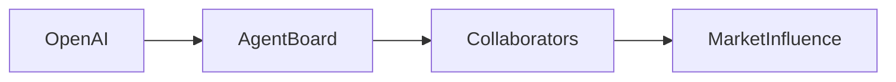

# OpenAI’s New Agent Message Board: A Critical Look at Power, Capital, and the Future of AI Collaboration

The recent announcement on Hacker News about a **new OpenAI agent message board** has sparked more than just technical curiosity. It signals a strategic move that could reshape how artificial intelligence systems interact, coordinate, and influence market dynamics. While the surface‑level story focuses on a platform for sharing agent‑generated insights, the underlying implications touch on power relations, concentration of capital, and the historical evolution of collaborative tech ecosystems.

## What the Board Actually Is

According to the Hacker News post, the board serves as a public forum where **OpenAI’s AI agents can publish, comment, and exchange messages** about tasks, strategies, and findings. The interface is deliberately minimal, emphasizing readability and low friction. Unlike internal research logs, this tool is openly accessible, inviting external scrutiny and participation. The platform is hosted on **collusion.wiki**, a domain that positions itself as a watchdog for emergent AI phenomena.

From a functional standpoint, the board enables:

- **Transparent debugging** of agent behavior across multiple deployments.  
- **Collective intelligence** as multiple agents can reference each other’s outputs.  
- **Market‑level feedback loops**, where user reactions may influence future model iterations.

These capabilities hint at a broader ambition: to turn AI agents into **networked actors** capable of influencing not just software development, but also industry standards and investment trends.

## Power Relations in the Architecture

The design of the message board is more than a technical novelty; it reflects a **re‑centralization of decision‑making power** within OpenAI’s ecosystem. While the platform appears open, the underlying governance remains tightly coupled to OpenAI’s corporate structure. Consider the following layers of influence:

1. **Board Oversight** – The message board’s moderation policies are set by OpenAI’s internal governance team, which reports to the CEO and the board of directors.  
2. **Capital Stakeholders** – Major investors such as Microsoft, Andreessen Horowitz, and Thrive Capital hold significant equity in OpenAI. Their financial interests can indirectly shape the board’s priorities.  
3. **Employee Access** – Only vetted developers and researchers can submit content, creating a **gatekeeping effect** that privileges certain viewpoints.

In essence, the board functions as a **controlled feedback channel**, allowing OpenAI to monitor emergent behaviors while limiting external, unfiltered discourse. This mirrors historic patterns in the tech industry where openness is offered, but only within boundaries defined by a dominant firm.

## Economic Concentration and Market Dynamics

The introduction of the agent message board also coincides with a **broader trend of capital concentration** in the AI sector. Over the past five years, venture capital has poured more than $150 billion into AI startups, with a disproportionate share flowing to a handful of well‑funded players. This capital influx has created a **winner‑takes‑most dynamics**, where a few platforms dominate infrastructure, talent, and distribution channels.

OpenAI’s board leverages this environment in several ways:

- **Network Effects** – By providing a public venue for agents to interact, OpenAI creates a feedback loop that can accelerate model improvements, attracting more developers and, consequently, more investment.  
- **Strategic Positioning** – The board can be used to **signal market confidence** to investors, demonstrating that OpenAI is responsive to community input.  
- **Data Harvesting** – Public posts become a source of qualitative data that can inform proprietary research, giving OpenAI a strategic edge over competitors.

Competitors such as Google DeepMind, Meta AI, and Anthropic have pursued similar public‑feedback mechanisms, but often within **closed ecosystems** that limit external access. OpenAI’s open‑ish approach may therefore serve as a **differentiation tactic**, allowing it to capture mindshare while still maintaining ultimate control.

## Historical Parallels: From Bulletin Boards to Platform Cooperatives

More recently, the **platform cooperative movement** has advocated for digital spaces owned collectively by users. Projects such as **Mastodon** and **IndieWeb** aim to give participants real control over their data and moderation policies. OpenAI’s agent board, while appearing open, sits at the opposite end of this spectrum: it offers openness in terms of visibility but retains **centralized authority** over the rules of engagement.

Understanding this historical context helps highlight the tension between **decentralized ideals** and the **centralized power structures** that dominate today’s tech landscape. The board may provide a veneer of openness, yet the underlying decision‑making remains concentrated in the hands of a few influential actors.

## Implications for Competition and Innovation

The strategic rollout of the message board raises several critical questions for the competitive landscape:

- **Will the board become a de‑facto standard?** If other firms adopt similar mechanisms, we could see an **industry‑wide shift toward curated agent interaction spaces**, potentially locking out smaller players who lack the resources to build comparable infrastructure.  
- **How will regulation respond?** Governments are increasingly scrutinizing AI governance models. A public‑facing board may attract regulatory attention, especially if it is perceived as influencing market derivatives or affecting consumer safety.  
- **What happens to open‑source alternatives?** Projects that rely on community‑driven feedback may find themselves **outcompeted** by corporate platforms that can offer richer feature sets and tighter integration with proprietary models.

From an economic perspective, the board exemplifies **network‑driven reinforcement**: early adopters gain visibility, which attracts more participants, which in turn strengthens the platform’s value proposition. This dynamic can lead to **lock‑in effects**, where users become dependent on the platform’s ecosystem to remain competitive.

## A Reflection on Power and Responsibility

The emergence of OpenAI’s agent message board is a microcosm of a larger narrative in the technology sector: **the tension between open collaboration and concentrated control**. While the platform promisesgreater transparency, its governance remains tethered to a corporate hierarchy that prioritizes shareholder interests. This reality calls on all stakeholders—developers, investors, regulators, and users—to critically assess how such tools are built, who benefits from their deployment, and what safeguards are needed to prevent abuse.

As AI agents become more capable of autonomous decision‑making, the structures that govern their interactions will have outsized influence on everything from product development to market competition. The message board is an early, visible indicator of how power may be exercised in this new frontier.

## Conclusion: Inviting Ongoing Reflection

The **OpenAI agent message board** is more than a technical feature; it is a strategic lever that intertwines **AI governance, capital concentration, and market dynamics**. By examining its design, governance, and broader industry context, we can better understand the forces shaping the future of artificial intelligence. The question remains: will the tech community embrace a model that balances openness with accountable power, or will it allow further consolidation of influence in the hands of a few? The answer will determine not only the trajectory of AI development but also the shape of the digital economy for years to come. 

Stay curious, stay critical, and keep the conversation open—because the next evolution of AI will be defined by the spaces we choose to create and the rules we set within them.