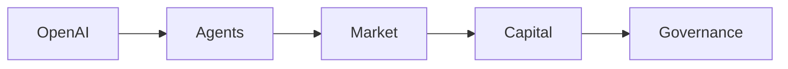

El anuncio reciente de OpenAI sobre la creación de un tablero de mensajes destinado a sus agentes de IA ha generado más que curiosidad técnica; ha abierto un debate amplio sobre cómo se distribuyen el poder, el capital y la influencia en la era de la inteligencia artificial. Este espacio, accesible a desarrolladores, investigadores y entusiastas, no es simplemente una herramienta de comunicación, sino un nuevo escenario donde se negocian algoritmos, datos y modelos económicos que, en última instancia, definen la arquitectura del futuro digital.

Desde la perspectiva de la economía de plataformas, el tablero de OpenAI funciona como un marketplace emergente dentro del ecosystem de IA. En él, los agentes pueden publicar versiones de sus modelos, compartir fine‑tuning y vender acceso a recursos computacionales. La estructura de incentivos se asemeja a la de los mercados de APIs de los años 2000, pero con una diferencia crucial: la interdependencia entre los participantes se ha vuelto más profunda y menos transparente. Grandes inversores, como Microsoft, que ya ha inyectado más de 10.000 millones de dólares en OpenAI, pueden ejercer presión indirecta sobre los tipos de proyectos que se promocionan en el foro, moldeando la agenda de investigación y, por ende, el rumbo tecnológico de la industria.

Históricamente, la dinámica de los tableros de discusión ha sido un termómetro de la cultura hacker. En los años 90, los foros de Usenet y los listservs de universidades fueron el corazón de la innovación en redes y sistemas operativos. La apertura de esos canales permitió la democratización del conocimiento, pero también facilitó la aparición de grupos de presión que, con el tiempo, se transformaron en corporaciones con sus propias reglas de juego. Hoy, el tablero de OpenAI replica ese ciclo, pero con una escala sin precedentes: la velocidad con la que se despliegan modelos de lenguaje y visión puede multiplicar los efectos de cualquier decisión tomada en la comunidad.

En el contexto de la competencia entre gigantes de la IA, el tablero se posiciona como un campo de batalla estratégico. Google DeepMind, con su propio ecosistema de agentes bajo la marca “Agent Framework”, ha comenzado a probar integraciones con su suite de productos empresariales. Anthropic, por su parte, ha lanzado un foro interno llamado “Claude Hub” que, aunque más restrictivo, muestra una tendencia similar. Microsoft, mediante su plataforma Azure AI, está construyendo una capa de orquestación que permite a los agentes de terceros operar dentro de su nube, siempre bajo la supervisión de la arquitectura de datos propietaria. Estas iniciativas convergen en la necesidad de controlar tanto el código como los datos de entrenamiento, lo que refuerza la concentración de poder en unas cuantas corporaciones.

En definitiva, el nuevo tablero de mensajes de OpenAI no es un simple canal de comunicación; es una vitrina de poder donde se negocian las reglas del juego de la inteligencia artificial. Cada publicación, cada repositorio compartido y cada conversación pública se traducen en valor económico que alimenta la cadena de concentración de capital. La manera en que se regule este espacio determinará, en gran medida, si la IA seguirá siendo una herramienta de democratización o se convertirá en otro activo de mercado controlado por unos pocos.

Este escenario invita a reflexionar sobre el futuro de la gobernanza tecnológica. ¿Hasta qué punto la comunidad de desarrolladores puede ejercer una presión real sobre las decisiones estratégicas de OpenAI? ¿Qué mecanismos existen para garantizar que la innovación no se subyugue a intereses económicos? La respuesta a estas preguntas definirá no solo la evolución del tablero, sino también la forma en que la sociedad interactuará con la inteligencia artificial en los próximos años.

MERMAID: graph LR; OpenAI --> Agents; Agents --> Market; Market --> Capital; Capital --> Governance

