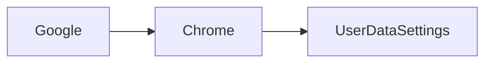

# Introducción  

En los últimos días, los medios technológicos han resonado con una noticia que parece repetir un patrón familiar: **Google** ha logrado, una vez más, que la configuración de datos del sitio en **Chrome** quede exenta de la voluntad del usuario. La noticia, publicada en *Hacker News*, señala que “Chrome again exempts Google from user site data settings”. Desde la perspectiva de un analista independiente, este movimiento no es solo un detalle técnico; es un síntoma de cómo el poder de **Google** se manifiesta en la arquitectura misma de la web.

# El último movimiento de Google  

El anuncio se dio a través de un comunicado interno que detallaba que, a partir de la próxima actualización, **Chrome** no solicitará permiso explícito para que los sitios web accedan a ciertos datos cuando la interacción sea considerada “esencial” para la funcionalidad del servicio. En términos simples, Google está reinterpretando lo que considera “datos del sitio” y, al hacerlo, está cerrando una brecha que previamente obligaba a los desarrolladores a pedir autorización al usuario.

Esta jugada se apoya en la teoría de que los usuarios, en su mayoría, no modifican los ajustes de privacidad por defecto. La lógica de Google apunta a que la complejidad de la configuración haría que la mayoría de los usuarios simplemente acepten los términos sin cuestionarlos. Así, la empresa evita que la experiencia del usuario sea interrumpida por diálogos de consentimiento, manteniendo una fluidez que, a ojos de la compañía, es esencial para la competitividad del navegador.

# Poder y concentración en la industria  

El poder de **Google** no se limita al dominio del navegador. La compañía controla gran parte del ecosistema de publicidad digital, posee el motor de búsqueda más utilizado y, mediante **Android**, domina el sistema operativo móvil. Cada uno de estos pilares se retroalimenta: los datos de búsqueda alimentan los anuncios; los anuncios financian el desarrollo de **Chrome**; y **Chrome**, a su vez, canaliza tráfico a los servicios de **Google**.

# Conclusión  

La reciente decisión de **Google** de eximir a **Chrome** de los ajustes de datos del sitio subraya la capacidad de la compañía para redefinir los límites del consentimiento del usuario. Más allá del ejercicio técnico, el movimiento revela una estrategia de poder que se alimenta de la concentración de capital, la estandarización de normas y la asimetría informativa.  

Reflexionar sobre este escenario implica preguntar: ¿hasta cuándo los usuarios aceptarán que sus decisiones sean “exentas” por decisión de una corporación? ¿Qué papel deben jugar los reguladores para equilibrar la innovación con la protección de derechos digitales? La respuesta no solo determinará el futuro de **Chrome**, sino también la forma en que la web mantendrá su capacidad de ser un espacio abierto y plural. Solo a través de una vigilancia constante y una participación informada de la ciudadanía tecnológica podremos asegurar que el poder no quede concentrado en manos de unos pocos, sino distribuido entre la sociedad que realmente utiliza la red.

