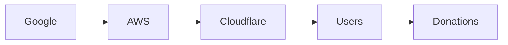

# Keep Our Servers Running: The Economics Behind September’s Donation Surge

The recent headline on *blog.archive.org* — *“Keep Our Servers Running: Your Recurring Donation Goes 3× This September”* — may appear as a simple fundraising plea. Yet, beneath the surface lies a microcosm of the tech industry’s power structures, capital concentration, and the historical cycle of dependence on public goodwill to maintain the digital commons. This article unpacks those dynamics, drawing connections to long‑standing patterns that shape who builds, owns, and funds the infrastructure that underpins our online life.

## The Hidden Ledger of Server Maintenance

Every time a user clicks “donate,” a small but measurable amount of money is earmarked for electricity, cooling, and the continual replacement of hardware. For many nonprofit archives, open‑source projects, and community‑driven platforms, these recurring donations are the only reliable revenue stream that keeps servers online beyond the life of a grant or a corporate sponsorship. The *3×* multiplier cited for September is not a random statistical blip; it reflects a seasonal spike in charitable giving, but also an intensified appeal that leverages the goodwill of a user base that sees itself as a steward of cultural memory.

From an economic standpoint, these donations function as a form of **micro‑investment** in the digital public sphere. However, the *distribution* of that investment is far from egalitarian. Large tech firms — Google, Amazon Web Services (AWS), Microsoft Azure — dominate the market for cloud hosting, and their pricing models have a direct impact on how much a small organization must raise to stay afloat. When a nonprofit opts for a cheaper, commodity‑based server rather than an enterprise‑grade solution, it often does so under the implicit assumption that *someone else* will pick up the slack if funding falters.

## Power Relations in a Concentrated Market

The tech industry’s **concentration of capital** is stark. According to recent market analyses, the top three cloud providers control over 65 % of global cloud infrastructure spending. This oligopolistic structure gives them disproportionate leverage over pricing, service levels, and even policy advocacy. When a small archive chooses AWS for its scalability, it simultaneously cedes a degree of operational control to a corporation that can, at any moment, adjust rates, alter service terms, or withdraw support for certain API features.

This power asymmetry is amplified when we consider the **network effects** that reinforce dominance. Cloud providers benefit from the data generated by countless smaller services, using that data to refine their own algorithms and to sell higher‑margin products. The revenue generated from these ancillary streams often funds the very infrastructure that small operators rely on, creating a feedback loop where the *big players* become both the *bank* and the *gatekeeper* for the *little players*.

## Historical Echoes: From Mainframes to Open‑Source

The current reliance on donation‑driven server funding is not a novel phenomenon. In the early days of the Internet, **bulletin board systems (BBS)** and **dial‑up networks** were sustained by hobbyist contributions and modest membership fees. The 1990s dot‑com boom ushered in a shift toward venture‑capital funded infrastructure, but when the bubble burst, many projects reverted to community‑based financing models.

The rise of **open‑source software** in the 2000s further democratized access to server platforms. Projects like Linux and Apache allowed anyone to run servers on commodity hardware. Yet, as cloud services matured, the cost of hardware and the expertise required to manage it rose, pushing many initiatives toward managed cloud offerings — and thereby into the orbit of the few dominant providers. This transition illustrates a recurring pattern: **technological empowerment followed by economic consolidation**.

## The Economics of September’s Donation Spike

Why does September see a threefold increase in recurring donations? The answer intersects multiple economic incentives:

1. **Seasonal Philanthropy** – Many donors align their giving with fiscal‑year-end charitable obligations, and the autumn months historically see higher disposable income.
2. **Visibility of Impact** – September often marks the start of the academic year and the launch of cultural initiatives, making the *need* for server funding more tangible.
3. **Corporate Matching Programs** – A growing number of tech companies match employee donations, effectively multiplying the impact of each recurring contribution.

These factors together create a temporary *demand elasticity* that can be modeled as a modest revenue boost for infrastructure‑dependent organizations. However, the spike also underscores a vulnerability: the financial health of critical services becomes **seasonally correlated** with donor behavior, which can be unpredictable.

## What This Means for the Future of Digital Public Goods

If the current model of **donation‑driven server funding** is to remain sustainable, several systemic shifts must occur:

- **Diversified Revenue Streams** – Projects need to explore tiered subscription plans, crowdfunding campaigns, and even modest usage fees to reduce reliance on volatile donation patterns.
- **Transparent Infrastructure Procurement** – Organizations should negotiate fair terms with cloud providers, perhaps through collective bargaining initiatives or open‑source‑friendly pricing tiers.
- **Collective Advocacy** – By forming coalitions, smaller entities can amplify their voice in policy discussions around data privacy, net neutrality, and the regulation of cloud markets.

These steps would help rebalance the power dynamics that currently tilt toward a handful of corporate giants, ensuring that the digital infrastructure remains a shared resource rather than a commodity subject to market whims.

## Conclusion: Reflecting on Our Shared Digital Stewardship

The simple act of clicking a “donate” button is, in many ways, an act of collective stewardship over the servers that store our memories, host our conversations, and preserve our cultural artifacts. As we watch the September donation multiplier triple, it is worth asking: *Who holds the reins of the infrastructure that makes our digital lives possible?* And more importantly, *How can we, as a community, reshape the economics of server maintenance to reflect a more equitable distribution of power?*

The answer will not come from a single donation; it will emerge from sustained dialogue, strategic collaboration, and a willingness to challenge the entrenched structures that have long dictated who can build, who can host, and who can fund the digital commons. Let us consider our next click not just as a transaction, but as a vote for the kind of internet we want to inhabit. 

---

MERMAID: graph LR; Google --> AWS; AWS --> Cloudflare; Cloudflare --> Users; Users --> Donations