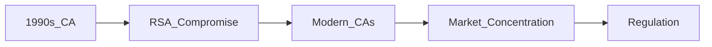

## Un hallazgo inesperado en el archivo de la historia digital  

La publicación en Hacker News titulada **“I’ve factored the RSA keys of a Certificate Authority from the 90s”** ha resonado más allá de los círculos de cripto‑entusiastas. El autor, Marco McPherrin, logró factorizar una clave RSA de 1024 bits usada por una *Certificate Authority* (CA) que operaba a finales de los años noventa, una hazaña que, a primera vista, parece una curiosidad histórica. Sin embargo, el impacto real se extiende a la arquitectura actual de la confianza digital, al modelo de negocio de las CAs y a la forma en que el capital se ha concentrado en unos pocos jugadores del sector.

## La tecnología que sustentó la primera era del internet  

En los inicios de la web comercial, la infraestructura de clave pública (PKI) era un ecosistema de laboratorios y startups experimentales. Empresas como **VeriSign**, **Entrust** y la entonces emergente **Thawte** (fundada en 1995) emitían certificados digitales que aseguraban las primeras transacciones electrónicas. Las claves RSA de 1024 bits, entonces consideradas seguras, eran el pilar de la confianza. La falta de estandarización y la escasa interconexión entre proveedores mantenían el mercado fragmentado y, paradójicamente, resistente a monopolios.

## El factor de la vulnerabilidad: una clave compuesta en la era de la expansión  

El factor que McPherrin logró obtener no es simplemente un número matemático; es una evidencia de que la seguridad de aquella época dependía de supuestos que hoy son obsoletos. La aparición de algoritmos de factorización más eficaces y la disponibilidad de potencia de cómputo en la nube (AWS, Google Cloud) hacen que una clave de 1024 bits sea trivial de romper con recursos modestos. Lo que antes era una barrera de entrada ahora se ha convertido en una puerta abierta.

## Concentración de capital: de la diversidad a los gigantes de la confianza  

A medida que internet creció, la cantidad de sitios web se multiplicó exponencialmente. La necesidad de una *cadena de confianza* consolidada llevó a la consolidación del mercado de CAs. En la actualidad, **DigiCert**, **Sectigo** (ex‑Comodo) y **GlobalSign** controlan más del 70 % del volumen de certificados SSL/TLS emitidos. **Let’s Encrypt**, aunque sin ánimo de lucro, dependía de la infraestructura de estos gigantes para sus operaciones automáticas.  

Esta concentración se traduce en una asimetría de poder: unas pocas empresas determinan tarifas, políticas de validación y, en última instancia, la percepción de seguridad de millones de usuarios. La rentabilidad de la industria, estimada en varios cientos de millones de dólares anuales, ha atraído la atención de fondos de capital privado y corporaciones tecnológicas. **Microsoft** y **Amazon** ahora venden certificados a través de sus plataformas cloud, aprovechando la reputación de los CAs tradicionales para ofrecer “certificados integrados”.  

Esta estrategia está alineada con la lógica de capital concentrado: las empresas con mayor liquidez pueden comprar startups de seguridad, absorber talento y reforzar su posición de mercado. Un ejemplo reciente es la adquisición de **Venafi** por parte de **Thoma Bravo**, un fondo de private equity que ahora controla una parte significativa de la gestión de certificados en entornos de nube.

## Dinámicas económicas y la lógica del “trust as a service”  

El modelo de negocio de las CAs se ha transformado de *producto único* (un certificado vendido una sola vez) a *servicio recurrente* (renovaciones automáticas, gestión de claves, detección de fraude). Esta evolución permite ingresos predecibles y refuerza la barrera de salida para los competidores. Además, la venta cruzada con servicios de **ciberseguridad** (firewalls, gestión de identidad) crea ecosistemas cerrados donde el cliente depende de un único proveedor para varias capas de protección.  

Esta estrategia está alineada con la lógica de capital concentrado: las empresas con mayor liquidez pueden comprar startups de seguridad, absorber talento y reforzar su posición de mercado. Un ejemplo reciente es la adquisición de **Venafi** por parte de **Thoma Bravo**, un fondo de private equity que ahora controla una parte significativa de la gestión de certificados en entornos de nube.

## Riesgos sistémicos derivados de la centralización  

El hallazgo de McPherrin resalta un riesgo estructural: cuando la confianza se concentra en unos pocos puntos críticos, cualquier falla (intencional o accidental) se propaga rápidamente. Incidentes pasados, como el colapso de **DigiNotar** en 2011, demostraron que la pérdida de una CA puede comprometer miles de sitios web y crear una crisis de confianza.  

Hoy, la vulnerabilidad de una clave RSA vieja es más que una pieza de historia; es una señal de que la cadena de confianza sigue dependiendo de estándares criptográficos que pueden quedar obsoletos. La presión regulatoria (por ejemplo, la normativa **eIDAS** en la UE y las guías del **NIST** en EE. UU.) empuja a los proveedores a migrar a claves de al menos 2048 bits o a algoritmos post‑cuánticos, pero la velocidad de adopción está limitada por la inercia de los sistemas legados.  

## ¿Qué papel juegan las grandes plataformas en la solución o el agravamiento?  

**Google**, **Apple** y **Microsoft** han implementado sus propias listas de CAs de confianza y, en algunos casos, han excluido a proveedores que no cumplen con criterios de seguridad modernos. Esta acción, aunque mejora la higiene del ecosistema, también refuerza su propio poder de mercado al forzar a los usuarios a adoptar sus servicios de certificación o a pagar por la inclusión en sus almacenes de confianza.  

Por otro lado, la oferta de **certificados gratuitos** por parte de **Let’s Encrypt**, respaldada por la fundación Internet Security Research Group (ISRG), ha democratizado el acceso a HTTPS, pero depende de la infraestructura de los CAs tradicionales para la validación de dominios. Así, la aparente competencia se traduce en una mayor dependencia de los mismos actores dominantes.  

## Tendencias históricas: de la fragmentación a la oligopolización  

La trayectoria de la industria de certificación digital se asemeja a la de otros sectores tecnológicos: los primeros pioneros operan en un entorno de baja barrera de entrada, la demanda crece rápidamente y, eventualmente, se forma un oligopolio que controla la mayor parte del valor. Este proceso se observó en los navegadores web (con Chrome, Safari y Firefox dominando), en los sistemas operativos (Apple, Microsoft, Google) y ahora en la infraestructura de PKI.  

El caso de la clave RSA de los años 90 sirve como recordatorio de que la *innovación* sin *regulación equilibrada* puede generar vulnerabilidades de largo plazo. La historia ya mostró que la fragmentación inicial es la semilla de la innovación; quizá sea momento de volver a sembrar esa diversidad antes de que la concentración se convierta en la única opción viable.

