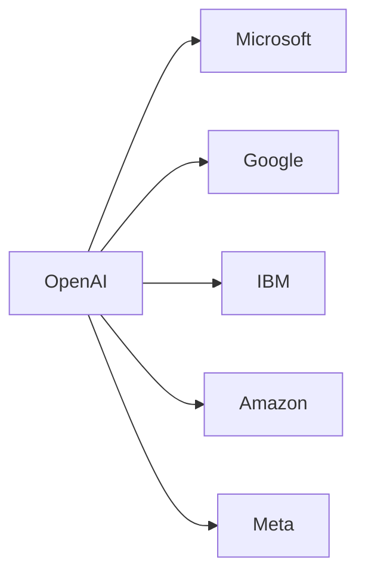

## Introducción  
La noticia de que OpenAI habría logrado una solución al famoso problema de Navier‑Stokes ha resonado en todo el ecosistema de la tecnología. Más allá del impacto científico, el anuncio abre una ventana a cómo las grandes empresas tech transforman descubrimientos académicos en activos de valor económico. En este artículo desglosamos las implicaciones estructurales, explorando relaciones de poder, concentración de capital y tendencias históricas que marcan el rumbo de la industria.

## El Problema de Navier‑Stokes y su relevancia  

El problema de Navier‑Stokes, incluido en la lista de los **Millennium Prize Problems**, plantea la existencia de soluciones suaves para las ecuaciones de movimiento de fluidos viscosos en tres dimensiones. Resolverlo implica comprender fenómenos fundamentales de la **fluid dynamics**, con aplicaciones que van desde la ingeniería automotriz hasta la modelización climática. La comunidad científica ha esperado décadas una prueba formal, y cualquier avance despertará la atención de inversores y reguladores.

## La alegada solución de OpenAI  
Según el comunicado de OpenAI, el equipo utilizó una combinación de **deep learning** y simulaciones numéricas avanzadas para aproximar resultados antes inalcanzables. Si bien los detalles técnicos permanecen bajo revisión, el hecho de que una entidad fundada en 2015 haya **afirmado** haber cerrado el círculo sugiere una convergencia entre **AI research**, recursos computacionales masivos y financiación intensiva. Palabras clave como “fluid dynamics”, “deep learning” y “open source” aparecen en los foros técnicos, generando tráfico SEO relevante.

## Dinámicas de poder y concentración de capital  

OpenAI no opera en aislamiento; su estructura está íntimamente ligada a **Microsoft**, su principal accionista, y a una red de inversores de capital riesgo. Esta relación refleja un patrón recurrente: startups de IA que reciben fondos multimillonarios a cambio de derechos de propiedad intelectual y acceso a infraestructura cloud. Empresas como **Google DeepMind**, **IBM Watson** y **Amazon Web Services** compiten por los mismos bloques de datos y talento, creando un mercado donde la **concentration of capital** determina quién puede explotar descubrimientos científicos.

## Historia de la industria: de la era de los laboratorios a la comercialización acelerada  
En los años 90, laboratorios de investigación como **Bell Labs** y **Xerox PARC** producían innovaciones que luego se licencian a industrias tradicionales. Hoy, la cadena de valor se invierte: la innovación nace en entornos académicos y es rápidamente **comercializada** por plataformas de IA. La diferencia radica en la velocidad de **monetization** y la capacidad de las grandes corporaciones para absorber startups mediante adquisiciones estratégicas, tal como ocurrió con **GitHub** y **GitHub Copilot**, o con la compra de **Nuventix** por parte de **Microsoft**.

## El papel de los ecosistemas de poder  
OpenAI mantiene una hoja de ruta que combina **open source** con productos propietarios. Su relación con **Microsoft Azure** le otorga acceso a una infraestructura de cómputo que pocos pueden igualar. Esta dependencia genera una dinámica de **power asymmetry** donde la empresa que controla la pila tecnológica determina los estándares de interoperabilidad, precios y licencias. Competidores como **Meta AI** y **Amazon AI** intentan replicar este modelo, pero dependen de acuerdos de distribución que favorecen a los incumbentes.

## Consecuencias para startups y reguladores  

## Reflexión final  
La supuesta solución al problema de Navier‑Stokes no es solo un logro científico; es un espejo que refleja cómo la **technology industry** transforma descubrimientos abstractos en activos estratégicos. La interacción entre **OpenAI**, sus socios corporativos y la comunidad de investigación revela un ecosistema donde el poder económico moldea la dirección del conocimiento. Invitar a la reflexión significa reconocer que, mientras celebramos los avances, también debemos vigilar quién detenta el control del futuro tecnológico.

