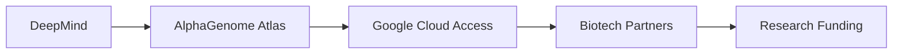

## Google DeepMind lanza Atlas Genómico: poder, capital y concentración en biociencias

*Meta descripción*: Google DeepMind presenta el Atlas Genómico AlphaGenome, una herramienta de IA que promete transformar la investigación en genómica. La iniciativa destaca cómo el poder, el capital y la infraestructura tecnológica se concentran en unas pocas corporaciones.

*Etiquetas*: Google DeepMind, AlphaGenome Atlas, biotecnología, IA, concentración de poder, capital, tecnología

---

### Un salto histórico en la intersección entre IA y genómica

En la última semana, Google DeepMind ha anunciado el lanzamiento de **AlphaGenome Atlas**, una plataforma que combina modelos de aprendizaje profundo con bases de datos genómicas masivas para mapear interacciones entre variantes genéticas y enfermedades. La noticia, difundida en el blog oficial de Google, ha generado entusiasmo en la comunidad científica y ha despertado críticas en sectores que observan la creciente acumulación de recursos tecnológicos en manos de unas pocas empresas.

AlphaGenome Atlas no es simplemente una herramienta de análisis; es un **ecosistema vertical** que integra procesamiento de datos, entrenamiento de modelos y acceso a infraestructura de cómputo en la nube bajo el paraguas de Google Cloud. Esta arquitectura permite a los investigadores ejecutar simulaciones de gran escala sin necesidad de invertir en hardware propio, lo que, en teoría, democratiza el acceso a la genómica computacional. Sin embargo, la realidad del mercado sugiere un **escenario más complejo**.

### El poder económico detrás del proyecto

#### Concentración de capital en el gigante tecnológico

El modelo de negocio de estas corporaciones se basa en la **verticalización**: controlan la capa de datos (genomas secuenciados), la capa de cálculo (centros de datos y servicios en la nube) y la capa de aplicación (software de análisis). Este esquema recuerda a los monopolios de la era industrial, donde la integración vertical permitía dominar toda la cadena de valor. En el contexto actual, la diferencia radica en la rapidez con la que la IA puede procesar petabytes de información genética y generar insights que antes requerían décadas de investigación.

#### Relaciones de poder con actores tradicionales

A diferencia de los laboratorios farmacéuticos tradicionales, que dependen de ensayos clínicos costosos y regulaciones estrictas, las plataformas de IA como AlphaGenome Atlas pueden **acelerar el pipeline de descubrimiento** mediante la simulación de millones de interacciones gen‑ambiente en cuestión de horas. Esto ha generado una competencia feroz con empresas como **IBM Watson for Genomics**, **Microsoft Azure AI for Health** y **Amazon Bedrock** en el ámbito de la salud. Cada una busca posicionarse como el proveedor de la infraestructura esencial para la próxima generación de medicina personalizada.

Sin embargo, la diferencia clave está en la **capacidad de monopolizar el acceso**. Google controla tanto la fuente de datos (a través de proyectos como el *Genome Aggregation Database* – gnomAD) como la plataforma de cómputo (Google Cloud) y la capa de distribución (a través de sus alianzas con instituciones académicas). Esta tríada le otorga una ventaja competitiva que, según analistas de *The Economist*, podría traducirse en una “capa de moat” más poderosa que cualquier patente tradicional.

### Contexto histórico: de la secuenciación al big data

La revolución genómica comenzó con el **Proyecto del Genoma Humano** a principios de los 2000, un esfuerzo global que costó alrededor de 3 mil millones de dólares y tomó más de una década completar el mapeo del ADN humano. En los años siguientes, la tecnología de secuenciación de nueva generación (NGS) redujo drásticamente el costo por genoma, pasando de cientos de dólares a menos de diez, según el *National Human Genome Research Institute*.

Paralelamente, la IA experimentó un renacimiento gracias a la disponibilidad de **grandes modelos de lenguaje** y **redes neuronales convolucionales**, que permitieron el reconocimiento de patrones complejos en datos biológicos. La confluencia de ambos campos dio origen a la **bioinformática basada en Deep Learning**, un área que ha atraído inversiones multimillonarias y ha generado startups como **DeepVariant** (Google) y **Insilico Medicine**.

AlphaGenome Atlas representa la cúspide de esta convergencia: una plataforma que no solo consolida la información genética, sino que también la **interpreta** mediante modelos que aprenden de patrones emergentes. La capacidad de generar hipótesis rápidamente ha llevado a una nueva dinámica de **cooperación abierta**, donde grandes empresas comparten datasets con universidades a cambio de acceso anticipado a descubrimientos.

### Dinámicas económicas y riesgos de exclusividad

#### El precio del acceso y la equidad

Aunque Google promete que AlphaGenome Atlas será accesible a instituciones académicas mediante **programas de investigación gratuitos**, la realidad del mercado sugiere que el costo real recae en la **dependencia de la infraestructura de nube**. Los precios de los servicios de cómputo en la nube de Google, aunque competitivos, pueden escalar rápidamente cuando se procesan millones de muestras. Esta dependencia económica crea un **bloqueo de salida** para los usuarios independientes, que pueden verse obligados a permanecer dentro del ecosistema de Google para evitar costos prohibitivos.

Además, la recopilación de datos genómicos a gran escala plantea preguntas sobre la **privacidad** y la **propiedad intelectual**. Los investigadores que utilizan AlphaGenome Atlas deben aceptar los términos de servicio de Google, que incluyen cláusulas de uso de los datos generados para entrenar futuros modelos de la compañía. Esto podría traducirse en una situación donde los hallazgos de investigación sean **reutilizados** por Google sin compensación directa a los creadores originales.

#### El rol de la regulación

Este escenario sugiere que la **concentración de poder** no será solo un fenómeno económico, sino también una cuestión regulatoria que podría definir los límites de la innovación en biotecnología durante las próximas décadas.

### Mirada al futuro: ¿Hacia una nueva era de monopolios digitales?

El lanzamiento de AlphaGenome Atlas abre un debate más amplio sobre la **sostenibilidad** del modelo de negocio de las big tech en sectores críticos como la salud. Por un lado, la integración de IA y genómica tiene el potencial de **acelerar curas** para enfermedades antes consideradas incurables. Por otro, la capacidad de una sola corporación para controlar tanto los datos como la infraestructura de análisis puede **estificar el mercado**, limitando la competencia y la diversificación de enfoques.

Históricamente, la superación de monopolios ha requerido **intervenciones regulatorias** (por ejemplo, la desintegración de Standard Oil o AT&T). En la era digital, la respuesta podría pasar por la creación de **arquitecturas abiertas** mediante estándares interoperables, o por la financiación pública de infraestructuras de cómputo neutrales que permitan a investigadores de todo el mundo acceder a recursos sin depender de un único proveedor.

### Conclusión: reflexión sobre el futuro del poder tecnológico

AlphaGenome Atlas es más que una herramienta de análisis genómico; es un espejo que refleja cómo el poder, el capital y la infraestructura tecnológica se concentran en unas cuantas corporaciones globales. La capacidad de Google para combinar IA de vanguardia con una vasta base de datos genómicas plantea preguntas esenciales sobre la **democracia del conocimiento** y la **responsabilidad** de quienes controlan los algoritmos que decidirán el futuro de la salud humana.

A medida que la industria avanza, será crucial que científicos, reguladores y ciudadanos exijan **transparencia**, **competencia** y **equidad** en el uso de estas tecnologías. Solo así podremos asegurar que los avances impulsados por la IA no se transformen en otro mecanismo de exclusión, sino en una fuerza democratizadora que benefice a toda la humanidad.

---

[Diagrama simplificado]

