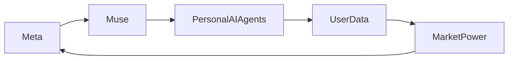

# Meta’s Muse: Un agente de IA personal y la nueva arquitectura del poder

Meta ha lanzado **Muse**, un agente de IA personal diseñado para actuar como un asistente ubicuo y consciente del contexto en toda su suite de plataformas sociales. A diferencia de modelos anteriores basados en chat, Muse se promociona como un **agente de IA personal** que aprende de los hábitos individuales de los usuarios, se integra con **WhatsApp**, **Instagram** y **Facebook**, y ofrece sugerencias proactivas sin necesidad de ser solicitado explícitamente.

## Implicaciones estratégicas para Meta

El lanzamiento de Muse no es solo una actualización de producto; es un movimiento estratégico para afianzar la dominancia de Meta en el **mercado de IA**. Al incorporar un **modelo de lenguaje grande (LLM)** que se afina continuamente con el historial de interacciones de cada usuario, Meta obtiene un bucle de retroalimentación sin precedentes. Este bucle alimenta datos de entrenamiento frescos mientras simultáneamente aumenta el engagement del usuario, lo que se traduce en mayores **ingresos publicitarios** y tiempos de sesión más prolongados.

Desde una perspectiva económica, el valor de Muse radica en su capacidad de convertir **datos de usuarios** en un **efecto de red** difícil de replicar para la competencia. Aunque Google, Apple y Amazon también han invertido fuertemente en asistentes personales, la ventaja de Meta se basa en su **grafo social**, la intrincada red de relaciones que define a quién siguen, qué comparten y cómo interactúan los usuarios. Este grafo proporciona un conjunto de datos más rico que los historiales de compras o las consultas de búsqueda, permitiendo a Muse predecir preferencias con una granularidad que pocos rivales pueden igualar.

## Dinámicas de poder entre las grandes tecnológicas

La introducción de Muse intensifica una competencia ya feroz entre las **grandes tecnológicas**. Google con su **Gemini** y Apple con **Siri** han ido iterando hacia experiencias más personalizadas, pero operan en plataformas más fragmentadas. El **único registro** de Meta brinda una ventaja única: un usuario que inicia sesión en Facebook es enrutado automáticamente al mismo nivel de IA que potencia recomendaciones en Stories de Instagram y chats de Messenger.

Esta consolidación del poder genera inquietudes sobre la **privacidad de datos** y la **supervisión regulatoria**. Históricamente, concentraciones similares despertaron investigaciones antimonopolio, como el caso **United States v. Microsoft** de principios de los años 2000. Hoy, los reguladores observan de cerca la expansión de capacidades de IA de **Meta**, temiendo que un **agente de IA personal** pueda convertirse en custodio del flujo de información, la segmentación publicitaria e incluso la persuasión política.

## Contexto histórico: de los mainframes a la movilidad

La historia de Muse encaja en una narrativa más larga de **concentración tecnológica**. En los años 60, los mainframes centralizaban el poder de cómputo en unas cuantas corporaciones. En los 90, surgieron las arquitecturas **cliente‑servidor**, que redistribuían el poder, pero eventualmente dieron paso a servicios **basados en la web** dominados por unos pocos buscadores y portales. La revolución móvil democratizó momentáneamente el cómputo, pero pronto las tiendas de aplicaciones quedaron controladas por Apple y Google, creando un nuevo dúopolio.

Actualmente, la era de los **agentes de IA personales** promete otro giro. Al incorporar IA directamente en herramientas de comunicación cotidianas, las plataformas pueden ejercer influencia no solo sobre el contenido que los usuarios ven, sino también sobre cómo **interpretan** ese contenido. Esto recuerda a principios de los 2000, cuando los motores de búsqueda comenzaron a moldear el flujo de información, generando debates sobre **burbujas de filtro** y **sesgo algorítmico**. Muse podría amplificar estos efectos a escala personal, haciendo que la **estrategia de IA** de una sola empresa sea asunto de política pública.

## Dinámicas económicas y concentración del mercado

Desde el punto de vista económico, la implementación de Muse ilustra cómo el **capital** y el **talento** se concentran alrededor de unos pocos incumbentes. Desarrollar un LLM sofisticado capaz de personalización requiere recursos de cómputo masivos, **expertise** de ingeniería y **adquisición de datos**, recursos que solo pueden sostener empresas con valuaciones multimillonarias. Las startups más pequeñas pueden innovar en nichos específicos, pero carecen de la escala necesaria para integrar IA en múltiples canales de comunicación al nivel que Meta imagina.

Los patrones de financiamiento por capital de riesgo reflejan esta concentración: los inversores destinan recursos a startups de **IA generativa** que prometen aplicaciones novedosas, pero la mayoría de las **rondas de financiamiento** siguen gravitando hacia empresas respaldadas por **grandes tecnológicas** o por un reducido número de fondos bien capitalizados. Esta dinámica refuerza una estructura de mercado **ganador‑toma‑todo**, donde pocos jugadores pueden costear la infraestructura y dominar el **ecosistema de IA**.

## Evaluación crítica: oportunidades y riesgos

Muse ofrece oportunidades tentadoras: experiencias de usuario más intuitivas, asistencia eficiente en tareas diarias y nuevos canales para la **expresión creativa** mediante contenido generado por IA. Sin embargo, los riesgos son igualmente significativos. La **centralización de la IA** bajo el alero de una corporación única puede limitar la competencia, frenar la innovación y concentrar el **poder de decisión** sobre qué información se presenta a los usuarios.

Además, el **modelo de monetización** de agentes de IA personales podría difuminar la línea entre interacción orgánica y publicidad. Si Muse recomienda un producto, un artículo de noticias o una postura política, los incentivos subyacentes podrían estar motivados más por **ingresos publicitarios** que por el bienestar del usuario. La transparencia y los mecanismos de rendición de cuentas serán esenciales para evitar que la **opacidad algorítmica** se convierta en herramienta de manipulación.

## Conclusión: Reflexiones sobre el futuro de los agentes de IA personalizados

El **Muse** de Meta representa un momento pivotal en la evolución de los **agentes de IA personales**, mostrando cómo los avances tecnológicos se entrelazan con el poder económico, el control de datos y los desafíos regulatorios. A medida que estos agentes se integren más en nuestra vida digital, la pregunta persiste: ¿quién definirá las reglas de este nuevo panorama?

La respuesta probablemente dependerá de una combinación de **intervenciones políticas**, **autoregulación sectorial** y **conciencia pública**. Los lectores están invitados a reflexionar sobre cómo la concentración del poder de IA podría afectar la privacidad, la competencia y el discurso democrático, y a participar en la conversación continua sobre el tipo de futuro tecnológico que deseamos construir.
---
