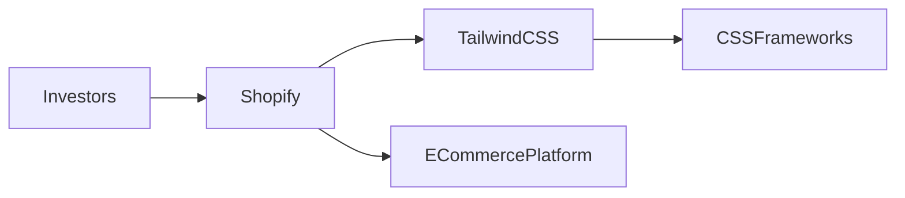

## Introducción  

El anuncio oficial de Shopify sobre la compra de Tailwind CSS, el popular framework de utilidades CSS, ha sacudido tanto la comunidad de desarrolladores como los analistas de mercado. Publicado en el blog de Tailwind y rápidamente difundido por Hacker News, el movimiento no es solo una transacción financiera; es un indicio de cómo las grandes plataformas de comercio electrónico están extendiendo su control sobre las capas más bajas del stack de desarrollo. En este artículo desglosamos las implicaciones de la adquisición, la dinámica de poder que subyace y su encaje dentro de un patrón histórico de concentración de capital en la industria tecnológica.  

## Un vistazo rápido a los protagonistas  

| Empresa | Core business | Modelo de ingresos | Posición en la cadena de valor |
|--------|----------------|--------------------|--------------------------------|
| **Shopify** | Plataforma SaaS de e‑commerce | Suscripciones, comisiones de venta, apps marketplace | Control total del front‑end y back‑end de tiendas online |
| **Tailwind CSS** | Framework de CSS basado en utilidades | Open source, financiamiento mediante licencias de diseño y “Tailwind UI” | Herramienta de desarrollo que acelera la creación de interfaces web |  

Shopify, fundada en 2006, se ha convertido en la columna vertebral del comercio digital para más de un millón de tiendas. Su ecosistema incluye una tienda de aplicaciones, integraciones con múltiples pasarelas de pago y una API robusta que permite a terceros construir extensiones. Tailwind, creado por Adam Wathan y Steve Schoger en 2017, ha redefinido la forma en que los front‑end developers estructuran CSS, favoreciendo la velocidad de desarrollo sobre la escritura de clases personalizadas.  

## El contexto de la adquisición  

A primera vista, la compra parece una sinergia natural: Shopify necesita herramientas que reduzcan el tiempo de despliegue de tiendas, mientras que Tailwind busca una base de usuarios masiva. Sin embargo, la transacción también revela una tendencia mayor — la **integración vertical** de plataformas que tradicionalmente se habían quedado en la superficie del mercado.  

### Capital y poder de decisión  

Shopify es una empresa pública que cotiza en la NYSE bajo el ticker SHOP, con una capitalización que supera los 80 mil millones de dólares. Sus principales accionistas institucionales — BlackRock, Vanguard y Morgan Stanley — poseen colectivamente más del 15 % de las acciones. Esta concentración de capital permite a Shopify ejecutar adquisiciones estratégicas sin vacilar, a diferencia de startups que dependen de rondas de financiación más fragmentadas.  

Tailwind, por otro lado, ha sido financiado en gran parte a través de su propio modelo de negocio (“Tailwind UI”) y de pequeñas rondas de capital riesgo, manteniendo una estructura de propiedad más dispersa y un fuerte arraigo en la comunidad open source. Al pasar a manos de Shopify, los flujos de decisión sobre la hoja de ruta del framework se trasladan a una junta directiva que prioriza la rentabilidad y la integración con su plataforma de comercio.  

### Dinámica histórica de consolidación  

* **Google adquirió Android (2005)** y, años después, **Flutter (2019)**, consolidando su dominio sobre el desarrollo móvil y web.  
* **Microsoft compró GitHub (2018)**, asegurando una posición estratégica en la infraestructura de código fuente y flujos CI/CD.  
* **Adobe incorporó Magento (2018)**, reforzando su suite de productos de comercio digital.  

En cada caso, la lógica subyacente es la misma: **controlar los “puntos de enganche” que los desarrolladores utilizan para crear, desplegar y mantener aplicaciones**. Al hacerlo, la empresa no solo captura más valor a lo largo de la cadena, sino que también establece barreras de entrada para competidores que dependen de esas mismas herramientas.  

## Impacto en la comunidad de desarrolladores  

### Beneficios potenciales  

1. **Integración nativa**: Los usuarios de Shopify podrían disfrutar de componentes Tailwind preconfigurados, reduciendo la fricción al diseñar tiendas responsive.  
2. **Recursos de inversión**: Shopify tiene el capital para invertir en documentación, herramientas de testing y capacitación que podrían acelerar la adopción de Tailwind.  

### Riesgos y tensiones  

1. **Pérdida de independencia**: Un framework que nace como proyecto open source corre el peligro de que sus decisiones de roadmap se alineen con los intereses comerciales de su nuevo propietario.  
2. **Posible “lock‑in”**: Si Shopify incorpora Tailwind de forma tan profunda que la única manera de mantener una tienda Shopify sea usar Tailwind, los comercios quedarán atados a la plataforma, limitando la portabilidad.  
3. **Erosión de la cultura open source**: La comunidad podría percibir la adquisición como una “captura corporativa”, disminuyendo la confianza en proyectos futuros que dependen de financiación externa.  

## El papel de los inversores y la regulación  

Los grandes fondos de inversión que respaldan a Shopify han demostrado una clara preferencia por **modelos de negocio “platform‑centric”**. La lógica es capturar efectos de red y crear “moats” (fosos defensivos) alrededor de la base de usuarios. En este sentido, la compra de Tailwind refuerza el “moat” de Shopify al ofrecer una capa de UI que es difícil de replicar fuera de su ecosistema.  

Desde la perspectiva regulatoria, la operación no ha despertado alarmas antimonopolio, en parte porque el mercado de frameworks CSS sigue siendo fragmentado (Bootstrap, Bulma, Material‑UI, etc.). Sin embargo, la tendencia de **concentrar poder de desarrollo bajo grandes plataformas** podría atraer mayor escrutinio en el futuro, especialmente si se traduce en prácticas de exclusión o precios de licencia que perjudiquen a pequeñas agencias y freelancers.  

## Comparación con otras plataformas  

| Plataforma | Estrategia de adquisición | Resultado |
|------------|----------------------------|-----------|
| **Shopify** | Tailwind CSS (2024) | Potencial integración de UI/UX en e‑commerce |
| **Adobe** | Magento (2018) | Unificación de experiencia de compra y marketing |
| **Microsoft** | GitHub (2018) | Dominio del flujo de trabajo de desarrollo |
| **Google** | Android (2005), Flutter (2019) | Control del ecosistema móvil y web |  

La tabla muestra que la **acumulación de activos tecnológicos** es una táctica recurrente para reforzar la **propiedad del ciclo de vida del producto**. En el caso de Shopify, la adquisición de Tailwind puede ser vista como el paso lógico después de comprar **Oberlo** (automatización de dropshipping) y **Handshake** (marketplace B2B). Cada compra amplía la capa de servicios que la empresa puede ofrecer bajo un mismo techo financiero.  

## Tendencias macroeconómicas que favorecen la consolidación  

1. **Elevado coste de desarrollo**: Las empresas buscan acelerar el time‑to‑market. Herramientas como Tailwind que prometen productividad se vuelven activos estratégicos.  
2. **Ciclos de financiación más ágiles**: El acceso a capital barato permite a compañías consolidadas comprar rápidamente startups antes de que alcancen una valoración prohibitiva.  
3. **Presión competitiva de jugadores de IA**: Con la aparición de generadores de código asistidos por IA (GitHub Copilot, Tabnine), los frameworks que pueden ser entrenados o “entendidos” por estos sistemas se vuelven aún más valiosos.  

## ¿Qué nos dice esto del futuro del desarrollo web?  

La compra de Tailwind por Shopify sugiere que **las plataformas de negocio están descendiendo a la capa de infraestructura** para asegurarse de que el flujo de valor se mantenga dentro de sus dominios. Para los desarrolladores, la conclusión es doble: mientras hay oportunidades para aprovechar recursos mejorados, también aumenta la necesidad de **diversificar las pilas tecnológicas** y no depender exclusivamente de una única plataforma propietaria.  

## Conclusión  

Shopify al adquirir Tailwind CSS no solo refuerza su posición en el mercado de comercio electrónico; está marcando otro paso en la larga marcha de los gigantes tecnológicos hacia el control completo del proceso de creación digital. La operación evidencia la continua **concentración de capital** y el **poder de decisión** que poseen los actores con acceso a grandes fondos de inversión. Al observar la historia reciente —desde la compra de Android por Google hasta la absorción de GitHub por Microsoft— vemos un patrón claro: la integración vertical de herramientas de desarrollo permite crear ecosistemas cerrados que maximizan ingresos pero pueden limitar la innovación abierta.  

Para la comunidad de desarrolladores, la pregunta ahora es cómo equilibrar los beneficios inmediatos de una integración profunda con la preservación de la **independencia tecnológica** y la **cultura open source**. Reflexionar sobre estas dinámicas nos ayuda a entender no solo el presente de la industria, sino también a anticipar sus posibles rutas de evolución.  

---  

**Invitación a la reflexión:** ¿Deberíamos aceptar que los frameworks que utilizan millones de desarrolladores formen parte de los arsenales de gigantes corporativos, o es momento de reforzar iniciativas comunitarias que mantengan la herramienta libre de ataduras comerciales? La respuesta a esta pregunta definirá el equilibrio entre innovación y control en los próximos años.