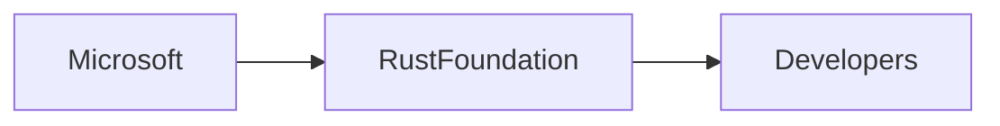

# Rust is Now a Tier‑1 Language at Microsoft: A Critical Look at Power, Money, and History

*By an independent tech analyst*  

## Introduction – A Milestone in Language Politics  
When Microsoft announced that **Rust** has been promoted to a **tier‑1 language** across its products, the tech world took notice. This isn’t just a technical upgrade; it signals a **strategic repositioning** of one of the world’s most powerful software firms. For readers who follow language ecosystems, the news reads like a headline from a **programming languages** saga that dates back to the 1970s when **C** dominated systems programming. Today, the rise of **Rust** mirrors earlier shifts from **assembly** to **C**, and from **C** to managed languages like **Java** and **C#**.  

## Historical Context – From C to Managed Languages  

The story of language adoption in large firms is a narrative of **economic necessity** and **technical risk**. In the 1990s, Microsoft built Windows and Office on **C** and **C++**, but the safety guarantees of those languages proved insufficient for massive codebases. The 2000s saw the rise of **C#** and **Visual Basic** to increase developer productivity, yet those languages introduced **garbage collection** overhead and performance trade‑offs.  

Fast forward to the 2010s: memory‑safety bugs became headline news (think Heartbleed). Companies began scouting for a language that offered **C‑like performance** with **compile‑time safety**. **Rust’s** ownership model fit perfectly, and its open‑source nature made it attractive for collaborative ecosystems.  

## Microsoft’s Tier‑1 Decision – Power and Capital Concentration  
Promoting **Rust** to tier‑1 status means Microsoft now **allocates senior engineering resources, long‑term maintenance budgets, and formal governance** to the language. This move concentrates **capital** and **decision‑making power** in the hands of a single corporation. While open‑source rhetoric celebrates decentralization, the reality is often a **public‑private hybrid**: a foundation backed by corporate contributions, but with **strategic vetoes** at the board level.  

### The Rust Foundation’s Role  
The **Rust Foundation**, founded in 2021, is governed by a board that includes representatives from **Microsoft, Google, Amazon, Apple, and others**. Microsoft’s tier‑1 status adds a new voting weight, shaping roadmap priorities such as **toolchain stability**, **binary compatibility**, and **integration with Azure**. From a **concentration of capital** perspective, this reinforces a **boardroom dynamic** where large cloud providers can align Rust’s evolution with their own platform interests.  

### Comparisons with Other Giants  
- **Google** uses Rust for parts of **Fuchsia** and **Android**, but its involvement is more **project‑specific**.  
- **Amazon** pushes Rust for **AWS Lambda** and **Firecracker**, yet its contributions are often **silos** within Amazon Web Services.  

Microsoft’s approach, by contrast, is **organizational**: Rust becomes a first‑class concern across **Windows Subsystem for Linux (WSL)**, **Azure services**, and **Office 365** security modules. This breadth amplifies Microsoft’s influence over the language’s **ecosystem** and **standard library** direction.  

## Economic Dynamics – Vendor Lock‑In, Open Source, and Market Incentives  

From an **economic** standpoint, the tier‑1 designation creates a **two‑fold incentive**:  

1. **Vendor Lock‑In Potential** – As Rust becomes the default language for critical services, migrating away could be **costly** for Microsoft’s partners and customers. This mirrors the **lock‑in** seen when Microsoft pushed **.NET** and **C#** in the early 2000s.  
2. **Open‑Source Goodwill** – By championing an **MIT‑licensed** language, Microsoft gains **reputation capital** in the open‑source community, which can translate into **talent acquisition** and **developer goodwill**.  

The **software development** market is increasingly **price‑sensitive**. Companies that can reduce **memory‑related bugs** and **security incidents** stand to save **millions** in remediation costs. Microsoft’s investment in Rust, therefore, can be seen as a **risk‑mitigation strategy** that also opens **new revenue streams** through Azure‑hosted Rust services.  

## Power Dynamics – Who Controls the Narrative?  
The tier‑1 promotion also reshapes **power dynamics** within the broader **programming languages** ecosystem. Historically, language standards were steered by **academic consortia** or **industry coalitions** (e.g., **ISO** for C++, **ECMA** for JavaScript). With Microsoft’s tier‑1 status, a **single corporate entity** now holds a **seat at the table** that can sway **release cadence**, **feature prioritization**, and **governance policies**.  

This concentration of influence raises questions about **transparency** and **community representation**. While the **Rust community** remains vibrant and decentralized, the **official voice** of the language now includes a **large corporate predicate**. This duality can both **protect** the language from fragmented corporate interests and **steer** it toward Microsoft’s cloud‑first vision.  

## Connecting to Broader Industry Trends  
- **Shift Toward Memory‑Safe Systems Programming** – The industry-wide move away from **C/C++** for safety‑critical components mirrors earlier migrations (e.g., from **assembly** to **C**).  
- **Open‑Source Foundations as Power Brokers** – Foundations like **Linux**, **Node.js**, and now **Rust** illustrate how **collective governance** can coexist with corporate sponsorship.  
- **Platform‑Centric Economic Models** – Cloud providers monetize language ecosystems through **managed services**, a model that Microsoft is accelerating with **Azure Functions** and **Rust runtime** offerings.  

## Critical Reflections – What Does This Mean for Developers and the Industry?  
Microsoft’s tier‑1 promotion of **Rust** is a watershed moment that intertwines **technical ambition**, **economic incentives**, and **power consolidation**. Developers gain a **safer, performant language**, but they also navigate a landscape where **corporate interests** can shape the tools they rely on.  

The key takeaway is this: **Language adoption is never neutral**. It is a battleground where **capital, governance, and historical momentum** intersect. Recognizing these dynamics helps us ask better questions about **who decides the future of our software stacks** and **what economic forces reward that decision**.  

## Conclusion – A Call to Reflective Thinking  
As **Rust** becomes a cornerstone of Microsoft’s infrastructure, the industry watches closely. Will this partnership empower a truly **open‑source future**, or will it usher in a new era of **platform‑centric control**? The answer may shape not just Microsoft’s products, but the very **architecture of software** for years to come.  

Consider this: the next time you write a line of **Rust** code, ask yourself whose **interests** are being served—yours, the community’s, or a larger corporate agenda. The reflection is yours to own.  

---