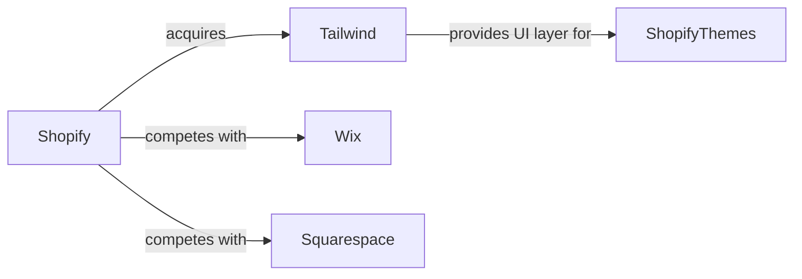

## Introducción

El anuncio de **Shopify** de adquirir **Tailwind CSS**, el popular framework de utilidades CSS, ha provocado una oleada de reacciones en la comunidad de desarrolladores y en los analistas de tecnología. Más allá del entusiasmo por la sinergia entre dos gigantes del ecosistema de comercio digital, la operación plantea interrogantes críticos sobre la **concentración de capital**, la **soberanía del software de código abierto** y la **dinámica de poder** que define la industria tecnológica actual.

En este artículo, desglosaremos los motivos estratégicos detrás de la compra, contextualizaremos la jugada en la historia de fusiones tecnológicas y evaluaremos sus posibles repercusiones para **e‑commerce**, **desarrolladores front‑end** y **competidores** como **Wix**, **Squarespace** o **BigCommerce**.

## ¿Por qué Tailwind CSS?

Tailwind CSS se lanzó en 2017 y, en menos de una década, se ha convertido en el estándar de facto para la creación rápida de interfaces visuales mediante clases de utilidad. Su modelo de negocio combina una **licencia de código abierto (MIT)** con productos de pago – como **Tailwind UI** – que venden componentes de interfaz diseñados y listos para usar. Este modelo ha generado ingresos recurrentes estimados en varios cientos de millones de dólares al año, según informes de mercado.

Para Shopify, que ya controla una gran parte de la infraestructura de **tiendas online** (más del 4 % del comercio global), la adquisición ofrece tres ventajas clave:

1. **Integración nativa** de un motor de UI que ya está profundamente arraigado en la comunidad de desarrolladores de Shopify Themes.
2. **Control del roadmap** de Tailwind, evitando que competidores (por ejemplo, **Meta** con su propio design system) lo co‑optaran.
3. **Creación de una puerta de entrada de pago**: los usuarios que adopten Tailwind UI pueden ser guiados a planes premium de Shopify, incrementando el **customer lifetime value**.

## Concentración de capital y riesgos de “walled garden”

Shopify, aunque más joven, sigue una trayectoria similar. Con la compra de **Handshaker** (una herramienta de checkout) en 2022 y ahora Tailwind, la compañía está ampliando su **capa de presentación** y su **pipeline de ingresos**. Esta estrategia aumenta el **poder de negociación** frente a los merchants (tiendas) y a los desarrolladores independientes, que dependen cada vez más de una única plataforma para lanzar y escalar sus negocios.

Desde la perspectiva de la **economía de plataformas**, la adquisición refuerza la posición de Shopify como **capa doble**: es a la vez **marketplace** (tiendas) y **proveedor de infraestructura** (tema y UI). Cuando una empresa controla ambos lados, la **asimetría de información** favorece al proveedor y puede traducirse en precios más altos, menos opciones de personalización y una mayor “dependencia de la plataforma”.

## Impacto en la comunidad de código abierto

Tailwind está bajo la **licencia MIT**, lo que permite su uso libre y sin restricciones. Sin embargo, la lógica de negocio de Tailwind depende de **componentes premium** y de la **marca** que ha construido. La adquisición plantea la siguiente disyuntiva:

- **Positivo**: Shopify promete seguir manteniendo el núcleo abierto, incrementar la velocidad de desarrollo e invertir recursos en la documentación y el ecosistema.
- **Negativo**: La integración podría llevar a **restricciones implícitas** (por ejemplo, funcionalidades que sólo funcionen de forma óptima dentro de Shopify Themes) o a una **monetización agresiva** de los paquetes premium, presionando a la comunidad a pagar por lo que antes era opcional.

Este dilema se asemeja a lo ocurrido con **Elastic** y **Kibana** después de su salida a bolsa, cuando la comunidad percibió una creciente orientación hacia los clientes empresariales a costa de los usuarios gratuitos.

## Dinámicas competitivas

La compra de Tailwind refuerza la **ventaja competitiva** de Shopify frente a otros constructores de sitios web:

| Competidor | Fuerza actual | Riesgo de pérdida de ventaja |
|------------|--------------|------------------------------|
| **Wix**    | Herramientas drag‑and‑drop, plantillas diseñadas por profesionales | Falta de un framework CSS de alto rendimiento que permita personalizaciones avanzadas sin sacrificar velocidad. |
| **Squarespace** | Enfoque en diseño visual premium, integración con marketing | Dependencia de su propio motor de estilos, menos comunidad de devs que usen utilidades como Tailwind. |
| **BigCommerce** | Integración profunda con ERP y B2B | Menor conexión con la tendencia “utility‑first” que domina el desarrollo front‑end moderno. |

Al integrar Tailwind, Shopify puede ofrecer **temas más rápidos** y **personalizables**, reduciendo la brecha entre plataformas “low‑code” y desarrollo a medida. El resultado podría ser una **consolidación de mercado**, donde los merchants migran de Wix o Squarespace a Shopify para aprovechar la combinación de **hosting robusto** + **UI de vanguardia**.

## Reflexión histórica: ciclos de apertura y cierre

La historia de la tecnología muestra patrones de **apertura** seguidos de **re‑centralización**. En los años 90, **Netscape** liberó su navegador, fomentando la era de los estándares web. Más tarde, **Microsoft** intentó monopolizar con IE. En la década 2010, la explosión de proyectos **open‑source** (Linux, Kubernetes) revivió la *democratización* del desarrollo, solo para que gigantes como **Red Hat** y **Google** comenzaran a monetizar estos proyectos mediante servicios gestionados.

Shopify se encuentra en la fase de **re‑centralización** de la cadena de suministro digital: ha pasado de ser un simple **gateway de pagos** a un **ecosistema integral** que incluye hosting, CMS, UI y ahora, propio framework CSS. Cada etapa refuerza su **barrera de entrada** para nuevos competidores y para los propios desarrolladores que podrían sentir que sus herramientas favoritas ahora dependen de una empresa cuyo objetivo principal es la **rentabilidad**.

## ¿Qué pueden hacer los desarrolladores?

1. **Diversificar** el stack: combinar Tailwind con otros frameworks como **Bootstrap**, **Material‑UI** o **Bulma**, para evitar la dependencia única.
2. **Contribuir a forks**: la licencia MIT permite crear versiones alternativas de Tailwind si Shopify cambiara la política de desarrollo.
3. **Participar en la gobernanza**: unirse a la comunidad de **Tailwind Labs** y presionar por una hoja de ruta **transparente** y **abierta**.

## Conclusión

La adquisición de Tailwind CSS por parte de Shopify es más que una simple alineación de productos; es una señal de que el **control de la experiencia de usuario** se está convirtiendo en la nueva frontera de la guerra de plataformas. Si bien la integración promete ventajas técnicas y una experiencia de compra más fluida, también intensifica la **concentración de poder** y plantea riesgos para la **soberanía del código abierto**. La comunidad de desarrolladores, los merchants y los reguladores deberán observar de cerca cómo se equilibra la innovación con la competencia, y decidir si este modelo de “ecosistema cerrado pero abierto” constituye una evolución beneficiosa o una trampa para la diversidad digital.

> **Reflexión:** ¿Estamos dispuestos a ceder cada vez más control de nuestras herramientas de creación a gigantes que también son nuestros clientes? La respuesta a esa pregunta definirá el futuro del desarrollo web y del e‑commerce en la próxima década.