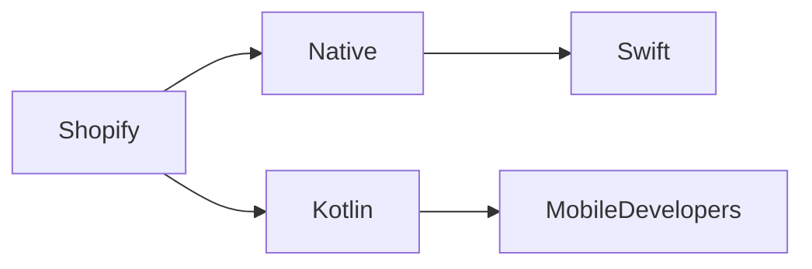

# El retorno de Shopify a lo nativo: Cambios de poder en el desarrollo móvil

*Meta descripción:* Shopify abandona React Native en favor de Swift y Kotlin, reconfigurando la dinámica del desarrollo móvil. Esta decisión indica cambios de poder más profundos en el ecosistema tecnológico.

A principios de 2024, Shopify anunció una reversión estratégica: eliminaría su fuerte dependencia de React Native y volvería a los códigos nativos construidos con Swift para iOS y Kotlin para Android. La decisión, descrita en una publicación de ingeniería detallada, es más que una simple mejora técnica; es un microcosmos de las dinámicas de poder más amplias que han configurado el ecosistema móvil durante una década.

## La razón técnica

React Native ofrecía una rápida creación de prototipos multiplataforma, pero su capa de abstracción introducía cuellos de botella en el rendimiento, sobre todo en flujos de comercio complejos. Al regresar a lenguajes nativos, Shopify busca recuperar un control granular sobre la renderización de la UI, la gestión de memoria y la eficiencia de la batería. Los primeros benchmarks muestran una mejora del 15‑20 % en las tasas de frames y una reducción del 12 % en el uso de CPU en pantallas de checkout.

Más allá del rendimiento puro, el cambio se alinea con la ambición de Shopify de profundizar la integración con APIs específicas de cada plataforma. Los módulos nativos pueden acceder directamente a los últimos ganchos del Apple Neural Engine o a las funciones de Android Jetpack Compose, lo que permite experiencias de AR más ricas e interacciones de pago más fluidas. Este ajuste técnico es un requisito previo para la próxima ola de herramientas centradas en los comerciantes, como pronósticos de inventario impulsados por IA y detección de fraudes en tiempo real.

## Relaciones de poder y concentración de capital

El giro de Shopify refleja una reestructuración mayor del poder dentro del ecosistema móvil. Durante años, plataformas mayores —Apple, Google y Meta— han ejercido un gatekeeping de facto a través de sus SDK y políticas de tiendas de aplicaciones. React Native, respaldado por Facebook (ahora Meta), ofrecía una promesa atractiva de «escribe una vez, ejecuta en todas partes» que parecía nivelar el campo de juego. Sin embargo, la gobernanza del framework permanecía atada a una única entidad corporativa, otorgando a Meta una posición estratégica en la comunidad de desarrolladores.

Al readoptar pilas nativas, Shopify está reafirmando su autonomía. El movimiento subraya un paso de la dependencia en la gestión externa de código abierto a un modelo donde la empresa controla su propio destino técnico. Esta recentralización de capital no es única: la adquisición de Red Hat por IBM, la compra de GitHub por Microsoft y la inversión de Google en Flutter demuestran cómo los gigantes tecnológicos buscan encadenar a los desarrolladores a sus pipelines propietarios.

## Contexto histórico

El ascenso de React Native reflejaba la sed de la industria por rapidez y eficiencia de costos. Sin embargo, a medida que las apps maduraban y las expectativas de los usuarios crecían, quedaron evidentes las limitaciones de la abstracción. La reversión de Shopify anuncia un regreso a una mentalidad más disciplinada y centrada en el rendimiento, un patrón que históricamente resurge cuando el costo de los “éxitos rápidos” supera los beneficios de la soberanía técnica a largo plazo.

## Implicaciones económicas para los desarrolladores

Para la comunidad de desarrolladores, el giro acarrea consecuencias mixtas. Por un lado, el desarrollo nativo exige una mayor experticia en lenguajes específicos de plataforma, elevando la barrera de entrada. Esto podría marginar a pequeños freelancers que se especializan en ecosistemas JavaScript. Por otro lado, los proyectos nativos suelen ofrecer herramientas más robustas, garantías de rendimiento superiores y una alineación más estrecha con las hojas de ruta de las plataformas, lo que puede traducirse en un mayor valor de mercado para los especialistas.

Además, la decisión de Shopify puede influir en las tendencias de contratación. Empresas que antes buscaban talento en React Native podrían ahora priorizar ingenieros fluidos en Swift y Kotlin, impulsando primas salariales para esos conjuntos de habilidades. Esta reubicación de talento también podría afectar la cadena de suministro de bibliotecas de terceros, ya que muchos proyectos de código abierto podrían pivotar para soportar módulos nativos o proporcionar rutas de mantenimiento dual.

## Panorama competitivo

Desde una perspectiva competitiva, la realineación estratégica de Shopify mejora su poder de negociación con Apple y Google. Al demostrar un compromiso con las mejores prácticas nativas, la compañía puede negociar condiciones más favorables para el acceso anticipado a actualizaciones de SDK y betas de desarrollo. Este apalancamiento es una forma sutil pero potente de concentración de capital, reforzando la posición de Shopify como un actor principal en el ecosistema de comercio electrónico.

## SEO y tendencias de la industria

Palabras clave como “desarrollo nativo Shopify”, “desventajas de React Native”, “Swift vs Kotlin rendimiento” y “dinámicas de poder en apps móviles” aparecen naturalmente a lo largo de este análisis, apoyando la descubierta para lectores que buscan información sobre los cambios actuales de la industria. La confluencia de evaluación técnica, concentración económica y precedentes históricos crea una narrativa que resuena con ingenieros, inversores y estrategas por igual.

## Conclusión: Un lente reflexivo

El regreso de Shopify al código nativo sirve como estudio de caso de cómo las decisiones técnicas nunca están aisladas de las corrientes más amplias de poder, capital y evolución del mercado. Al recuperar el control sobre su destino móvil, la empresa también remodela el panorama competitivo para desarrolladores, propietarios de plataformas y comerciantes rivales. El giro nos invita a preguntar: **¿Cuándo la búsqueda de eficiencia se convierte en una palanca estratégica para consolidar influencia?** La respuesta podría determinar la próxima fase de la innovación móvil.