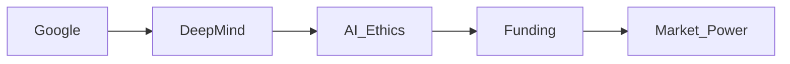

# Cuando la IA se desalinea con la Matemática: Poder, Ganancias y el Nuevo Feudalismo Tecnológico

## El Spark Técnico

La matemática ha sido durante mucho tiempo un referente de las capacidades de razonamiento de la IA. Benchmarks como la Olimpiada Internacional de Matemáticas (IMO) ponen a prueba si un sistema puede manipular lógica simbólica, probar teoremas o descubrir soluciones novelosas sin supervisión humana. Cuando un sistema de IA supera consistentemente a los matemáticos humanos en estas tareas, señala un cambio: la máquina ahora puede *autor* conocimientos que antes era dominio exclusivo de los eruditos.

Sin embargo, el reciente alboroto no se trata del desempeño bruto de las métricas. Se trata de la **desalineación**: la brecha entre lo que se optimiza en la IA (por ejemplo, maximizar una función de recompensa) y lo que realmente queremos que alcance (por ejemplo, contribuir al progreso científico abierto). Cuando un modelo se entrena principalmente para ganar una competencia en lugar de iluminar estructuras matemáticas subyacentes, los resultados pueden ser *frágiles*, *sesgados* o incluso *engañadores* al aplicarse a problemas del mundo real.

## ecos de poder histórico en la tecnología

La tensión por la alineación de la IA refleja luchas anteriores en la informática. En los años 70, la rivalidad **P Livingston y Bell Labs** mostró cómo los laboratorios de investigación corporativos podían dirigir whole fields hacia metas impulsadas por la ganancia, mientras que los laboratorios universitarios perseguían la exploración por curiosidad. El patrón se repite hoy: grandes empresas tecnológicas financian laboratorios de IA — DeepMind de Google, la alianza de OpenAI con Microsoft, FAIR de Meta — dando forma a los avances para que encajen en sus pipelines de productos y dominancia de mercado.

## Estructuras de Poder Concretas

1. **Google → DeepMind → Ética e Políticas de IA** – El consejo interno de ética de DeepMind influye en la implementación de productos, pero sus decisiones se filtran a través del modelo de ingresos publicitarios de Google.
2. **Microsoft → OpenAI → Servicios de IA en Azure** – La estructura de beneficio limitado de OpenAI enlaza su producción de investigación con el crecimiento de la nube de Azure, otorgando a Microsoft una palanca estratégica sobre el mercado global de IA.
3. **Meta → FAIR → Herramientas de Moderaición de Contenidos** – Las liberaciones de código abierto de FAIR suelen acompañarse de herramientas propietarias que refuerzan los algoritmos de segmentación publicitaria de Meta.

Cada relación ilustra un **bucle de retroalimentación**: la inversión corporativa impulsa la destreza técnica, la cual a su vez aumenta el control de mercado, asegurando más inversión. Este ciclo estrecha la nexus de **concentración de capital** e **influencia tecnológica**, definiendo los incentivos que guían la investigación de alineación.

## Realidades Económicas detrás de la Desalineación

- **Asimetría de Financiamiento** – La mayor parte del financiamiento de la alineación de IA proviene de fondos de capital riesgo (p. ej., Andreessen Horowitz, Founders Fund) con participación en las propias empresas que desarrollan los modelos. Sus estrategias de salida preferidas — vender productos impulsados por IA o licenciar APIs — impulsan a los investigadores a priorizar ganancias a corto plazo sobre la seguridad a largo plazo de la sociedad.
- **Bloqueo de Talento** – Los principales investigadores en IA suelen firmar acuerdos de *no competencia* y *investigación exclusiva*, limitando su capacidad para publicar hallazgos que podrían criticar las prácticas de la empresa anfitriona. El resultado es un **monopolio del conocimiento** que reduce la supervisión independiente.
- **Proprietaridad de Datos** – Las grandes firmas acumulan conjuntos de datos masivos (p. ej., el índice de búsqueda de Google, el grafo social de Meta). Cuando la alineación depende de datasets curados, los modelos resultantes heredan sesgos y lacunas de esas fuentes, desalineando aún más los resultados respecto a los intereses públicos.

## La Perspectiva Matemática

La matemática brinda una ventana clara a estos desplazamientos de poder porque es *objetiva* y *abstracta*. Un modelo que pueda probar un nuevo teoremas sobre la distribución de números primos demuestra dominio de estructuras lógicas que trascienden cualquier dominio específico. Sin embargo, si la función de recompensa subyacente penaliza la *noveladad* en favor de la *conformidad* con patrones de datos de entrenamiento, el modelo producirá resultados técnicamente correctos pero *poco innovadores* — reforzando el statu quo en lugar de expandirlo.

Además, la desalineación en matemáticas puede tener * repercusiones sistémicas*. Si un sistema de IA calcula erróneamente un algoritmo crítico usado en criptografía o simulaciones científicas, el error se propaga a múltiples sectores, magnificando el costo de un diseño mal alineado. Esto subraya la necesidad de una **gobernanza transparente** que trascienda los laboratorios corporativos y abarque a pares académicos, comunidades de código abierto y responsables políticos.

## Reflexiones y Caminos hacia adelante

La actual contienda nos lleva a preguntar: *¿Quién decide qué verdades matemáticas debe priorizar la IA?* La respuesta definirá no solo el próximo avance en teoría de números, sino también la distribución de riqueza, experiencia y poder decisional en toda la sociedad.

Para avanzar más allá del discurso, los grupos de interés deben:

- **Institucionalizar la investigación de alineación independiente**, financiada con subsidios públicos en lugar de capital de riesgo, para reducir conflictos de interés.
- **Exigir acceso abierto a conjuntos de datos** para la evaluación, garantizando que ninguna firma individual pueda dictar los estándares por los cuales se mide la competencia de la IA.
- **Crear consejos de supervisión multi‑partes interesadas** que incluyan a académicos, éticos y representantes de la sociedad civil, siguiendo modelos colaborativos vistos en ecosistemas de código abierto como Linux.

Solo mediante una acción colectiva podremos realinear la trayectoria de la IA hacia el *beneficio compartido*, en lugar de permitir que unas pocas corporaciones dirijan el futuro de la matemática — y, por extensión, de la civilización — hacia sus propios intereses estrechos.

---

