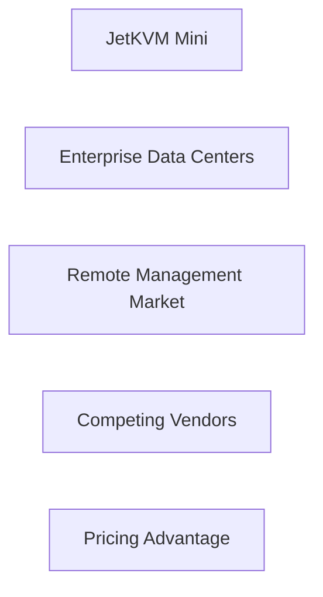

El reciente lanzamiento del JetKVM Mini ha generado conversación entre los círculos tecnológicos, no solo por sus especificaciones técnicas, sino por lo que señala sobre el panorama más amplio del control de hardware y la concentración del mercado. Como un conmutador KVM (Teclado, Video, Ratón) compacto que promete acceso remoto completo a servidores a una fracción del costo tradicional, el dispositivo llega en un momento en que los operadores de centros de datos están revaluando la economía de las soluciones de gestión bloqueadas por proveedores. La estrategia de precios de JetKVM, posicionada por debajo de los 200 USD para una unidad de cuatro puertos, desafía directamente a los incumbentes como la iDRAC de Dell, la iLO de HPE y los módulos IPMI de Supermicro, que a menudo exigen precios premium sostenidos por extensos ecosistemas de software y contratos de soporte a largo plazo. Esta presión de precios no es un caso aislado; refleja una tendencia más amplia en la que los nuevos entrantes en hardware aprovechan firmware de código abierto y diseños modulares para erosionar los márgenes de ganancia de los jugadores establecidos. Al examinar las estructuras de poder dentro de la industria, el JetKVM Mini ilustra un desplazamiento desde monopolios verticalmente integrados hacia un ecosistema más fragmentado. Históricamente, empresas como IBM e Intel han dictado estándares mediante pilas de hardware‑software tightly coupled, insertándose en la cadena de suministro de cada gran implementación de centros de datos. En cambio, la arquitectura del JetKVM se basa en componentes genéricos de SoC (System‑on‑Chip) basados en ARM provenientes de múltiples proveedores, lo que le permite eludir el papel de exigencia de los monopolios tradicionales de chips. Esta descentralización en la adquisición de componentes reduce el poder de negociación de cualquier proveedor único, remodelando el equilibrio del flujo de capital hacia los fabricantes por contrato en lugar de hacia los diseñadores de chips propietarios. Sin embargo, el surgimiento de una solución de hardware de código abierto y bajo costo plantea preguntas sobre la sostenibilidad y la viabilidad a largo plazo. La concentración del mercado ha sido tradicionalmente reforzada por efectos de red: los proveedores bloquean a los clientes en pilas de gestión propietarias, creando flujos de ingresos recurrentes por licencias de software, actualizaciones de firmware y contratos de soporte. El modelo de negocio de JetKVM, que monetiza principalmente a través de la venta de hardware y soporte premium opcional, amenaza con romper este patrón de ingresos. Si la adopción se acelera, podríamos observar una redistribución de la inversión en I+D alejada de suites de gestión pulidas y con abundantes características hacia firmware liviano y centrado en la seguridad que pueda ser auditado y modificado por la comunidad. Desde una perspectiva económica, el cambio también impacta la distribución del capital a lo largo de la cadena de suministro. Los proveedores tradicionales de gestión siempre han capturado una parte desproporcionada de las inversiones de capital, destinando fondos a desarrollo de software de alto margen y extensas campañas de marketing. Al bajar la barrera de entrada para los fabricantes de hardware, JetKVM fomenta un mercado de capitales más competitivo donde el financiamiento de venture puede dirigirse hacia form factors innovadores, como conmutadores KVM modulares que integren aceleradores de IA en el borde o que soporten apagado remoto de energía. Esta reasignación podría estimular el crecimiento en mercados periféricos, como gateways IoT y plataformas de computación resistente, diversificando así el ecosistema tecnológico. En conclusión, el JetKVM Mini es más que un conmutador KVM de bajo costo; es un catalizador para replantear cómo se distribuyen el poder, el capital y el control dentro del sector de hardware empresarial. Al exponer los mecanismos de la concentración del mercado e ilustrar el potencial de una arquitectura más abierta y descentralizada, invita a los líderes de la industria, a los inversores y a los reguladores a reconsiderar la sostenibilidad de los actuales flujos de poder. La reflexión que provoca se centra en la pregunta: ¿la próxima ola de innovación en hardware disolverá aún más los silos y redistribuirá las ganancias económicas, o emergerán nuevas formas de bloqueo para reemplazar a las antiguas? La respuesta moldeará no solo el futuro de la gestión remota, sino también la trayectoria broader de la empoderamiento tecnológico en la era digital.

