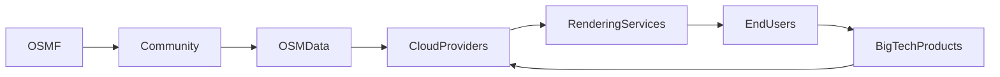

# Tu primera edición en OpenStreetMap: Poder, Capital y Mapeo Colectivo

Al abrir JOSM (Java OpenStreetMap Editor) por primera vez y hacer clic en “Make your first edit”, entras en un paradoja. En la superficie parece un acto inocuo de curiosidad cartográfica: un aficionado que ajusta una etiqueta de carretera o añade un edificio que falta. Sin embargo, esa acción se extiende por una compleja red de **relaciones de poder**, **capital concentrado** y **dinámicas históricas de la industria** que determinan quién tiene la capacidad de definir el espacio, los datos y, en última instancia, la realidad misma.

## La ilusión de una apertura pura

OpenStreetMap (OSM) se vende como un *común*: una ciudadanía editable a nivel global, libre de propiedad corporativa. La narrativa del “mapeo colectivo” oculta una realidad en la que **grandes empresas tecnológicas** ejercen una influencia desproporcionada sobre la infraestructura que hace posible OSM. Empresas como **Google**, **Amazon**, **Microsoft** y **Meta** brindan servicios esenciales: alojamiento en la nube para los datos de OSM, pipelines de renderizado de mapas y financiamiento para la OpenStreetMap Foundation (OSMF). Su participación no es altruista; aseguran un flujo constante de datos geoespaciales que alimentan sus propios productos—Google Maps, Amazon Route 53, Azure Location Services y la publicidad dirigida de Meta.

Esta dependencia crea un sutil pero potente **bucle de retroalimentación**. A medida que OSM gana tracción, la demanda de APIs robustas y soluciones de almacenamiento crece. Los proveedores de nube responden con ofertas especializadas (por ejemplo, AWS Open Data Registry, Azure Maps), posicionándose como socios indispensables. Al hacerlo, **capturan una porción de la cadena de valor**, reforzando su dominio de mercado mientras dirigen sutilmente la dirección del ecosistema OSM.

## Contexto histórico: De los GIS propietarios a los bienes comunes abiertos

El sector de la cartografía ha estado dominado por Sistemas de Información Geográfica (GIS) propietarios. Esri’s ArcGIS, lanzado a principios de la década de 1990, se convirtió en el estándar de facto para gobiernos y empresas, incorporando **tarifas de licencias de software** en presupuestos públicos. El surgimiento de alternativas gratuitas y de código abierto—QGIS, GRASS y, posteriormente, OSM—rompió ese modelo al democratizar la recopilación de datos.

## La economía de la concentración

La concentración de capital en el ámbito cartográfico se evidencia en adquisiciones recientes. La compra de **Waze** por **Google** (2013) y la adquisición de **C3 Technologies** por **Apple** (2012) fueron movimientos estratégicos para asegurar datos de ubicación generados por usuarios. Más recientemente, **Amazon Web Services** anunció una colaboración con la OSMF para alojar los datos de OSM en sus servidores, convirtiendo el mapa abierto en un **servicio gestionado** que puede monetizarse mediante cargos de cómputo y almacenamiento.

Estos movimientos ilustran una tendencia más amplia: **los bienes comunes de datos se vuelven cada vez más dependientes del capital privado**, el cual extrae valor mediante licencias, tarifas de uso de API o publicidad dirigida. Este sesgo favorece a las entidades que pueden costear la infraestructura, dejando a los contribuyores de base para asumir la labor de recolección y curación de datos.

## Poder en el código: El papel de JOSM y los plugins

Esta dependencia desplaza **el control** de la comunidad hacia los proveedores de la plataforma subyacente. Aunque el código sigue siendo de código abierto, los **canales de distribución**—los lugares donde se descubren, instalan y actualizan los plugins—frequentemente son gestionados por terceros que pueden priorizar socios comerciales. En consecuencia, la **economía de la atención** y la **monetización de la actividad del desarrollador** se entrelazan con el acto aparentemente neutro de editar un mapa.

## Concentración de poder: Mapeando los agentes

Para visualizar estas relaciones, considere el siguiente diagrama simplificado:

- **OSMF** (OpenStreetMap Foundation) provee gobernanza pero depende de financiamiento externo.
- **Comunidad** (voluntarios) genera los datos cartográficos brutos.
- **Proveedores de nube** (AWS, Google Cloud, Azure) alojan y sirven los datos.
- **Servicios de renderizado** (Mapbox, OpenLayers) transforman los datos en mapas visuales.
- **Usuarios finales** consumen los mapas.
- **Productos de Big Tech** (Google Maps, servicios de ubicación de Meta) monetizan la salida visual, alimentando de nuevo el ciclo.

Este bucle revela un **mecanismo de retroalimentación**: cuanto más datos consume la Big Tech, más ingresos puede destinar a infraestructura, lo que a su vez mejora la calidad y accesibilidad de los datos—reforzando el ciclo.

## Reflexiones sobre la soberanía y la gestión

El acto de editar OSM no es simplemente técnico; es una declaración política sobre **quién posee el espacio**. Cuando añades un Caminopeatón que falta en una zona remota, estás asserting una reclamación de representación que los proveedores comerciales podrían ignorar. Sin embargo, la infraestructura que permite esa reclamación—servidores, APIs, pipelines de renderizado—permanece bajo el dominio de actores corporativos cuyas motivaciones se alinean con la **expansión de mercado**, no con la **gestión comunitaria**.

Comprender estas dinámicas invita a un engagement más crítico: ¿Somos simplemente **curadores** de un bien público o participamos en un **común compartido** que está siendo envuelto silenciosamente por el capital privado? La respuesta influye en cómo los contribuyentes asignan su tiempo, cómo se financian los proyectos y cómo los legisladores diseñan regulaciones para bienes públicos digitales.

## Una llamada a la reflexión

Tu primera edición en OSM puede parecer trivial, pero desencadena una cascada de implicaciones económicas y de poder que resuenan en todo el sector tecnológico. Al elegir una carretera para etiquetar, un edificio para añadir o una característica para mapear, piensa en las fuerzas más amplias en juego. ¿Quién se beneficia de los datos que generas? ¿Quién controla las herramientas que usas? ¿Qué alternativas podrían impulsar un ecosistema de mapeo realmente descentralizado?

**¿Qué vas a mapear a continuación y de quiénes intereses sirve ese mapeo?**

---

MERMAID: graph LR; OSMF --> Community; Community --> OSMData; OSMData --> CloudProviders; CloudProviders --> RenderingServices; RenderingServices --> EndUsers; EndUsers --> BigTechProducts; BigTechProducts --> CloudProviders

