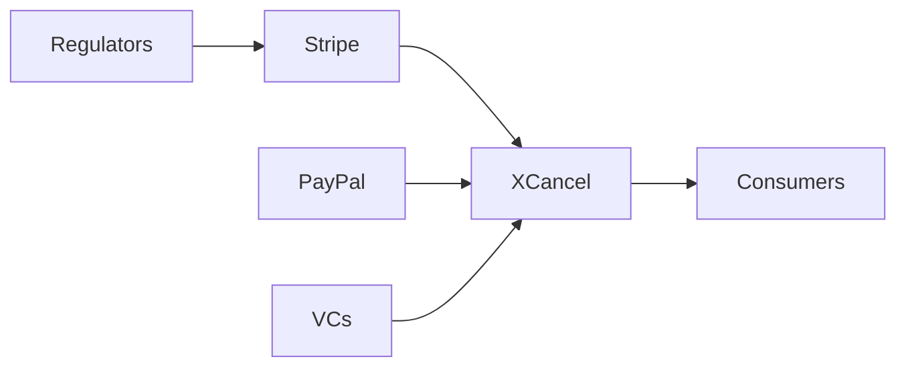

## Introducción  
El anuncio en Hacker News de que **XCancel** suspende su servicio “hasta nuevo aviso” ha encendido una conversación que trasciende a la propia herramienta. XCancel, una startup especializada en la automatización de cancelaciones y cambios de suscripciones en línea, se ubica en el cruce de dos tendencias dominantes: la proliferación de modelos de negocio basados en pagos recurrentes y la creciente concentración de poder en unas pocas plataformas de pago y grandes fondos de capital de riesgo.

En este artículo, como analista independiente, desgloso por qué la pausa de XCancel no es sólo un revés operativo, sino una señal de cómo las relaciones de poder, la concentración de capital y las dinámicas económicas reales están reconfigurando la industria tecnológica.  

## XCancel y su modelo de negocio  

XCancel nació con la promesa de simplificar la vida de los consumidores que desean **cancelar sus suscripciones** sin navegar interminables menús de usuario o luchar contra políticas de retención agresivas. Su modelo se basa en integrarse con APIs de procesadores de pago (Stripe, PayPal, Braintree) y en ofrecer a los usuarios una “capa de cancelación” que actúa como intermediario. La empresa levantó varios rounds de financiación en 2022‑2023, liderados por **Sequoia Capital** y **Andreessen Horowitz**, con una valoración que rondaba los $150 M.  

Sin embargo, esa misma arquitectura que le permitió escalar rápidamente depende de la **dependencia estructural** de los gigantes de pagos, cuyas políticas pueden cambiar de golpe. Cuando Stripe introduce una restricción de API o cuando PayPal revisa sus términos de uso, una startup como XCancel queda expuesta. La suspensión del servicio parece coincidir con una actualización de políticas de Stripe que limitó el “access token” para aplicaciones de terceros, obligando a XCancel a detener operaciones mientras negocia una solución.  

## Concentración de poder en la infraestructura de pagos  
### Los gigantes del “payment stack”  
- **Stripe**: Valoración > $95 B, controla gran parte del ecosistema de pagos SaaS.  
- **PayPal**: Posee más de 400 M de usuarios activos y una red de pagos global.  
- **Square (Block)**: Expande su dominio en pagos offline y en servicios financieros para pymes.  

Estas compañías no sólo procesan pagos; también dictan términos de integración, precios de transacción y acuerdos de datos. La **concentración de capital** se manifiesta en la capacidad de estas plataformas para adquirir startups innovadoras (p. ej., la compra de **Plaid** por Visa) y para influir en regulaciones mediante lobby.  

### Efectos en los intermediarios  
Para un intermediario como XCancel, la **asimetría de poder** se traduce en riesgos operacionales y de negocio:  
1. **Bloqueo de API** – Cambios unilaterales pueden romper la funcionalidad esencial.  
2. **Política de “data ownership”** – Restricciones sobre la recopilación y uso de datos de usuario.  
3. **Presión de precios** – Incrementos de tarifas de transacción que erosionan márgenes.  

En un mercado donde los *gatekeepers* de infraestructura son pocos, los players medianos y las startups enfrentan una **barrera de dependencia** que dificulta la construcción de modelos sostenibles a largo plazo.  

## Dinámicas económicas y flujos de capital  

### Capital de riesgo y la “hype cycle” de las suscripciones  
Durante los últimos cinco años se ha visto una explosión de **modelos de suscripción** (streaming, SaaS, gym, comida). Los fondos de capital de riesgo inyectaron más de $30 B en startups de gestión de suscripciones, de las cuales **XCancel** fue una de las más visibles. Sin embargo, la concentración del capital en unas cuantas firmas (Sequoia, Andreessen) crea una **cultura de “growth at any cost”**, donde los indicadores de salud financiera (cash‑flow, rentabilidad) quedan relegados a segundo plano.  

Cuando el entorno macroeconómico se endurece (inflación, subida de tasas de interés), los VCs reducen el ritmo de inversión. Las startups con modelos de negocio altamente dependientes de terceros (como XCancel) experimentan una caída de liquidez que frecuentemente culmina en suspensiones operativas o reestructuraciones drásticas.  

### Economía de plataformas y externalidades negativas  
El caso de XCancel es emblemático de una **externalidad negativa** para los consumidores: la pérdida de una herramienta de gestión de suscripciones genera fricción y aumenta la “inercia de pago”, lo que beneficia a los proveedores de servicios que buscan retener a usuarios. En otras palabras, la suspensión del servicio fortalece indirectamente a los **monopolios de suscripción** que dependen de la falta de alternativas para cancelar.  

## Comparación histórica: de la era de los “app stores” a la actual  
En la década de 2000, Apple y Google consolidaron el **control de los ecosistemas móviles** mediante sus App Stores. Los desarrolladores se vieron obligados a aceptar comisiones del 30 % y reglas de publicación estrictas. Las disputas (por ejemplo, la batalla legal de Epic Games contra Apple) dejaron en evidencia la vulnerabilidad de los actores más pequeños.  

Hoy, la **centralización se ha desplazado** desde la distribución de aplicaciones hacia la infraestructura de pagos. Donde antes los desarrolladores temían el «gatekeeping» de las tiendas, ahora temen el «gatekeeping» de los procesadores de pago. La suspensión de XCancel se inscribe en esta continuidad histórica: el poder estructural de unas pocas plataformas define la viabilidad de toda una cadena de valor.  

## Qué puede hacer la industria: opciones y riesgos  
1. **Diversificación de proveedores** – Integrar múltiples pasarelas de pago y construir capas de abstracción que permitan cambiar de proveedor sin interrupciones.  
2. **Open‑source y protocolos estándar** – Fomentar el desarrollo de APIs abiertas (por ejemplo, la iniciativa **Open Payments Initiative**) que reduzcan la dependencia de un único actor.  
3. **Regulación antimonopolio** – Los reguladores pueden abordar la concentración de poder mediante normas que obliguen a los procesadores a ofrecer **acceso razonable y no discriminatorio** a terceros.  
4. **Financiamiento responsable** – Los VCs podrían priorizar métricas de rentabilidad y sostenibilidad sobre el puro crecimiento de usuarios, mitigando riesgos de liquidez.  

Cada opción implica costos y negociaciones de poder: diversificar implica mayor complejidad tecnológica; los estándares abiertos requieren consenso que, paradójicamente, puede ser liderado por los mismos gigantes; la regulación enfrenta la presión de lobby de los *payment giants*; y el cambio cultural en el capital de riesgo demanda un cambio de mentalidad que tarda años.  

## Conclusión  
La suspensión de XCancel no es un simple “problema técnico”; es una **manifestación visible** de cómo la concentración de capital y de infraestructura de pagos está moldeando la arquitectura de la economía digital. Mientras los gigantes de pagos continúan consolidando su poder, los intermediarios y los consumidores quedan cada vez más expuestos a decisiones unilaterales. La historia nos muestra que los *gatekeepers* tienden a consolidarse, pero también que la presión colectiva —tanto del mercado como regulatoria— puede abrir espacios para una mayor competencia y resiliencia.  

En última instancia, la pregunta que debemos hacernos es: ¿qué papel queremos jugar nosotros, como usuarios, inversores y reguladores, en la redefinición de un ecosistema de pagos que sirva a la innovación sin sacrificar la autonomía de los actores más pequeños?