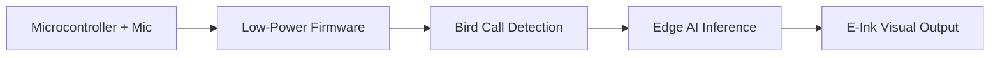

# Oyente de Ink-E de Pájaro Captura Bocetos de los 1800s con IA de Borde

En Hacker News, un modesto repositorio titulado *fugleramme* ha llamado la atención por un proyecto que combina la ilustración retro con la informática de vanguardia en el borde. El creador, Arne Giacomo, desarrolló un marco de tinta electrónica que escucha cantos de aves, ejecuta un modelo de IA ligero en el dispositivo y dibuja instantáneamente la fuente aviar del sonido como una xilografía del siglo XIX.

Si bien la novedad técnica es impactante, los dinámicas subyacentes revelan patrones más profundos sobre cómo se intersectan poder, capital e innovación en el ecosistema tecnológico actual.

## Desde mainframes a micro‑marcos: Una perspectiva histórica

La historia de *fugleramme* no es un experimento aislado; se apoya en una larga contienda de democratización del hardware. En los años 60, los fabricantes de mainframes como IBM encerraron el poder de cómputo detrás de servicios costosos y centralizados. La revolución de las computadoras personales de los años 70 y 80 transfirió ese control a los usuarios individuales, impulsada por estándares abiertos y una oleada de entusiasmo DIY. Más tarde, *Mac* de Apple y *Windows* de Microsoft consolidaron esa libertad en ecosistemas propietarios, generando especulaciones renovadas sobre una era “post‑móvil” en la que el cómputo migraría nuevamente hacia el borde.

## Relaciones de poder en el mercado de IA de borde

El proyecto *fugleramme* ejemplifica la tensión entre la ambición del código abierto y la atracción del capital concentrado. El repositorio está alojado en GitHub, una plataforma propiedad de Microsoft, que también monetiza la actividad de los desarrolladores mediante integraciones con Azure y GitHub Sponsors. Aunque el código se publica bajo una licencia estilo MIT, el modelo de IA subyacente suele depender de TensorFlow o PyTorch — bibliotecas mantenidas respectivamente por Google y Facebook (Meta). Estas bibliotecas se construyen sobre enormes conjuntos de datos y recursos de cómputo que solo las mayores firmas tecnológicas pueden permitirse curar y sostener.

Cuando un proyecto de aficionado gana tracción en Hacker News, suele ser cooptado por firmas de capital de riesgo que buscan la próxima startup de hardware “explosiva”. El patrón típico es claro: un prototipo de código abierto genera ruido mediático, se levanta una ronda semilla y el equipo se inclina hacia un producto comercial que puede priorizar la captura de mercado sobre la gestión comunitaria. Esta dinámica se asemeja a los primeros días de Android, donde Google open‑sourced el núcleo del SO pero finalmente dirigió su evolución hacia un ecosistema tightly controlled que beneficia sus negocios publicitarios y en la nube.

## Concentración de capital y la economía del hardware de bajo consumo

El costo de los materiales para un marco de tinta electrónica capaz de inferencia de audio en tiempo real es modesto — normalmente unos pocos dólares por la pantalla, un microcontrolador y un micrófono. Sin embargo, la economía de escalar dicho dispositivo revela la profundidad de la concentración de capital. La fabricación a gran escala requiere contratos de componentes negociados que favorecen distribuidores establecidos como Avnet o Arrow, cuyas propias fuentes de ingresos están vinculadas a OEM más grandes. Además, el costo de certificar módulos inalámbricos para actualizaciones OTA puede superar el costo del hardware mismo, una barrera que solo las startups bien financiadas pueden absorber.

## Código abierto como contrapeso

A pesar de estas presiones, las iniciativas de código abierto continúan creando nichos donde los intereses comerciales dudan. El código base de *fugleramme*, por ejemplo, está deliberadamente minimalista, permitiendo a los aficionados experimentar sin necesidad de SDKs propietarios. Al publicar el firmware y los scripts de conversión de modelos, el autor invita a una comunidad global a adaptar el marco a otros casos de uso — como paisajes sonoros urbanos o pantallas educativas para museos de historia natural.

## Conectando pasado y futuro: Lecciones de los 1800

La salida visual de *fugleramme* extrae directamente de técnicas de ilustración del siglo XIX, tomando motivos de las placas de aves de Audubon y el intrincado trabajo de líneas de los primeros naturalistas. Esta referencia histórica es más que estética; señala un deseo de reconectar la tecnología con la artesanía que definió la comunicación científica anterior. En los 1800, las sociedades científicas publicaban revistas ilustradas que eran a la vez académicas y atractivas para el público, un modelo que fomentó una participación más amplia en la creación de conocimiento.

## Conclusión: Reflexiones sobre poder, capital y agencia creativa

El proyecto *fugleramme* es un microcosmos de fuerzas mayores que están dando forma al panorama tecnológico: la concentración de capital, el uso estratégico del código abierto como forma de resistencia y palanca, y los ciclos históricos que repetidamente repositionan el cómputo desde los mainframes centralizados a nodos distribuidos en el borde. Mientras observamos prototipos de hardware indie ganar visibilidad en plataformas como Hacker News, es crucial preguntar quién se beneficia realmente de su éxito. ¿La comunidad está reteniendo su agencia o los intereses de capital riesgo están remodelando inevitablemente estas innovaciones para ajustarse a las estructuras de poder existentes?

