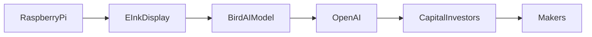

## Introducción: arte, IA y un marco de papel digital

En la comunidad de Hacker News apareció recientemente **fugleramme**, un proyecto de código abierto que transforma los cantos de los pájaros en delicadas ilustraciones al estilo de los grabados botánicos del siglo XIX. El prototipo consiste en un marco de pantalla e‑ink que, gracias a un micrófono y a un modelo de aprendizaje profundo, identifica la especie del ave y genera, en tiempo real, un dibujo en blanco y negro que recuerda a las obras de John James Audubon o a los folletos de la Royal Botanic Gardens, Kew.

A primera vista, parece una curiosa mezcla de nostalgia y tecnología punta. Sin embargo, el caso de fugleramme permite reflexionar sobre dinámicas estructurales de la industria: la creciente concentración de capital en pocos gigantes, la tendencia a “industrializar” la creatividad mediante IA y la persistente vulnerabilidad de los makers independientes frente a la extracción de datos y hardware controlado por conglomerados.

## El stack técnico del proyecto

El repositorio de GitHub (<https://github.com/arnegiacomo/fugleramme>) incluye:

* **Hardware**: una placa Raspberry Pi Zero 2 W, una pantalla e‑ink de 7 pulgadas (basada en el controlador IL0373) y un micrófono MEMS.
* **Software**: un modelo de clasificación de audio entrenado con **BirdCLEF** y una red generativa (Stable Diffusion fine‑tuned) que traduce la etiqueta de la especie en una imagen estilo "grabado".
* **Interfaz**: un minimalista UI que muestra la entidad “escuchada”, la ilustración y la hora del avistamiento.

Todo el código está licenciado bajo MIT, lo que permite que cualquiera pueda replicar o adaptar el dispositivo. Pero la disponibilidad del hardware y los modelos de IA está mediada por actores con poder de mercado.

## La cadena de suministro: ¿quién controla los bloques?

| Etapa | Proveedor dominante | Relación de poder |
|------|--------------------|-------------------|
| **Microcontrolador** | **Raspberry Pi Foundation** (filantropía, pero con vínculo a Broadcom) | Dependencia de una única arquitectura ARM para “prototipos baratos”. |
| **Pantalla e‑ink** | **Pervasive Displays**, **E Ink Corp.** | Patentes sobre la tecnología de tinta electrónica que limitan la competencia y elevan precios. |
| **Modelos de IA** | **OpenAI**, **Stability AI**, **Google DeepMind** | Acceso a datos y APIs en gran escala mediante suscripciones costosas; open‑source se vuelve “open‑source bajo licencia comercial”. |
| **Servicios de nube** | **AWS**, **Google Cloud**, **Microsoft Azure** | Costo de entrenamiento y despliegue que solo pueden absorberse con escalas de millonésimas de dólares. |

El ensamblaje de fugleramme depende, por lo tanto, de una red de proveedores donde cada nodo está centralizado en una empresa con recursos financieros que dificultan la replicación a gran escala sin su permiso o sin licencias pagas.

## Concentración de capital y la “industrialización” de la creatividad

En los últimos diez años, la industria tecnológica ha visto cómo la inversión de capital riesgo se ha canalizado hacia startups que prometen **IA + contenido**. Empresas como **OpenAI** (respaldada por Microsoft) y **Stability AI** (con inversión de la firma de capital de riesgo *Lightspeed*) han creado barreras de entrada al entrenar modelos multimodales (texto‑imagen‑audio) que requieren petabytes de datos y GPU de última generación.

Fugleramme, al reutilizar modelos pre‑entrenados y ajustar finamente solo la capa de salida, se beneficia de la “economía de escala” de estos gigantes. A cambio, el proyecto sacrifica parte de su independencia: el modelo de generación de imágenes depende de un checkpoint distribuido bajo licencia CreativeML que Prohibición de uso comercial sin permiso explícito.

Esta asimetría encaja con la teoría de la “economía de la atención”, donde los grandes jugadores monetizan la atención a través de plataformas de contenido (por ejemplo, **Meta** con Instagram, **TikTok** de ByteDance). En fugleramme, la atención se dirige a una experiencia “silenciosa” que, sin embargo, está construida sobre la infraestructura de IA de los monopolios.

## ¿Qué dice la historia? De los impresores del siglo XIX a los ecosistemas de hardware de hoy

Los grabados botánicos del siglo XIX fueron posibles gracias a la colaboración entre **John James Audubon**, el impresor **James Hill** y los patrocinadores aristocráticos que financiaban expediciones. La cadena de valor estaba controlada por unas cuantas casas de impresión y mecenas con acceso a recursos de papel y tinta.

Hoy, el paralelismo es evidente: los **fabricantes de hardware** (Raspberry Pi, E Ink) actúan como los impresores, mientras que los **proveedores de IA** son los mecenas que abastecen los “datasets” y la potencia de cómputo. Los “artesanos” modernos (desarrolladores de fugleramme) son los ilustradores, pero dependen de la disponibilidad de herramientas cuyo coste está regulado por pocos actores.

En la década de 1990, la apertura de los **PC compatibles** (IBM compatibles) democratizó la fabricación de software, pero la llegada de **Windows** como sistema operativo dominante re‑centralizó el control. Hoy, la “apertura” de los modelos de IA reemplaza al código fuente, pero la propiedad del **hardware especializado** y de los **datasets** sigue pareciendo más restrictiva.

## Dinámicas económicas reales: ¿Quién gana y quién pierde?

1. **Consumidores de nicho**: Los entusiastas de la naturaleza y coleccionistas de arte digital encuentran valor en un objeto físico y una experiencia sensorial. Pero su número es limitado, lo que dificulta la viabilidad de un modelo de negocio basado en ventas masivas.
2. **Fabricantes de componentes**: Empresas como **E Ink Corp.** se benefician de la atención mediática; cada hype aumenta la demanda de sus pantallas para “productos de nicho premium”.
3. **Proveedores de IA**: Cada vez que un proyecto open‑source llama a sus APIs, la facturación de **OpenAI** o **Stability AI** aumenta, reforzando su posición dominante.
4. **Capital de riesgo**: Los inversores que buscan “AI‑first hardware” pueden ver en fugleramme una prueba de concepto que justifica rondas de financiación para escalar a productos comerciales (por ejemplo, marcos de e‑ink para museos o publicidad ambiental).

En este escenario, el **poder económico** fluye de los creadores de contenido (makers) hacia los dueños de infraestructura (hardware y IA). La pregunta clave es si la comunidad open‑source podrá crear rutas de suministro alternativas, como **pantallas e‑ink de código abierto** o **modelos de IA entrenados con datos de dominio público**, antes de que la consolidación haga imposible la replicación.

## Competidores y paralelos: Apple, Google y la carrera por el “arte generativo”

Apple, con su **Apple Watch** y **AirPods**, ha empezado a integrar sensores de sonido y algoritmos de detección de fauna para funcionalidades de salud (monitorización de entornos). Google, mediante **Pixel Tablet** y la integración de **TensorFlow Lite**, permite a los desarrolladores ejecutar modelos de visión en dispositivos de bajo consumo.

Ambas compañías poseen la ventaja de **optimizar hardware y software conjuntamente**, algo que los makers como fugleramme solo pueden emular mediante bricolaje. La estrategia “ecosistema cerrado” de Apple y el “ecosistema abierto con capas proprietarias” de Google demuestran que la **integración vertical** sigue siendo la fórmula ganadora para monetizar experiencias sensoriales avanzadas.

## Perspectivas: ¿Puede un proyecto como fugleramme escalar sin ceder su independencia?

Existen tres rutas plausibles:

1. **Licenciamiento cruzado**: Crear alianzas con fabricantes de e‑ink que ofrezcan kits de desarrollo a precios reducidos a cambio de branding. Esto reduce la dependencia de distribuidores mayoristas.
2. **Modelos de IA descentralizados**: Adoptar iniciativas como **Stable Diffusion** en sus versiones “LoRA”, entrenando modelos locales en hardware ARM con técnicas de quantization. Esto disminuiría costos de API y reduciría la exposición a políticas de uso.
3. **Economía de suscripción de nicho**: Ofrecer un servicio de “avistamiento premium” donde los usuarios pagan una suscripción para recibir datos de ubicación de aves, generación de ilustraciones personalizadas y acceso a una comunidad curada. Esta monetización permitiría reinvertir en investigación independiente.

Sin embargo, cada opción implica compromisos: mayor complejidad de desarrollo, dependencia de una comunidad activa o exposición a regulaciones de derechos de autor sobre las imágenes generadas.

## Conclusión: reflexión sobre la innovación y el poder

Fugleramme es, a la vez, una pieza de arte digital y un espejo que refleja la arquitectura del poder en la tecnología contemporánea. Mientras los grandes conglomerados consolidan el control sobre hardware esencial y modelos de IA, los pequeños creadores deben navegar entre la apertura creativa y la dependencia de infraestructuras costosas.