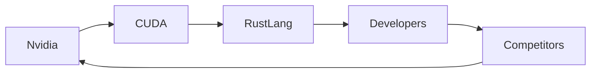

# Nvidia presenta CUDA‑Rust: una apuesta estratégica para la programación nativa de GPU con Rust

La reciente publicación de Nvidia en su blog oficial anuncia **CUDA‑Rust**, una iniciativa que permite escribir kernels GPU directamente en Rust mediante una capa de abstracción native. Este movimiento no solo amplía el ecosistema de herramientas de *high‑performance computing* (HPC), sino que también reconfigura las dinámicas de poder entre los principales actores del sector de cómputo acelerado.  

En el artículo de referencia, los ingenieros de Nvidia describen dos “track” para los desarrolladores: uno basado en **C** y otro en **Rust**, ambos orientados a compilar kernels que se ejecutan en los Tensor Cores de las GPUs Ampere y Hopper. La decisión de abrir un camino nativo con Rust responde a tres fuerzas convergentes: la maduración del lenguaje, la creciente demanda de seguridad de memoria y la necesidad de un rendimiento comparable al código C/C++.  

## ¿Por qué Rust ahora?


Empresas como **Microsoft**, **Amazon Web Services** y **Google Cloud** ya están adoptando Rust para sus infraestructuras de IA y servicios gestionados, lo que sugiere que la industria está lista para una alternativa a los lenguajes tradicionales. La incursión de Nvidia, por tanto, no es un acto aislado, sino parte de una tendencia más amplia donde los proveedores de hardware buscan atrapar a los desarrolladores dentro de sus propios ecosistemas mediante gateways de programación más seguros y productivos.

## Concentración de poder y estrategias de lock‑in


Al lanzar CUDA‑Rust, Nvidia no solo está ofreciendo una nueva herramienta; está consolidando su posición como **gatekeeper** del futuro de la programación de GPU. La compañía controla tanto el hardware (chips Hopper, arquitectura Tensor Core) como la capa de software (CUDA Toolkit, driver). Al facilitar la migración a Rust, Nvidia asegura que la mayor parte del código que se ejecute en sus GPUs provenga de su propio entorno de desarrollo, lo que refuerza su posición frente a competidores como **AMD** (con su enfoque en *ROCm* y *HIP*) y **Intel** (con *oneAPI*).  

Esta estrategia recuerda a la época en que **Microsoft** dominantemente dictó los estándares de desarrollo mediante *Win32* y *DirectX*, o cuando **Apple** utilizó su propio *Metal* para binderizar el ecosistema de su hardware. En cada caso, la combinación de **poder de mercado** y **control de la capa de abstracción** permitió a la empresa ejercer una influencia desproporcionada sobre los desarrolladores y, por ende, sobre la innovación tecnológica.

## Conexión con tendencias históricas

El uso de **lenguajes de nivel superior** para abstraer el hardware no es nuevo. En los años 70, el **C** se convirtió en el lingua franca de los sistemas operativos y aplicaciones de alto rendimiento; en los 90, **Java** intentó ofrecer portabilidad con un *bytecode* gestionado por una máquina virtual, aunque con sacrificios de rendimiento. Hoy, **Rust** representa el siguiente paso en esta evolución: un lenguaje que combina la *productividad* de los interpretados con la *eficiencia* de los compilados de bajo nivel.  

Sin embargo, a diferencia de Java, Rust no necesita una máquina virtual; su compilación genera **código nativo** que puede ser tan rápido como el ensamblador hand‑written. Esta característica es crucial para los kernels de GPU, donde cada ciclo cuenta. Al permitir que los desarrolladores escriban código seguro sin renunciar a velocidad, Rust abre la puerta a una nueva generación de aplicaciones de IA que pueden ejecutar modelos más complejos en hardware limitado, democratizando el acceso a la computación acelerada.

## Impacto económico y de capital


Desde una perspectiva económica, la introducción de CUDA‑Rust puede influir en la **distribución de la inversión** en startups de IA. Empresas emergentes que antes necesitaban contratar expertos en C++ para optimizar kernels ahora pueden depender de la curva de aprendizaje más suave de Rust y de la abundante documentación y comunidade. Esto reduce las barreras de entrada y potencialmente **desplaza la concentración de talento** hacia plataformas que ofrezan mayor soporte y ejemplos de código.  

Al mismo tiempo, la capacidad de Nvidia para **monetizar** esta capa de software mediante licencias de desarrollo, soporte empresarial y servicios de nube (por ejemplo, *Nvidia GPU Cloud*) incrementa sus flujos de ingreso recurrentes. En un mercado donde los márgenes de hardware están bajo presión, la venta de *software as a service* se vuelve una estrategia vital para mantener la rentabilidad.




## Conclusión y perspectiva futura

CUDA‑Rust representa más que una herramienta técnica; es una **jugada estratégica** que combina la seguridad de Rust con la domination del ecosistema CUDA de Nvidia. Si la adopción es masiva, podríamos ver una ola de **portabilidad de código** entre diferentesproveedores de GPU, pero la mayor probabilidad es que Nvidia mantenga su posición dominante al ofrecer la combinación más completa de *compilador, runtime y soporte*.  

Los próximos meses serán cruciales para observar cómo responden AMD y Intel, si lanzarán sus propias interfaces de Rust o si adoptarán un modelo de *open source* que frene la concentración de poder. La decisión de los desarrolladores de migrar a Rust dependerá de la madurez del ecosistema, la disponibilidad de bibliotecas y, sobre todo, de la percepción de que esta apuesta **no solo mejora la productividad, sino también la sostenibilidad a largo plazo** de sus proyectos de IA y HPC.

```