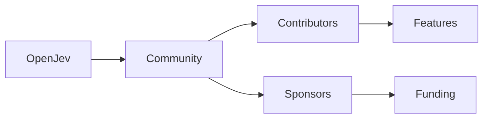

# OpenJev y la reconfiguración del poder en la movilidad tecnológica

En los últimos meses, la plataforma **OpenJev** ha emergido como un punto de convergencia entre la movilidad de código abierto y la infraestructura de desarrollo contemporánea. Aunque su nombre aún resuena principalmente en círculos de desarrolladores avanzados, su arquitectura subyacente está diseñando una nueva forma de distribución del control tecnológico. Este artículo analiza el fenómeno desde una perspectiva crítica, centrándose en cómo **OpenJev** está reconfigurando relaciones de poder, concentrando capital y estableciendo nuevas dinámicas de dependencia en la industria de la tecnología.

## Un vistazo histórico a la concentración de poder en la industria

Estas dinámicas históricas comparten una característica esencial: la capacidad de una entidad o coalición para imponer condiciones de acceso mediante el control de infraestructuras críticas. En el contexto actual, **OpenJev** se posiciona como un intento de romper — o al menos mitigar — ese patrón mediante la adopción de un modelo más abierto y modular.

## El papel estructural de OpenJev

**OpenJev** se basa en un stack modular que combina **microkernel**, **API de interoperabilidad** y **herramientas de gestión de contenedores**. Su propuesta no es simplemente ofrecer otro motor de ejecución, sino crear una capa neutral que permita a los proyectos de código abierto ejecutarse en múltiples entornos sin depender de endpoints propietarios. Este enfoque tiene implicaciones profundas:

1. **Descentralización de la ejecución**: Al abstraer la capa de orquestación, **OpenJev** reduce la dependencia de plataformas centradas como **Kubernetes** o **Docker Enterprise**.
2. **Facilitación de la contribución**: La documentación y los pipelines de CI/CD están diseñados para ser accesibles a cualquier desarrollador, fomentando una comunidad más amplia.
3. **Modelo de financiación híbrido**: La plataforma combina **donaciones de la comunidad**, **subvenciones de fundaciones** y **acuerdos de patrocinio** con empresas que buscan integrar sus productos en un ecosistema abierto.

Este esquema contrasta con la tradición de **modelos cerrados** donde el capital fluye principalmente hacia grandes corporaciones que mantienen el control de los estándares críticos.

## Relación con grandes jugadores y estructuras de poder

Aunque **OpenJev** se presenta como una solución neutral, su trayectoria está indudablemente ligada a actores del ecosistema tecnológico. Empresas como **Red Hat**, **Google**, y **Microsoft** han manifestado interés en participar mediante **patrocinios estratégicos** y **contribuciones de codebase**. Sin embargo, su involvement plantea preguntas sobre la verdadera neutralidad de la plataforma:

- **Red Hat** ha incluido módulos de **OpenJev** en su distribución **OpenShift**, lo que le otorga una ventaja competitiva en la oferta de soluciones híbridas.
- **Google Cloud** ha financiado **kioscos de documentación** y **eventos de hackathon** centrados en la documentación de **OpenJev**, reforzando su presencia en la conversación de desarrolladores.
- **Microsoft** ha colaborado en la integración de **OpenJev** con **Azure DevOps**, permitiendo que sus clientes existentes adopten la tecnología sin renegociar sus contratos actuales.

Estas relaciones revelan una dinámica de **poder compartido**: mientras **OpenJev** busca democratizar la ejecución de código, las grandes corporaciones pueden dirigir su desarrollo hacia sus propios productos y servicios, manteniendo una influencia sustancial sobre la dirección del proyecto.

## Dinámicas de poder y concentración de capital

La aparición de **OpenJev** ilustra cómo la concentración de capital puede coexistir con modelos aparentemente abiertos. En lugar de una completa desvinculación de los gigantes tecnológicos, la plataforma se beneficia de **flujos de financiamiento** que provienen de inversiones en **infraestructura cloud** y **servicios de gestión de datos**. Este fenómeno se alinea con la teoría de los **“capitales de red”**, donde el valor de una red crece con la participación de actores poderosos que a su vez refuerzan su posición.

Además, los **acuerdos de patrocinio** frecuentemente incluyen cláusulas de **propiedad intelectual** que otorgan a los patrocinadores derechos de uso preferencial sobre ciertas funcionalidades. Este tipo de mecanismos, aunque descritos como “neutrales”, pueden inclinar la balanza de poder hacia los patrocinadores más abundantes, creando una forma sutil de **concentración de recursos** incluso dentro de un ecosistema abierto.

## Implicaciones para los desarrolladores y la comunidad

Para los desarrolladores independientes y las pequenas organizaciones, **OpenJev** ofrece una alternativa prometedora: la posibilidad de desplegar aplicaciones sin depender de proveedores de servicios costosos. No obstante, la comunidad enfrenta varios desafíos:

- **Curva de aprendizaje**: La arquitectura modular requiere una comprensión profunda de conceptos como **service mesh**, **service discovery**, y **policy enforcement**, lo que puede limitar la adopción entre desarrolladores menos experimentados.
- **Sostenibilidad del proyecto**: La dependencia de patrocinio corporativo puede generar incertidumbre respecto a la dirección futura del proyecto, especialmente si los patrocinadores retiran su apoyo por razones estratégicas.
- **Fragmentación del ecosistema**: La aparición de forks y variantes de **OpenJev** podría splinterizar la comunidad, generando incompatibilidades entre versiones y dificultando la consolidación de estándares abiertos.

Abordar estos retos implica fomentar **modelos de financiamiento híbrido**, incentivar la **educación técnica** en torno a la plataforma y promover **licencias compatibles** que preserven la libertad de uso y modificación.

## Conclusión: reflexionando sobre el futuro de la movilidad tecnológica

**OpenJev** representa un experimento ambicioso que combina la búsqueda de **soberanía digital** con la realidad de las **dinámicas de poder** inherentes a la industria tecnológica. Su capacidad para transformar la movilidad de código abierto dependerá de cómo logre equilibrar la **neutralidad** con la **interdependencia** de los grandes actores del mercado. Si la comunidad logra mantener una visión colectiva y resistir la presión de la concentración capitalista, **OpenJev** podría sentar las bases para una nueva generación de infraestructuras más resilientes y descentralizadas.

A medida que avanzamos, la clave será observar de cerca quién financia, quién contribuye y quién se beneficia de cada avance. Solo así podremos evaluar si **OpenJev** se convertirá en un verdadero agente de democratización o simplemente en una nueva capa de **intermediación** bajo el velo del **código abierto**.

---

---