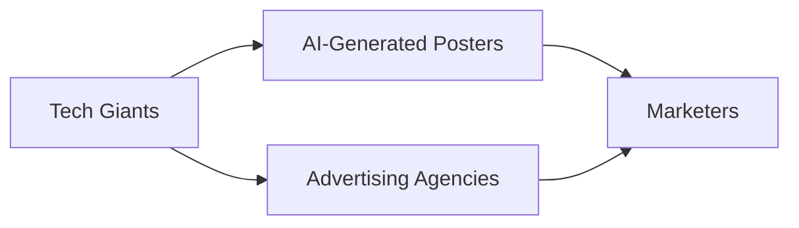

# AI‑Generated Posters Are Redefining Creative Agency and Market Power

The recent headline “AI‑generated posters don’t have to be horrible” reflects a broader shift that is already reshaping the advertising and design sectors. While the technology itself is not new, its rapid adoption by major brands and agencies is forcing a re‑examination of long‑standing hierarchies, capital flows, and creative labor. This article unpacks the economic and political ramifications of AI‑generated visual content, focusing on concrete examples, historical context, and the strategic moves of a handful of powerful firms.

## A Brief Historical Lens

## Who Controls the Tools?

## Economic Mechanics of Concentration

From an economic standpoint, the rise of AI‑generated posters illustrates a classic “winner‑takes‑all” dynamic. The marginal cost of reproducing a synthetic image after the initial training expense is near‑zero, while the upfront investment in data, compute, and talent remains astronomical. This asymmetry creates high barriers to entry for independent creators and small studios, who must either license expensive APIs or partner with larger firms that can absorb the upfront costs.

Capital concentration is further reinforced through venture‑backed rounds that funnel money into AI startups focused on niche applications such as automated ad‑creative generation. For instance, **Runway ML** and **Stability AI** have each raised over $200 million, valuations that place them in the same league as mid‑size tech firms. These financing rounds are typically led by the same institutional investors — venture capital firms that also hold stakes in cloud infrastructure providers — creating a feedback loop that consolidates both talent and capital under a limited set of ecosystems.

## Power Relations Between Creators and Platforms

Moreover, the data that trains these models is sourced from massive public datasets that often include copyrighted works. While the legal status of such training data remains contested, the practical reality is that platforms can generate commercially viable imagery without compensating the original creators. This lack of remuneration erodes a core revenue stream for many freelance designers and independent illustrators, accelerating a shift toward subscription‑based creative labor.

## Real‑World Case Studies

- **Google’s “Imagen”** integration with **Google Ads** allows marketers to generate localized banner designs on the fly, bypassing traditional design agencies. Early adoption reports show a 30 % reduction in creative production time for mid‑size e‑commerce firms.
- **Meta’s “Scribe”** tool, embedded in **Facebook Business Suite**, enables advertisers to auto‑generate carousel images tailored to diverse audience segments. The feature is only accessible to pages managed through Meta Business Manager, giving the platform a direct channel to influence ad creative pipelines.
- **Nvidia’s “Picasso”** platform, offered as a SaaS to enterprise customers, provides on‑premise deployment of diffusion models for confidential brand assets. By restricting access behind corporate firewalls, Nvidia positions itself as a gatekeeper for high‑value, proprietary visual content.

These examples underscore how AI‑generated imagery is no longer a peripheral experiment; it is becoming a core component of the commercial creative workflow, reshaping who can produce, distribute, and profit from visual media.

## Linking to Broader Industry Trends

The current trajectory mirrors the 1990s shift from print to digital publishing, where a handful of software vendors (Adobe, Microsoft) came to dominate the creative toolchain. In the same way, AI‑generated content is concentrating decision‑making power in the hands of firms that control the underlying models, data, and compute resources. This concentration has implications for competition policy, as regulators in the EU and US are beginning to scrutinize “platform‑centric” AI ecosystems for potential antitrust concerns.

At the same time, the emergence of open‑source models — such as **Stable Diffusion** released under a permissive license — offers a counterbalance. Community‑driven forks and fine‑tuned variants enable smaller studios to bypass proprietary clouds, fostering a more decentralized creative economy. Yet the sustainability of this open ecosystem hinges on continued volunteer maintenance, which is increasingly threatened by the same capital concentration that fuels proprietary ventures.

## Conclusion – A Call for Reflection

AI‑generated posters are not inherently “horrible” or “perfect”; they are a symptom of deeper structural changes within the technology and advertising industries. The concentration of capital, the tightening of power relationships, and the re‑definition of creative labor are all intertwined in a feedback loop that favors a small number of well‑resourced actors. As these tools become mainstream, the industry must grapple with questions of ownership, fairness, and the long‑term health of a diverse creative landscape. The reflection we invite is simple: **Who gets to shape the visual language of tomorrow, and on what terms?**

