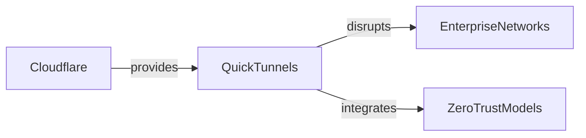

TITLE: Cloudflare Quick Tunnels: el atajo que pone en jaque a los gigantes del acceso seguro
DESCRIPTION: Cloudflare Quick Tunnels desafía a los gigantes del acceso seguro al ofrecer un túnel sencillo y seguro, mientras se analizan sus implicaciones en la concentración de capital y el futuro de la infraestructura en la nube.
TAGS: cloud computing, security, market concentration
CONTENT: ## Cloudflare Quick Tunnels: un nuevo desafío para la infraestructura en la nube

Cloudflare Quick Tunnels ha irrumpido en los foros de tecnología tras su anuncio en Hacker News, ofreciendo una forma simplificada de exponer servicios locales a internet mediante un túnel cifrado. La herramienta, accesible a través de try.cloudflare.com, permite a desarrolladores y pequeñas empresas publicar aplicaciones sin necesidad de configurar redes complejas de NAT o inverso proxy. Este lanzamiento coincide con una tendencia histórica de migración de infraestructuras on‑premise a soluciones basadas en la nube, donde la facilidad de uso se vuelve tan importante como la seguridad.

Desde el punto de vista técnico, Quick Tunnels funciona como un gateway inverso que encapsula tráfico HTTP/HTTPS dentro de un túnel TLS gestionado por Cloudflare. Al abrir un puerto local, el servicio crea una conexión saliente persistente al borde de la red de Cloudflare, donde se termina el TLS y se reencanta el tráfico al destino interno. Esta arquitectura reduce la exposición de puertos y simplifica la gestión de certificados, algo que tradicionalmente ha sido dominio de soluciones como ngrok o localtunnel, pero ahora bajo la etiqueta de empresa de infraestructura de seguridad.

El concepto de túneles seguros no es nuevo; desde los primeros proxies inversos en los años 90 hasta las plataformas modernas de zero‑trust, la industria ha buscado abstraer la complejidad de la red para que los desarrolladores puedan enfocarse en la lógica de negocio. Cloudflare, con its historial de operar una de las mayores redes de distribución de contenido (CDN) y su inversión en anycast DNS, está posicionándose como una capa más de confianza entre el usuario final y los recursos back‑end. Al integrar Quick Tunnels con su plataforma de Zero Trust, la empresa no solo ofrece un canal de exposición, sino también políticas de acceso granulares, monitoreo en tiempo real y auditoría de sesiones.

Sin embargo, el ascenso de un servicio como Quick Tunnels también revela dinámicas de poder sutiles. La empresa depende de una infraestructura financiada por inversores de capital riesgo que buscan retornos rápidos, lo que puede traducirse en decisiones de producto orientadas a la monetización antes que a la apertura abierta. Además, al concentrar la terminación de TLS y el routing en sus propios bordes, Cloudflare incrementa su dependencia de un flujo constante de datos de usuarios externos, lo que a su vez fortalece su posición bargaining con proveedores de cloud y con reguladores que vigilan la soberanía de datos.

Desde una perspectiva económica, la tarifa de uso de Quick Tunnels se presenta como una alternativa económica para pequeñas startups que desean exponer APIs sin incurrir en costos elevados de equilibrador de carga gestionado. Sin embargo, este modelo freemium puede crear una dependencia de la capa de negocio de Cloudflare, limitando la capacidad de los usuarios para migrar a soluciones de código abierto o a otras plataformas sin incurrir en costos de re‑architectación. La fragmentación del mercado entre servicios gestionados y auto‑hosted también refleja una tendencia histórica de centralización, donde la comodidad del usuario se vuelve un activo estratégico para los proveedores.

En el plano regulatorio, la expansión de plataformas como Quick Tunnels plantea interrogantes sobre la jurisdicción de los datos y la capacidad de los gobiernos para ejercer supervisión sobre servicios que operan en la periferia de la red. Aunque Cloudflare asegura cumplir con estándares de privacidad, la falta de interoperabilidad entre diferentes túneles y la ausencia de un marco estándar abierto pueden dificultar la fiscalización y la auditoría independiente, lo que favorece a los actores con mayor poder de negociación en acuerdos de intercambio de información.

La llegada de Cloudflare Quick Tunnels marca un hito en la democratización del acceso seguro a recursos digitales, pero también ilustra cómo la concentración de capital y la arquitectura de confianza pueden moldear la dirección de la innovación. Al ofrecer una solución que combina simplicidad técnica con políticas de seguridad avanzadas, la herramienta desafía a los gigantes del sector a replantear sus estrategias de integración y a considerar el impacto sobre la diversidad del ecosistema. La reflexión final debe girar en torno a la pregunta: ¿Podemos confiar en que la comodidad de los túneles gestionados no termine por eclipsar la necesidad de infraestructuras abiertas y descentralizadas?

A nivel de adopción, los primeros usuarios reportan una reducción significativa del tiempo de puesta en marcha: mientras que configurar un túnel tradicional podía llevar horas de ajuste de firewall y certificados, Quick Tunnels permite lanzar el servicio con un solo comando y una URL segura en cuestión de minutos. Esta rapidez no solo acelera el desarrollo ágil, sino que también abre la puerta a experimentos de micro‑servicios en entornos de pruebas donde la seguridad es esencial pero el presupuesto es limitado.

