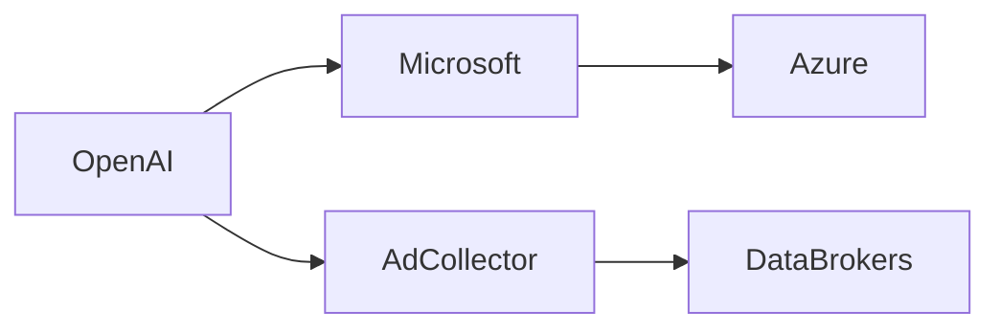

## Introducción  

La noticia que hoy circula en Hacker News —*ChatGPT now knows what you do on other websites via ad collector*— ha encendido el debate sobre los límites de la inteligencia artificial generativa y la vigilancia publicitaria. OpenAI, la empresa detrás de ChatGPT, ha integrado un “ad collector” que extrae datos de los anuncios que ves mientras navegas, permitiendo al modelo inferir tu comportamiento en sitios externos. Este desarrollo no es solo un asunto técnico; es una pieza más del rompecabezas de poder y concentración de capital que ha marcado la historia reciente de la industria tecnológica.

## ¿Cómo funciona el ad collector?  

El ad collector actúa como un “pixel invisible” que se dispara cuando una página muestra un anuncio compatible con los proveedores de OpenAI. Cada vez que el anuncio se carga, se envía información —como URL de referencia, ID de usuario y parámetros de segmentación— a los servidores de OpenAI. Luego, los datos se procesan con los embeddings de ChatGPT, de modo que el modelo puede responder preguntas basadas en lo que has visto en otras plataformas, sin que necesites proporcionar explícitamente esos datos.

En términos simples, el modelo ahora posee una “memoria” indirecta de tu comportamiento web, alimentada por la infraestructura publicitaria que ya domina el ecosistema digital.

## Concentración de capital y relaciones de poder  

### OpenAI y Microsoft  

### El ecosistema ad tech  

El ad collector depende de los corredores de publicidad —The Trade Desk, Xandr (de Amazon), Criteo— y de los brokers de datos como LiveRamp y Oracle Data Cloud. Estas empresas venden “audiencias” creadas a partir de la actividad cruzada de usuarios. Con la integración de OpenAI, los datos que antes estaban fragmentados en “cookies” y “device IDs” pueden ahora ser consolidados en embeddings de IA, elevando el valor del activo de datos a niveles sin precedentes.

### Concentración y barreras de entrada  

Los gigantes —Google, Meta, Amazon y Microsoft — ya controlan la mayor parte del mercado de publicidad digital (más del 70% del gasto global). La capacidad de combinar IA generativa con datos de anuncios refuerza esa concentración: **los jugadores que no pueden invertir cientos de millones en infraestructura de IA y en redes de datos quedarán fuera del bucle**. Las startups de IA que dependen de datos abiertos o de modelos pequeños enfrentan una barrera de entrada cada vez más alta.

## Dinámicas económicas reales  

1. **Monetización de la atención** – El ad collector convierte la “atención” en un activo tokenizable que alimenta el modelo de lenguaje. Cada interacción con un anuncio puede traducirse en una “pulsación” que aumenta la precisión de los resultados y, a su vez, el valor del producto SaaS de OpenAI.  
2. **Externalidades de privacidad** – Cuando el modelo conoce tu historial de navegación, no se trata solo de un beneficio para el usuario (respuestas más personalizadas). También crea externalidades negativas: los datos pueden ser vendidos a terceros, creando incentivos para recopilar más información, lo que a su vez alimenta la “economía de vigilancia”.  
3. **Regulación en juego** – Las autoridades de la UE y de California ya han impuesto GDPR y CCPA, que limitan la recolección y el uso de datos sin consentimiento explícito. Sin embargo, la arquitectura del ad collector puede evadir esos requisitos al “agrupar” los datos en embeddings anónimos, una zona gris que muchos reguladores aún no han definido.

## Un vistazo histórico  

El modelo de negocio publicitario basado en seguimiento se originó con los *cookies* de Netscape a mediados de los 90. Desde entonces, la industria ha pasado de *third‑party cookies* a *device fingerprinting* y, más recientemente, a *privacy‑sandbox* de Google. Cada fase representó una respuesta a la presión regulatoria y a las demandas de los usuarios. La integración de IA generativa en este ciclo es la siguiente lógica evolutiva: **convertir datos de comportamiento en “conocimiento” procesable por modelos de lenguaje**.

Casos como *Cambridge Analytica* y los escándalos de Facebook en 2018 demostraron que la combinación de datos de usuarios y algoritmos puede influir en procesos democráticos. Hoy, el riesgo se traslada a la esfera de la información personalizada: los modelos de IA pueden generar contenidos que refuercen sesgos o manipulen decisiones de consumo, respaldados por un flujo constante de datos publicitarios.

## Empresas bajo la lupa  

| Empresa | Rol en la cadena de valor | Implicación de datos |
|---------|--------------------------|----------------------|
| **OpenAI** | Desarrollador del modelo | Recibe datos de anuncios para entrenar embeddings |
| **Microsoft** | Proveedor de nube y distribución | Facilita infraestructura para almacenar y procesar datos |
| **The Trade Desk** | Plataforma de compra de medios | Suministra información de impresiones a OpenAI |
| **LiveRamp** | Data onboarding | Transforma datos de cookies en identificadores compatibles con IA |
| **Meta** | Competidor de atención | Podría desarrollar su propio “ad‑collector” interno |

Esta tabla ilustra cómo cada actor se beneficia de la circulación de datos, creando un **ecosistema de poder interconectado** donde la información fluye hacia arriba (OpenAI/Microsoft) y se redistribuye abajo (agencias, anunciantes).

## Riesgos y oportunidades  

### Riesgos  

- **Erosión de la privacidad**: El híbrido IA‑publicidad permite inferir intereses sensibles (salud, política) sin consentimiento directo.  
- **Sesgo algorítmico**: Los datos de anuncios reflejan los sesgos de los sistemas de segmentación, que luego se amplifican en las respuestas de ChatGPT.  
- **Monopolio de datos**: La consolidación de datos en manos de pocos actores puede limitar la innovación y la competencia.  

### Oportunidades  

- **Personalización legítima**: En contextos donde el usuario otorga permiso explícito, la IA puede ofrecer asistencia más precisa (p. ej., recomendaciones de productos).  
- **Nuevos modelos de negocio**: Empresas de privacidad pueden crear capas de “consentimiento verificable” que actúen como intermediarias entre anunciantes y OpenAI.  
- **Regulación proactiva**: Legisladores pueden usar esta coyuntura para imponer normas de “data‑by‑design” en sistemas de IA generativa.  

## Qué pueden hacer los usuarios y los reguladores  

1. **Transparencia de consentimientos** – Exigir que los proveedores de IA ofrezcan un panel donde el usuario pueda ver y revocar qué datos de anuncios se están compartiendo.  
2. **Auditorías independientes** – Organizaciones como la Electronic Frontier Foundation (EFF) pueden solicitar auditorías de los pipelines de datos de OpenAI.  
3. **Legislación específica** – Introducir una categoría legal de “datos de modelo de lenguaje” que requiera un nivel de protección similar al de datos personales bajo GDPR.  

## Conclusión  

La incorporación del ad collector a ChatGPT no es una simple mejora de producto; es un punto de inflexión que refuerza la **concentración de capital y poder** en manos de un reducido número de gigantes tecnológicos. Al transformar el rastreo publicitario en conocimiento accionable para modelos de IA, se abre una vía que podría redefinir la relación entre usuarios, anunciantes y plataformas de IA. La cuestión clave que queda es si la sociedad permitirá que el mercado autorregule esta convergencia o si, como en momentos críticos del pasado, la intervención legislativa será necesaria para salvaguardar la privacidad y la competencia.

> *Reflexiona: ¿estamos dispuestos a ceder parte de nuestra intimidad a cambio de respuestas más “personalizadas”, o deberíamos exigir un marco que garantice que el poder de la IA no se convierta en una herramienta de vigilancia sin control?*